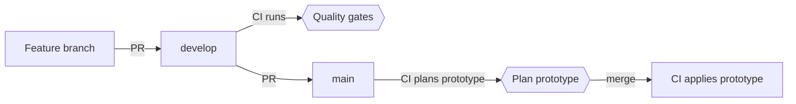

# Hello, Factored! 👋

This guide takes you from a fresh clone to a working setup for whichever part of the project you're touching. The repo holds the Python package and the Terraform infrastructure for the banking agent, which runs on AWS in two environments: `local`, for iterating from a laptop, and `prototype`, the hosted environment behind the hackathon submission.

Setup commands are idempotent, so re-running one after a failure is always safe, and `make doctor` tells you at any point which steps are done and which are left.

## Contents

- [Pick your path](#pick-your-path)
- [How the project ships](#how-the-project-ships)
  - [Environments](#environments)
  - [Branches](#branches)
  - [Guardrails](#guardrails)
- [Setup](#setup)
  - [1. Install the toolchain](#1-install-the-toolchain)
  - [2. Connect to the dataset](#2-connect-to-the-dataset)
  - [3. Deploy your own copy](#3-deploy-your-own-copy)
- [Day-to-day workflow](#day-to-day-workflow)
  - [Make a change](#make-a-change)
  - [Run the quality gates](#run-the-quality-gates)
  - [Iterate on infrastructure](#iterate-on-infrastructure)
  - [Promote to prototype](#promote-to-prototype)
  - [Record decisions](#record-decisions)
- [Troubleshooting](#troubleshooting)
- [Teardown](#teardown)
- [Reference](#reference)

---

## Pick your path

Most contributions need no AWS access at all. Find the row that matches what you want to do:

| You want to | You need | Follow |
|---|---|---|
| Change code, tests, or docs | Only the toolchain | [Step 1](#1-install-the-toolchain) |
| Explore or process the organizers' dataset | The read-only keys from the dataset dictionary | [Steps 1 and 2](#2-connect-to-the-dataset) |
| Run the whole stack in your own AWS account | Admin access to an AWS account | [Steps 1 and 3](#3-deploy-your-own-copy), plus step 2 when you need the data |

No path depends on the maintainers' AWS account or credentials. Resource names are derived from the account you sign in to, so a second copy of the project never collides with the first.

---

## How the project ships

### Environments

| Environment | Deployed by | When | Purpose |
|---|---|---|---|
| `local` | You, from your laptop | When you run `make apply` | Iterating on infrastructure |
| `prototype` | GitHub Actions | On every merge to `main` | The hosted prototype linked from the submission |

Both live in the same AWS account. Each has its own Terraform state file, its own deploy role, and its own `Environment=<env>` tag, and a deploy role can only touch resources tagged for its own environment. `prototype` runs on synthetic data and mock banking tools, and is deliberately not called production.

### Branches

Feature branches merge into `develop`, which runs the quality gates and deploys nothing. `main` mirrors what is live on `prototype` and only accepts merges from `develop`, so promoting is a deliberate step and a half-finished feature never reaches the prototype by accident.



### Guardrails

The operations that can hurt are hard to trigger by mistake:

| Risk | What stops it |
|---|---|
| Applying or destroying `prototype` from a laptop | `make` refuses without `I_KNOW=1`; CI owns `prototype` |
| `make destroy` hitting the wrong environment | It requires an explicit `ENV`, and refuses when Terraform is initialized for a different one |
| Unfinished work reaching the prototype | A workflow fails any PR into `main` that doesn't come from `develop` |
| Deploying from an unreviewed branch | The prototype deploy role only trusts jobs in the `prototype` GitHub Environment, which only `main` can use |
| Write credentials on pull requests | PR plans run under a read-only role |
| CI changing its own permissions | `infra/iam/` is applied by hand with admin credentials, and the deploy roles are denied IAM changes to themselves |
| Bootstrapping with the organizers' keys | `make bootstrap`, `make backend`, and `make teardown` refuse the organizers' account |
| Deleting shared state | `iam-destroy` needs `I_KNOW=1`, and `make teardown` makes you type the bucket name |
| Secrets in commits | `gitleaks` and `detect-private-key` run on every commit |

---

## Setup

### 1. Install the toolchain

| Tool | Version | Needed for |
|---|---|---|
| [uv](https://docs.astral.sh/uv/) | Recent | Python 3.13 (uv installs it from `.python-version`), dependencies, pre-commit |
| [Terraform](https://developer.hashicorp.com/terraform/install) | 1.16.x (`.terraform-version`) | Infrastructure, and the Terraform hooks |
| [tflint](https://github.com/terraform-linters/tflint#installation) | CI uses v0.64.0 | Terraform lint hook. On Homebrew, install from `terraform-linters/tap/tflint`: since v0.63, homebrew-core no longer gets new releases |
| [trivy](https://github.com/aquasecurity/trivy) | CI uses v0.74.0 | Terraform security scan (pre-push hook) |
| [AWS CLI v2](https://docs.aws.amazon.com/cli/latest/userguide/install-cliv2.html) | Recent (2.37 works) | Steps 2 and 3 only |
| [direnv](https://direnv.net) | Optional | Setting `AWS_PROFILE` when you enter the repo |

Then install the dependencies and hooks, and run every check once:

```bash
make install   # Python deps, pre-commit hooks for both stages, tflint plugins
make check     # Every hook against every file: the same command CI runs
```

If `make check` passes, your machine matches CI. Re-run `make install` after pulling changes to `pyproject.toml`, `.pre-commit-config.yaml`, or `.tflint.hcl`.

From now on, hooks run on their own:

| Stage | What runs | When |
|---|---|---|
| `pre-commit` | Hygiene checks (whitespace, YAML, merge conflicts, large files, private keys), `terraform fmt`, `tflint`, `gitleaks`, `actionlint`, `shellcheck`, `pyproject-fmt`, `ruff check`, `ruff format`, `mypy` | On `git commit` |
| `pre-push` | `terraform validate`, `trivy`, `pytest` (with an 80% coverage floor) | On `git push` |

### 2. Connect to the dataset

The organizers host the dataset in their own AWS account (read-only, `us-east-2`). The access keys are in the dataset dictionary they distribute, which lives locally under `docs/hackathon/` (gitignored). Store the keys in a profile of their own, so they never mix with your deploy credentials:

```bash
aws configure set aws_access_key_id <access-key-id> --profile factored-hackathon
aws configure set aws_secret_access_key <secret-access-key> --profile factored-hackathon
aws configure set region us-east-2 --profile factored-hackathon
```

> [!WARNING]
> The dictionary's own commands omit `--profile`, so they overwrite your `default` profile with the organizers' keys. Keep the flag.

Check it with `make doctor`: under "Dataset profile" it should report that it can read `s3://factored-datathon-2026-s3-157725502942-us-east-2-an/data/`. To use a different profile name, set `DATASET_SOURCE_PROFILE`.

### 3. Deploy your own copy

This stands up the full stack in an AWS account you control: a Terraform state bucket, three deploy roles, the `local` environment, and CI deployments of `prototype`. It happens once per account, with admin credentials.

#### 3.1 Before you start

- Sign in to the account as an admin: `aws login`, SSO, and access keys all work. The one-time steps use the `default` profile; set `AWS_ADMIN_PROFILE` to use another.
- The account needs GitHub's OIDC provider, once per account and shared across projects. If `aws iam list-open-id-connect-providers` doesn't list `token.actions.githubusercontent.com`, create it:

  ```bash
  aws iam create-open-id-connect-provider \
    --url https://token.actions.githubusercontent.com \
    --client-id-list sts.amazonaws.com
  ```

- `make doctor` should report `ok` for the admin profile.

#### 3.2 Bootstrap the state backend

```bash
make bootstrap
```

This creates the state bucket (private, versioned, encrypted, with S3 native locking, so no DynamoDB table), regenerates the backend files, writes `infra/iam/iam.tfvars` with your principal ARN, and writes a `.envrc` that sets `AWS_PROFILE=banking-agent-local`. Hold off on `direnv allow` until step 3.4 creates that profile.

The bucket is named `banking-agent-tfstate-<account-id>-us-east-1-an`, in your account's [regional namespace](https://docs.aws.amazon.com/AmazonS3/latest/userguide/gpbucketnamespaces.html): only your account can own that name. The script always runs as the admin profile, whatever `AWS_PROFILE` says, and refuses the organizers' account.

> [!NOTE]
> Deploying from a fork? The regenerated backend files name your bucket, so commit them. Also add `github_oidc_subject_prefix` to `infra/iam/iam.tfvars` before the next step, so the CI roles trust your repository instead of this one. Copy the value from `gh api repos/<owner>/<repo>/actions/oidc/customization/sub --jq .sub_claim_prefix`: repositories created after 2026-07-15 carry the owner and repository IDs in it (`repo:<owner>@<owner-id>/<repo>@<repo-id>`), so it can't be written from the name alone.

#### 3.3 Create the deploy roles

```bash
make provision
```

This applies `infra/iam/` (Terraform asks you to confirm) and initializes the `local` stack. It creates:

| Role | Assumed by | Permissions |
|---|---|---|
| `banking-agent-local-deploy` | You, from your laptop | Write, scoped to `local` |
| `banking-agent-prototype-deploy` | The apply job, only from the `prototype` GitHub Environment | Write, scoped to `prototype` |
| `banking-agent-prototype-plan` | The plan job on PRs into `main` | Read-only |

`make iam-output` prints their ARNs whenever you need them.

#### 3.4 Configure your local deploy profile

Point a profile at the local deploy role, on top of your admin sign-in:

```bash
aws configure set role_arn <local_role_arn> --profile banking-agent-local
aws configure set source_profile default --profile banking-agent-local
aws configure set region us-east-1 --profile banking-agent-local
```

Use your `AWS_ADMIN_PROFILE` as `source_profile` if it isn't `default`. Then activate the profile for the repo with `direnv allow`, or `export AWS_PROFILE=banking-agent-local` without direnv.

#### 3.5 Connect GitHub

The deploy workflow needs a `prototype` environment and two repository variables. Until the variables exist, its jobs are skipped rather than failed, so CI stays green before AWS is ready.

1. In **Settings → Environments → New environment**, create `prototype`. Under **Deployment branches and tags**, choose **Selected branches and tags** and add `main`. The prototype deploy role only trusts jobs in this environment, which makes a merge to `main` the only path to a prototype apply. Leave required reviewers off: merges deploy straight away.
2. Store the plan and deploy role ARNs from `make iam-output` as repository variables. They're variables, not secrets, because role ARNs aren't sensitive on their own:

   ```bash
   gh variable set AWS_ROLE_ARN_PROTOTYPE_PLAN --body "<prototype_plan_role_arn>"
   gh variable set AWS_ROLE_ARN_PROTOTYPE --body "<prototype_role_arn>"
   ```

   Or add them under **Settings → Secrets and variables → Actions → Variables**.

The apply job runs on merges to `main` that touch `infra/`. If `main` already has the infrastructure when you set the variables, trigger the first deploy by hand: **Actions → Deploy · Prototype → Run workflow** on `main`, or `gh workflow run deploy-prototype.yml --ref main`.

#### 3.6 Verify and deploy `local`

```bash
make doctor   # Every line should read ok
make plan     # Preview the local stack
make apply
```

A fully configured machine looks like this:

```text
Admin profile: default (bootstrap, IAM roles, teardown)
  ok    arn:aws:iam::<account-id>:user/<you>
  ok    state bucket banking-agent-tfstate-<account-id>-us-east-1-an exists
  ok    infra/envs/local.backend.tfbackend points at it
  ok    infra/envs/prototype.backend.tfbackend points at it
  ok    infra/iam/backend.tfbackend points at it

Dataset profile: factored-hackathon (organizers' read-only keys)
  ok    arn:aws:iam::157725502942:user/factored-datathon-2026-s3-reader can read s3://factored-datathon-2026-s3-157725502942-us-east-2-an/data/

Local deploy profile: banking-agent-local (make plan/apply)
  ok    arn:aws:sts::<account-id>:assumed-role/banking-agent-local-deploy/<session>

AWS_PROFILE in this shell: banking-agent-local

No failures.
```

From here on, every merge to `main` deploys `prototype` (see [Promote to prototype](#promote-to-prototype)).

---

## Day-to-day workflow

### Make a change

Branch from `develop`, push, and open a PR back into `develop`:

```bash
git switch develop && git pull
git switch -c feature/my-change
git push -u origin feature/my-change
```

CI runs the quality gates; merge when they pass. Nothing deploys from `develop`.

A few habits keep PRs quick to review:

- Write commit subjects in the imperative mood, as the history does ("Add IAM bootstrap module for deploy roles").
- Cite the requirement IDs from [docs/hackathon-requirements.md](docs/hackathon-requirements.md) (for example `SEC-05`) in the PR description and in the tests that cover them, so every change traces back to what the organizers score.
- Add an ADR when the change makes a decision someone could reasonably question later (see [Record decisions](#record-decisions)).

### Run the quality gates

Hooks run on commit and push, and you can run them on demand:

```bash
make check        # Every hook against every file (both stages)
make format       # Apply ruff lint fixes and formatting to src and tests
make lint         # Run ruff check on src and tests
make type         # Run mypy on src and tests
make test         # Run pytest with coverage
make integration  # Run integration-marked tests (needs credentials; deselected by default)
make tf-format    # Format all Terraform files
```

`make check` is exactly what the CI quality gates run, so a green local run predicts a green PR. In an emergency, skip a single hook with `SKIP=<hook-id> git commit`; CI still runs it.

### Iterate on infrastructure

With `AWS_PROFILE=banking-agent-local` active (direnv sets it when you enter the repo):

```bash
make init                # Initialize the local backend (safe to re-run)
make plan                # Preview changes
make apply               # Apply changes
make destroy ENV=local   # Tear down your local resources
```

`ENV` defaults to `local`.

Add infrastructure as per-concern modules under `infra/modules/`, wired into `infra/main.tf`. The deploy roles have `PowerUserAccess`, which covers almost any AWS service. IAM is the exception: a deploy role can only manage roles named `banking-agent-<env>-*`, so name Lambda and task execution roles accordingly.

After adding a module or bumping a provider version, regenerate the lock files so CI (linux/amd64) has the right platform hashes, and commit them with your change:

```bash
make lock
```

### Promote to prototype

When `develop` is in a state you'd be happy for judges to see, open a PR from `develop` into `main`. If the batch touches `infra/` (outside `infra/iam/`), CI posts a sticky **Terraform Plan · `prototype`** comment for reviewers. Merging applies the change to `prototype`. Merge with **Create a merge commit**: a squash or rebase puts commits on `main` that `develop` never gets, and the next promotion then carries the whole history again.

To redeploy `main` without an infrastructure change, run the workflow by hand: **Actions → Deploy · Prototype → Run workflow**.

> [!NOTE]
> The apply runs `terraform apply` against current state at merge time; the PR plan is informational, not the artifact applied, and there is no manual approval gate. A plan-bound, approval-gated production pipeline is remaining deployment work, not something this prototype operates.

Changes under `infra/iam/` never deploy from CI. Apply them by hand with admin credentials (`make iam-plan`, then `make iam-apply`).

### Record decisions

Decisions that are expensive to reverse, or likely to be questioned (a region, a model, a data contract), get an Architecture Decision Record in [docs/adr/](docs/adr/), written from the template in its README. ADRs are never deleted: a reversed decision is marked `Superseded by ADR-NNNN` and links forward.

---

## Troubleshooting

Run `make doctor` first; most setup problems show up there.

| Symptom | Cause and fix |
|---|---|
| `make doctor` says the admin profile is the organizers' dataset reader | The dataset dictionary's `aws configure set` commands overwrote `default`. Sign in again (`aws login`) and move their keys to their own profile ([step 2](#2-connect-to-the-dataset)). |
| The AWS CLI or Terraform can't find the `banking-agent-local` profile | `.envrc` is active before the profile exists. Finish [step 3.4](#34-configure-your-local-deploy-profile), or run `direnv deny` until then. |
| `Backend mismatch: configured key is ...` | Terraform is initialized for another environment. Run `make init ENV=<env>`. |
| `Terraform not initialized` | Run `make init ENV=<env>`. |
| Expired credentials | Your sign-in session ended. Run `aws login` again. |
| Deploy workflow jobs show as skipped | The repository variables from [step 3.5](#35-connect-github) aren't set yet. |
| CI's `terraform init` fails on provider checksums | The lock files lack hashes for linux/amd64. Run `make lock` and commit them. |
| A hook passes on commit but fails in CI | Commit hooks only see changed files. Run `make check`, which runs both stages on every file, as CI does. |

---

## Teardown

Teardown is setup in reverse, and the order matters: every `terraform destroy` reads state from the state bucket, so the bucket goes last.

```bash
make destroy ENV=local
AWS_PROFILE=default make init ENV=prototype
AWS_PROFILE=default make destroy ENV=prototype I_KNOW=1
make iam-destroy I_KNOW=1
make teardown
```

Everything after the local destroy runs with admin credentials: the local deploy role can't reach `prototype` state, and the prototype deploy role is only assumable from CI. The `iam-*` targets and `make teardown` switch to `AWS_ADMIN_PROFILE` on their own; the `prototype` commands need the override spelled out. `make teardown` prints what it will delete and makes you type the bucket name to confirm. It leaves the account's GitHub OIDC provider in place, since other projects may depend on it.

---

## Reference

Run `make help` for every target.

### Configuration

| Variable | Default | Used by |
|---|---|---|
| `ENV` | `local` | The Terraform targets (`local` or `prototype`) |
| `I_KNOW` | Unset | Set to `1` to allow `prototype` apply or destroy, and `iam-destroy` |
| `AWS_PROFILE` | `banking-agent-local` (from `.envrc`) | Terraform for `local`, and ad hoc AWS CLI calls |
| `AWS_ADMIN_PROFILE` | `default` | `make bootstrap`, the `iam-*` targets, `make teardown`, `make doctor` |
| `DATASET_SOURCE_PROFILE` | `factored-hackathon` | `make doctor` |

### What's pinned

| What | Where |
|---|---|
| Python 3.13 | `.python-version`, and `requires-python` in `pyproject.toml` |
| Python dependencies | `uv.lock` |
| Terraform 1.16.x | `.terraform-version`, and `required_version` in each root |
| AWS provider | `.terraform.lock.hcl` in each root (linux/amd64, darwin/amd64, darwin/arm64) |
| Hook versions | `rev` entries in `.pre-commit-config.yaml` |
| GitHub Actions | Commit SHAs in `.github/workflows/`, with the release in a trailing comment |
| CI tool versions | `env` blocks in `.github/workflows/` |

Dependabot ([.github/dependabot.yml](.github/dependabot.yml)) opens a monthly PR into `develop` for each of: Python dependencies, hook versions, GitHub Actions and the AWS provider. It skips releases younger than a week. Python, Terraform and the CI tool versions are still bumped by hand.

### Files

The backend files (`infra/envs/*.backend.tfbackend`, `infra/iam/backend.tfbackend`) are generated by `make backend` from the project name and the account ID, and committed. CI regenerates them on every deploy job, after its OIDC login. The scripts behind the setup targets live in [scripts/](scripts/) and share their naming and guards through `scripts/common.sh`; run them through `make` rather than directly.

Gitignored files worth knowing about:

- `.terraform/`: Terraform plugin cache and local state
- `infra/iam/iam.tfvars`: your principal ARN (and `github_oidc_subject_prefix`, on a fork)
- `.envrc`: your local `AWS_PROFILE`
- `.env`, `.env.*`: local secrets such as LLM API keys; if you add one, document its variables in a tracked `.env.example`
- `data/`: the organizer-provided dataset, which must never be committed
- `docs/hackathon/`: the organizers' materials, including the dataset keys
