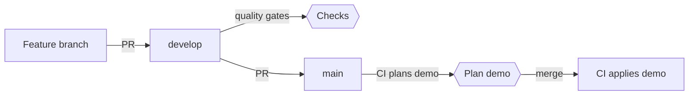

# Contributing

This repo contains the Python code and Terraform infrastructure for the banking agent, deployed to AWS across two environments: `local` for iterating from your laptop, and `demo` for the hosted prototype behind the hackathon submission. Infrastructure changes headed for `demo` get a CI-generated plan on the PR, so reviewers can see exactly what the merge would change.

> [!IMPORTANT]
> This project requires:
> - [uv](https://docs.astral.sh/uv/) for Python tooling and pre-commit hooks
> - [Terraform](https://developer.hashicorp.com/terraform/install) ~> 1.15.0
> - [AWS CLI v2](https://docs.aws.amazon.com/cli/latest/userguide/install-cliv2.html) configured with credentials
> - [GitHub OIDC provider](https://docs.github.com/en/actions/how-tos/secure-your-work/security-harden-deployments/oidc-in-aws) configured in your AWS account

> [!NOTE]
> Check if your AWS account already has a GitHub OIDC provider configured: `aws iam list-open-id-connect-providers`. If it's not there, create it once (`token.actions.githubusercontent.com`, audience `sts.amazonaws.com`). The IAM module references it but doesn't create it.

## Contents

- [DevOps strategy](#devops-strategy)
  - [Environment model](#environment-model)
  - [Branch model](#branch-model)
- [First-time setup](#first-time-setup)
  - [Install development dependencies and hooks](#install-development-dependencies-and-hooks)
  - [Bootstrap the remote state backend](#bootstrap-the-remote-state-backend)
  - [Create the IAM roles](#create-the-iam-roles)
  - [Configure GitHub](#configure-github)
  - [Configure your local AWS profile](#configure-your-local-aws-profile)
- [Day-to-day workflow](#day-to-day-workflow)
  - [Local iteration](#local-iteration)
  - [Quality gates](#quality-gates)
  - [Integrating on develop](#integrating-on-develop)
  - [Promoting to demo](#promoting-to-demo)
  - [Adding new infrastructure](#adding-new-infrastructure)
- [Teardown](#teardown)
- [Reference](#reference)

## DevOps strategy

### Environment model

The project has two deployment environments in the same AWS account:

| Environment | Who deploys | When |
|---|---|---|
| `local` | You, from your laptop | Iterating on infrastructure changes |
| `demo` | GitHub Actions | On merge to `main` |

`demo` is the hosted prototype: the link that goes into the submission and that judges can open at any time. It runs on synthetic data and mock banking tools, and is deliberately not called production.

> [!NOTE]
> Each environment has its own Terraform state file, its own IAM role, and its own set of resources tagged with `Environment=<env>`. The IAM roles are scoped so each one can only touch resources tagged for its own environment.

### Branch model

`develop` is the integration branch: feature PRs land there and run the quality gates, but nothing deploys. `main` mirrors what is live on `demo`, and only accepts merges from `develop`. Promoting is a deliberate step, so a half-finished feature never reaches the demo by accident.



> [!NOTE]
> The apply runs `terraform apply` directly against current state at merge time; the PR plan is informational, not the artifact applied. There is no manual approval gate. A plan-bound, approval-gated production pipeline is remaining deployment work, not something this prototype operates.

## First-time setup

### Install development dependencies and hooks

Sync Python dependencies, install pre-commit hooks for both `pre-commit` and `pre-push` stages, and install the tflint plugins declared in `.tflint.hcl`:

```bash
make install
```

This is idempotent. Re-run it after `git pull` whenever `pyproject.toml`, `.pre-commit-config.yaml`, or `.tflint.hcl` change.

Hooks fire automatically on every git operation:

| Stage | What runs | When |
|---|---|---|
| `pre-commit` | hygiene checks (whitespace, YAML, merge conflicts, large files, private keys), `terraform fmt`, `tflint`, `gitleaks`, `actionlint`, `shellcheck`, `pyproject-fmt`, `ruff check`, `ruff format`, `mypy` | On `git commit` |
| `pre-push` | `terraform validate`, `terraform trivy`, `pytest` (with an 80% coverage floor) | On `git push` |

> [!IMPORTANT]
> If not already installed in your system, install [trivy](https://github.com/aquasecurity/trivy) and [tflint](https://github.com/terraform-linters/tflint#installation) first. The remaining hook tools are fetched by pre-commit or installed by `uv`.

### Bootstrap the remote state backend

You only do it once per AWS account, with admin credentials.

```bash
make bootstrap
```

This creates the S3 bucket that holds Terraform state for all environments, rewrites the `*.backend.tfbackend` files (one per env, plus one for the IAM bootstrap), writes `infra/iam/iam.tfvars` (gitignored) with your caller ARN and bucket name, and writes a `.envrc` that sets `AWS_PROFILE=banking-agent-local`. The bucket is private, versioned, encrypted, and uses S3 native locking (`use_lockfile = true`), so no DynamoDB table is required. The script is idempotent.

### Create the IAM roles

The roles live in a separate Terraform root at `infra/iam/`. They're applied once with admin credentials and rarely touched afterward.

| Role | Assumed by | Permissions |
|---|---|---|
| `banking-agent-local-deploy` | You, from your laptop | Write, scoped to `local` |
| `banking-agent-demo-deploy` | The apply job, only from the `demo` GitHub Environment | Write, scoped to `demo` |
| `banking-agent-demo-plan` | The plan job on PRs into `main` | Read-only |

```bash
make iam-init && make iam-apply
```

The output gives you three role ARNs. Keep them: two go into GitHub and one into your AWS config.

> [!TIP]
> `make provision` chains `iam-init`, `iam-apply`, and the service-stack `init` for `ENV=local` in one shot.

### Configure GitHub

In the repo settings:

**Settings → Environments → New environment → `demo`**
- Under **Deployment branches and tags**, choose **Selected branches and tags** and add `main`. The demo deploy role only trusts jobs running in this environment, so this is what makes a merge to `main` the only path to a demo apply.
- No required reviewers: merges to `main` deploy straight away.

**Settings → Secrets and variables → Actions → Variables (Repository tab)**
- `AWS_ROLE_ARN_DEMO_PLAN` = `demo_plan_role_arn` (read-only; used by the PR plan)
- `AWS_ROLE_ARN_DEMO` = `demo_role_arn` (write; used by the apply job only)

Variables (not secrets) is correct since role ARNs aren't sensitive on their own.

> [!NOTE]
> Until these variables exist, the deploy workflow skips its jobs instead of failing, so the pipeline stays green before AWS is bootstrapped.

### Configure your local AWS profile

Add to `~/.aws/config`:

```ini
[profile banking-agent-local]
role_arn       = <local_role_arn>
source_profile = default
region         = us-east-1
```

`source_profile = default` assumes you're already authenticated as your IAM user via `~/.aws/credentials` or SSO. The `banking-agent-local` profile assumes the local-deploy role on top of that. Verify:

```bash
AWS_PROFILE=banking-agent-local aws sts get-caller-identity
```

The returned ARN should end in `assumed-role/banking-agent-local-deploy/...`.

> [!WARNING]
> The dataset dictionary's setup steps run `aws configure set ...`, which overwrites your `default` profile with the organizers' read-only keys and breaks the `source_profile` above. Put their keys in a named profile instead (append `--profile <name>` to each command).

## Day-to-day workflow

### Local iteration

`make bootstrap` writes a `.envrc` that sets `AWS_PROFILE=banking-agent-local` via [direnv](https://direnv.net). Run `direnv allow` once and the profile is set whenever you enter the directory. Without direnv, export it manually.

```bash
make init                # Initialize the local backend (idempotent, safe to re-run)
make plan                # Preview changes
make apply               # Apply changes
make destroy ENV=local   # Tear down all local resources
```

> [!IMPORTANT]
> `make` defaults to `ENV=local`. The Makefile refuses to apply or destroy `demo` unless `I_KNOW=1`; CI owns `demo`.

### Quality gates

Hooks run automatically, but you can also invoke them on demand:

```bash
make check        # Run every hook against every file (both stages)
make format       # Apply ruff lint fixes and formatting to src and tests
make lint         # Run ruff check on src and tests
make type         # Run mypy on src and tests
make test         # Run pytest with coverage
make integration  # Run integration-marked tests (deselected by default)
make tf-format    # Format all Terraform files
```

`make check` is what the CI quality gates job runs. If it passes locally, your PR will pass it in CI. In an emergency, skip a single hook with `SKIP=<hook-id> git commit`.

### Integrating on develop

Branch from `develop`, push, and open a PR targeting `develop`:

```bash
git switch develop && git pull
git switch -c feature/my-change
git push -u origin feature/my-change
```

CI runs the quality gates. Merge when they pass; nothing deploys.

### Promoting to demo

When `develop` is in a state you'd be happy for judges to see, open a PR from `develop` to `main`. If the batch touches `infra/` (outside `infra/iam/`), CI posts a sticky **"Terraform Plan · `demo`"** comment. Review it and merge; CI applies the change to `demo`.

### Adding new infrastructure

Add per-concern modules under `infra/modules/` and wire them into `infra/main.tf`. The deploy roles have `PowerUserAccess`, so they cover almost any AWS service. IAM is the exception: a deploy role can only manage roles named `banking-agent-<env>-*`, so name Lambda and task execution roles accordingly.

After adding a module or bumping a provider version, regenerate the lock files so CI (linux/amd64) has the right platform hashes, and commit them with your change:

```bash
make lock
```

## Teardown

Teardown is first-time setup in reverse, and the order matters: every `terraform destroy` reads state from the state bucket, so the bucket goes last.

```bash
make destroy ENV=local
AWS_PROFILE=default make init ENV=demo
AWS_PROFILE=default make destroy ENV=demo I_KNOW=1
AWS_PROFILE=default make iam-destroy I_KNOW=1
AWS_PROFILE=default bash teardown.sh
```

Everything after the local destroy runs with admin credentials: the local deploy role can't reach `demo` state, and the demo deploy role is only assumable from CI. `teardown.sh` prints what it will delete and makes you type the bucket name to confirm. It leaves the account's GitHub OIDC provider in place, since other projects may depend on it.

## Reference

Run `make help` for the full list of targets. `ENV` defaults to `local`; override with `make plan ENV=demo`.

Gitignored files worth knowing about:

- `.terraform/`: Terraform plugin cache and local state
- `infra/iam/iam.tfvars`: contains your principal ARN
- `.envrc`: your local `AWS_PROFILE`
- `.env`, `.env.*`: local secrets such as LLM API keys (a `.env.example` documenting the shape stays tracked)
- `data/`: the organizer-provided hackathon dataset, which must never be committed

Backend files (`infra/envs/*.backend.tfbackend`, `infra/iam/backend.tfbackend`) are committed and generated deterministically by `bootstrap-backend.sh` from the project name. CI regenerates them on every deploy job.
