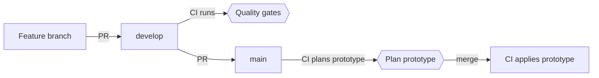

# Contributing

This guide takes you from a fresh clone to a working setup for whichever part of the project you're touching. The repo holds the Python package, the web app, and the Terraform infrastructure for Faro, which runs on AWS in two environments: `local`, for iterating from a laptop, and `prototype`, the hosted environment behind the hackathon submission.

Setup commands are idempotent, so re-running one after a failure is always safe, and `make doctor` tells you at any point which steps are done and which are left.

## Contents

- [Pick your path](#pick-your-path)
- [How the project ships](#how-the-project-ships)
  - [Environments](#environments)
  - [Branches](#branches)
  - [Guardrails](#guardrails)
- [Setup](#setup)
  - [1. Install the toolchain](#1-install-the-toolchain)
  - [2. Connect to the dataset](#2-connect-to-the-dataset)
  - [3. Deploy your own copy](#3-deploy-your-own-copy)
- [Reproduce the results](#reproduce-the-results)
- [Day-to-day workflow](#day-to-day-workflow)
  - [Make a change](#make-a-change)
  - [Run the quality gates](#run-the-quality-gates)
  - [Iterate on infrastructure](#iterate-on-infrastructure)
  - [Evaluate](#evaluate)
  - [Promote to prototype](#promote-to-prototype)
  - [Record decisions](#record-decisions)
- [Troubleshooting](#troubleshooting)
- [Teardown](#teardown)
- [Reference](#reference)
  - [Configuration](#configuration)
  - [What's pinned](#whats-pinned)
  - [Files](#files)

---

## Pick your path

Most contributions need no AWS access at all. Find the row that matches what you want to do:

| You want to | You need | Follow |
|---|---|---|
| Change code, tests, or docs | Only the toolchain | [Step 1](#1-install-the-toolchain) |
| Explore or process the organizers' dataset | The read-only keys from the dataset dictionary | [Steps 1 and 2](#2-connect-to-the-dataset) |
| Run the whole stack in your own AWS account | Admin access to an AWS account, and your own fork of this repository | [Steps 1 and 3](#3-deploy-your-own-copy), plus step 2 when you need the data |
| Check our reported numbers | The toolchain to start; the dataset keys and your own stack for the later checks | [Reproduce the results](#reproduce-the-results) |

No path depends on the maintainers' AWS account or credentials. Resource names are derived from the account you sign in to, so a second copy of the project never collides with the first.

---

## How the project ships

### Environments

| Environment | Deployed by | When | Purpose |
|---|---|---|---|
| `local` | You, from your laptop | When you run `make apply` | Iterating on infrastructure |
| `prototype` | GitHub Actions | On merges to `main` that touch the stack | The hosted prototype linked from the submission |

Both live in the same AWS account. Each has its own Terraform state file, its own deploy role, and its own `Environment=<env>` tag, and a deploy role is denied any resource tagged for the other environment. `prototype` runs on synthetic data and mock banking tools, and is deliberately not called production.

> [!NOTE]
> Tag-based isolation is partial: it doesn't reach untagged resources, or actions that ignore resource tags (S3 object reads and writes among them). The state bucket, and each environment's own buckets and CloudFront functions, are covered by explicit denies instead (see [Guardrails](#guardrails)). A separate AWS account per environment is remaining deployment work.

### Branches

Feature branches merge into `develop`, which runs the quality gates and deploys nothing. `main` mirrors what is live on `prototype` and only accepts merges from `develop`, so promoting is a deliberate step and a half-finished feature never reaches the prototype by accident.



### Guardrails

The operations that can hurt are hard to trigger by mistake:

| Risk | What stops it |
|---|---|
| Applying or destroying `prototype`, or deploying its site, from a laptop | `make` refuses without `I_KNOW=1`; CI owns `prototype` |
| A `local` target running as your admin profile | `make` refuses the targets that deploy or test `local` while `AWS_PROFILE` is unset, instead of falling back to the default profile |
| `make destroy` hitting the wrong environment | It requires an explicit `ENV`, and refuses when Terraform is initialized for a different one |
| Unfinished work reaching the prototype | A workflow fails any PR into `main` that doesn't come from `develop` |
| Deploying from an unreviewed branch | The prototype deploy role only trusts jobs in the `prototype` GitHub Environment, which only `main` can use |
| Write credentials on pull requests | PR plans run under a read-only role, without taking the state lock |
| CI changing its own permissions | `infra/iam/` is applied by hand with admin credentials; the deploy roles are denied IAM changes to themselves, and every role they create must carry a permissions boundary that excludes IAM |
| One environment touching another's state | Each role is denied every other prefix in the state bucket (including the IAM and dataset roots'), and any change to the bucket itself; the roles they create are denied the bucket entirely |
| One environment writing another's site or zips | Each deploy role, and every role it creates, is denied the other environment's buckets and CloudFront functions by name, since S3 object writes ignore tags and functions can't carry them |
| Bootstrapping with the organizers' keys | `make bootstrap`, `make backend`, and `make teardown` refuse the organizers' account |
| Deleting shared state | `iam-destroy` and `dataset-destroy` need `I_KNOW=1`, and `make teardown` makes you type the bucket name |
| Secrets in commits | `gitleaks` and `detect-private-key` run on every commit, and `gitleaks-history` rescans the full history on every push and in CI |
| The model key reaching state, plans, or CI | The IAM root creates each environment's secret empty, `make model-key` stores the key from your `.env`, and the stack only looks the secret up by name ([step 3.7](#37-verify-and-deploy-local)) |
| The dataset changing under an evaluation | `make data` stops when the organizers' bucket drifts from `dataset.lock`, and the data bucket rejects any write that would overwrite a snapshot |

---

## Setup

### 1. Install the toolchain

| Tool | Version | Needed for |
|---|---|---|
| [uv](https://docs.astral.sh/uv/) | Recent | Python 3.13 (uv installs it from `.python-version`), dependencies, pre-commit |
| [Node.js](https://nodejs.org) | 24.21.0 (`.nvmrc`; with [nvm](https://github.com/nvm-sh/nvm), `nvm install` in the repository) | The web app in `web/`, and its hooks |
| [pnpm](https://pnpm.io) | Recent; it runs the version `web/package.json` pins | The web app's dependencies |
| [Terraform](https://developer.hashicorp.com/terraform/install) | 1.16.x (`.terraform-version`) | Infrastructure, and the Terraform hooks |
| [tflint](https://github.com/terraform-linters/tflint#installation) | CI uses v0.64.0 | Terraform lint hook. On Homebrew, install from `terraform-linters/tap/tflint`: since v0.63, homebrew-core no longer gets new releases |
| [trivy](https://github.com/aquasecurity/trivy) | CI uses v0.74.0 | Terraform security scan (pre-push hook) |
| [AWS CLI v2](https://docs.aws.amazon.com/cli/latest/userguide/install-cliv2.html) | Recent (2.37 works) | Steps 2 and 3 only |
| [GitHub CLI](https://cli.github.com) | Recent | Step 3 only |
| [direnv](https://direnv.net) | Optional | Setting `AWS_PROFILE` when you enter the repo |

Then install the dependencies and hooks, and run every check once:

```bash
make install   # Python and web deps, both hook stages, tflint plugins
make check     # Every hook against every file, as CI's pre-commit job runs them
```

If `make check` passes, your machine runs the same hooks as CI; CI also plays the regression set, which `make regression` runs locally. Re-run `make install` after pulling changes to `pyproject.toml`, `web/package.json`, `.pre-commit-config.yaml`, or `.tflint.hcl`.

From now on, hooks run on their own:

| Stage | What runs | When |
|---|---|---|
| `pre-commit` | Hygiene checks (whitespace, YAML, merge conflicts, large files, private keys), `terraform fmt`, `tflint`, `gitleaks`, `actionlint`, `shellcheck`, `pyproject-fmt`, `ruff check`, `ruff format`, `mypy`; for the web app, Prettier, ESLint, and `tsc` | On `git commit` |
| `pre-push` | `terraform validate`, `trivy`, `gitleaks-history` (the full history), `pytest` (with an 80% coverage floor); for the web app, Vitest (with the same floor) and a production build | On `git push` |

### 2. Connect to the dataset

The organizers host the dataset in their own AWS account (read-only, `us-east-2`). The access keys are in the dataset dictionary they distribute, which lives locally under `docs/hackathon/` (gitignored). Store the keys in a profile of their own, so they never mix with your deploy credentials:

```bash
aws configure set aws_access_key_id <access-key-id> --profile factored-hackathon
aws configure set aws_secret_access_key <secret-access-key> --profile factored-hackathon
aws configure set region us-east-2 --profile factored-hackathon
```

> [!WARNING]
> The dictionary's own commands omit `--profile`, so they overwrite your `default` profile with the organizers' keys. Keep the flag.

Check it with `make doctor`: under "Dataset profile" it should report that it can read `s3://factored-datathon-2026-s3-157725502942-us-east-2-an/data/`. To use a different profile name, set `DATASET_SOURCE_PROFILE`.

Then download the pinned snapshot into `data/`:

```bash
make data
```

[`dataset.lock`](dataset.lock) lists every file of the snapshot the code is pinned to, with its size, the organizers' ETag, and a SHA-256 ([ADR-0002](docs/adr/0002-mirror-dataset-into-pinned-snapshots.md)). `make data` downloads the organizers' `data/` prefix (5.35 GB) into `data/snapshots/<snapshot-id>/` and checks every file against both, so a rerun downloads only what's missing, and your copy holds exactly the bytes the evaluation reports were computed from. If the organizers' bucket no longer matches the lock, it stops and lists the difference (see [Troubleshooting](#troubleshooting)).

With the snapshot in place, analyze it:

```bash
make analysis
```

It reads exactly the files in the lock, with no AWS access, and writes four reports to [docs/analysis/](docs/analysis/), stamped with the snapshot ID: the data quality profile, the workflow selection [ADR-0003](docs/adr/0003-choose-workflow-from-evidence.md) rules on, the card support analysis the policy cites, and the traffic analysis behind [ADR-0004](docs/adr/0004-agent-architecture-on-agentcore.md)'s capacity limits. The last three read the snapshot as of the instant the profile dates and add SVG figures; the card support and traffic analyses read development customers only. Each report carries the same numbers as JSON, publishes aggregates only (row counts under 10 suppressed), and writes the same bytes on a rerun, which takes about five minutes. `uv run python -m banking_agent.analysis <profile|select|cards|traffic>` writes one report.

### 3. Deploy your own copy

This stands up the full stack in an AWS account you control: a Terraform state bucket, three deploy roles, the dataset bucket, the `local` environment, and CI deployments of `prototype`. It happens once per account, with admin credentials.

#### 3.1 Before you start

- Work from a GitHub repository you administer, with `origin` pointing at it: your own fork, unless you maintain this one. The prototype pipeline runs in that repository's Actions, and its CI roles trust only that repository. On a fork, enable workflows once under the **Actions** tab; GitHub disables them on new forks.
- Sign in to the GitHub CLI with `gh auth login`. `make bootstrap` uses it to read your repository's OIDC subject, and step 3.5 to set its variables.
- Sign in to the account as an admin: `aws login`, SSO, and access keys all work. The one-time steps use the `default` profile; set `AWS_ADMIN_PROFILE` to use another.
- The account needs GitHub's OIDC provider, once per account and shared across projects. If `aws iam list-open-id-connect-providers` doesn't list `token.actions.githubusercontent.com`, create it:

  ```bash
  aws iam create-open-id-connect-provider \
    --url https://token.actions.githubusercontent.com \
    --client-id-list sts.amazonaws.com
  ```

- `make doctor` should report `ok` for the admin profile, and name your repository under "GitHub repository" with an `ok` for its OIDC subject.

#### 3.2 Bootstrap the state backend

```bash
make bootstrap
```

This creates the state bucket (private, versioned, encrypted, with S3 native locking, so no DynamoDB table), regenerates the backend files, writes `infra/iam/iam.tfvars` with your principal ARN and your repository's OIDC subject prefix, and writes a `.envrc` that sets `AWS_PROFILE=banking-agent-local`. Hold off on `direnv allow` until step 3.4 creates that profile.

The bucket is named `banking-agent-tfstate-<account-id>-us-east-1-an`, in your account's [regional namespace](https://docs.aws.amazon.com/AmazonS3/latest/userguide/gpbucketnamespaces.html): only your account can own that name. The script always runs as the admin profile, whatever `AWS_PROFILE` says, and refuses the organizers' account.

The OIDC subject prefix is what the CI roles trust. The script reads it from GitHub for the repository `origin` points at, and prints it; check that it names your repository. Repositories created after 2026-07-15 carry the owner and repository IDs in it (`repo:<owner>@<owner-id>/<repo>@<repo-id>`), so it can't be written from the name alone. To set it without the GitHub CLI, export `GITHUB_OIDC_SUBJECT_PREFIX` before running the script.

> [!NOTE]
> Deploying from a fork? The regenerated backend files name your bucket, so commit them to your fork: every clone of it then points at your state, as `make doctor` checks. CI regenerates them on its own.

#### 3.3 Create the deploy roles

```bash
make provision
```

This applies `infra/iam/`, then `infra/dataset/` (Terraform asks you to confirm each), and initializes the `local` stack. The first creates the deploy roles:

| Role | Assumed by | Permissions |
|---|---|---|
| `banking-agent-local-deploy` | You, from your laptop | Write, scoped to `local` |
| `banking-agent-prototype-deploy` | The apply job, only from the `prototype` GitHub Environment | Write, scoped to `prototype` |
| `banking-agent-prototype-plan` | The plan job on PRs into `main` | Read-only |

`make iam-output` prints their ARNs whenever you need them. The IAM root also creates an empty secret for each environment's model key, `banking-agent-<env>-anthropic-api-key`, which you fill in [step 3.7](#37-verify-and-deploy-local). The second creates the data bucket, `banking-agent-data-<account-id>-us-east-1-an`, which holds the dataset snapshots and the exports of the tools' data ([step 3.6](#36-copy-the-dataset-snapshot-and-the-tools-data)), and the log group DynamoDB's imports write to. It lives outside the environment stacks, so destroying one never deletes the data.

#### 3.4 Configure your local deploy profile

Point a profile at the local deploy role, on top of your admin sign-in:

```bash
aws configure set role_arn <local_role_arn> --profile banking-agent-local
aws configure set source_profile default --profile banking-agent-local
aws configure set region us-east-1 --profile banking-agent-local
```

Use your `AWS_ADMIN_PROFILE` as `source_profile` if it isn't `default`. Then activate the profile for the repo with `direnv allow`, or `export AWS_PROFILE=banking-agent-local` without direnv.

#### 3.5 Connect GitHub

The deploy workflow needs a `prototype` environment and two repository variables. Until the variables exist, its jobs are skipped rather than failed, so CI stays green before AWS is ready.

1. In **Settings → Environments → New environment**, create `prototype`. Under **Deployment branches and tags**, choose **Selected branches and tags** and add `main`. The prototype deploy role only trusts jobs in this environment, which makes a merge to `main` the only path to a prototype apply. Leave required reviewers off: merges deploy straight away.
2. Store the plan and deploy role ARNs from `make iam-output` as repository variables. They're variables, not secrets, because role ARNs aren't sensitive on their own:

   ```bash
   gh variable set AWS_ROLE_ARN_PROTOTYPE_PLAN --body "<prototype_plan_role_arn>"
   gh variable set AWS_ROLE_ARN_PROTOTYPE --body "<prototype_role_arn>"
   ```

   Or add them under **Settings → Secrets and variables → Actions → Variables**.

The apply job runs on merges to `main` that touch the stack's code (`infra/`, `src/`, `web/`), and deploys the site once Terraform has applied; the deployment then links the site's URL from the `prototype` environment, on your fork's own CloudFront domain. Store `prototype`'s model key before its first deploy ([step 3.7](#37-verify-and-deploy-local)), or the apply fails. If `main` already has the infrastructure when you set the variables, trigger the first deploy by hand: **Actions → Deploy · Prototype → Run workflow** on `main`, or `gh workflow run deploy-prototype.yml --ref main`.

#### 3.6 Copy the dataset snapshot and the tools' data

With the dataset profile from [step 2](#2-connect-to-the-dataset) configured and `AWS_PROFILE=banking-agent-local` active:

```bash
make snapshot
```

This runs `make data`, then uploads the verified copy to `snapshots/<snapshot-id>/` in the data bucket. S3 checks each file's SHA-256 on arrival and rejects any write that would overwrite an object, and the lock goes up last, so a snapshot in the bucket is complete once `make doctor` sees it. Pipelines and the prototype read this copy with the project's own roles, never the organizers' bucket.

The stack's plan reads an export of the tools' data from the same bucket ([ADR-0006](docs/adr/0006-batch-medallion-pipeline.md)), so upload one before the first deploy. The [pipeline](pipeline/README.md) builds it from the snapshot:

```bash
make pipeline  # Build bronze, silver, and gold, with every check
make export    # Export gold's items and upload them to the data bucket
```

On a recent laptop, `make pipeline` takes under a minute and `make export` about a minute and a half before its upload. Both read the snapshot in `data/` and print counts, never a customer's ID or values; what they write under `data/` stays out of git. `make export` prints the export's snapshot and pipeline version, which `tools_data_export` in `infra/envs/<env>.tfvars` must name. The version is a hash of the code that shapes the export, so the same code gives the same version on every machine, and the committed value works in your fork once your bucket holds the export. The first import in an account logs to `/aws-dynamodb/imports`, which [step 3.3](#33-create-the-deploy-roles) created with a retention.

For a faster first deploy, a tiny export holds only the two journey personas' items: run `make personas` and `make tiny-export`, and set the version it prints instead. The personas' items are the same in both exports.

#### 3.7 Verify and deploy `local`

The agent calls Anthropic's API with a key that Terraform never sees. [Step 3.3](#33-create-the-deploy-roles) created an empty secret for it, and you store the key there from a `.env` file that git ignores, before the first apply: AgentCore reads the key when the apply creates the stack's key provider.

```bash
make doctor            # Every line but the model keys' should read ok
cp .env.example .env   # Then set ANTHROPIC_API_KEY in .env
make model-key         # Store it in banking-agent-local-anthropic-api-key
make plan              # Build the zips, then preview and save the plan
make apply             # Apply the saved plan
make site              # Build the web app and upload it to the site
```

`make model-key` sends the key straight to Secrets Manager, without printing it or putting it on a command line. Store `prototype`'s key the same way before its first deploy, with `AWS_PROFILE=default make model-key ENV=prototype`, since the local deploy role can't reach its secret; `make doctor` reports both. The secrets outlive `make destroy`, so the key is stored once per environment; `make iam-destroy` deletes them.

From here on, every merge to `main` deploys `prototype` (see [Promote to prototype](#promote-to-prototype)).

A fully configured machine looks like this:

```text
Admin profile: default (bootstrap, IAM roles, teardown)
  ok    arn:aws:iam::<account-id>:user/<you>
  ok    state bucket banking-agent-tfstate-<account-id>-us-east-1-an exists
  ok    infra/envs/local.backend.tfbackend points at it
  ok    infra/envs/prototype.backend.tfbackend points at it
  ok    infra/iam/backend.tfbackend points at it
  ok    infra/dataset/backend.tfbackend points at it

GitHub repository: <owner>/<repo> (CI runs here; the CI roles trust it)
  ok    OIDC subject repo:<owner>@<owner-id>/<repo>@<repo-id>
  ok    infra/iam/iam.tfvars trusts it

Dataset profile: factored-hackathon (organizers' read-only keys)
  ok    arn:aws:iam::157725502942:user/factored-datathon-2026-s3-reader can read s3://factored-datathon-2026-s3-157725502942-us-east-2-an/data/

Local deploy profile: banking-agent-local (make plan/apply)
  ok    arn:aws:sts::<account-id>:assumed-role/banking-agent-local-deploy/<session>

Dataset snapshot: dataset.lock (make data, make snapshot)
  ok    dataset.lock pins snapshot <snapshot-id> (7671 files)
  ok    data/snapshots/<snapshot-id> holds every file (make data re-verifies them)
  ok    s3://banking-agent-data-<account-id>-us-east-1-an/snapshots/<snapshot-id>/ is complete

AWS_PROFILE in this shell: banking-agent-local

No failures.
```

---

## Reproduce the results

These checks rerun what our reports rest on (OPS-07). Each needs a little more than the one before it: the first runs on the toolchain alone, the next five on the snapshot from [step 2](#2-connect-to-the-dataset) (a 5.35 GB download), and the last on your own stack from [step 3](#3-deploy-your-own-copy), with a model key.

| What you check | Run | What you should see |
|---|---|---|
| The control logic, as CI checks it | `make regression` | It passes: no safety check fails, and every finding has an open entry in the [disagreement log](docs/evaluation/disagreements.md) |
| The four analysis reports | `make data`, then `make analysis` | The same bytes: `git status` shows no change under `docs/analysis/` |
| The development sets | `make pipeline`, then `make eval-sets` | The same cases: each manifest under `docs/evaluation/sets/` keeps its `sha256`, and only `versions.generator`, your commit, changes. `git restore docs/evaluation/sets/` puts ours back |
| The held-out set | `make eval-sets HELD_OUT=600` | The 608 cases its committed manifest describes; the manifest stays as it is |
| The deterministic baseline | `make eval-play SET=selection MODELS=baseline` | 139 of 151 cases passed, on every rerun, in about 15 seconds |
| The baseline on the held-out set | `make eval-play SET=held_out MODELS=baseline` | The counts of our baseline run, 339 of 602 cases passed, in the [results](docs/evaluation/results.md); we play the held-out set once, so we haven't rerun it |
| The system, end to end | `make eval-run SET=selection` | Counts near our two reported selection runs (147 and 146 of 157, in [runs.md](docs/evaluation/runs.md)), not equal to them, since the model's answers vary between runs. A run costs about 0.80 USD |

Every number in the [results](docs/evaluation/results.md) comes from the held-out set. It is drawn once ([ADR-0005](docs/adr/0005-offline-scenario-evaluation.md#the-split)), and once a run names it, `make eval-sets HELD_OUT=600` only rebuilds it: the draw is kept when it matches the committed manifest's hash, and refused otherwise, so no one can change the set under its name. Like every set's cases, its cases stay out of the repository, and so does the runs' evidence, since both hold the snapshot's row-level values (SEC-03); each reported run's manifest under [docs/evaluation/runs/](docs/evaluation/runs/) names the commit, the snapshot, the pipeline version, and each prompt's hash. A held-out run end to end, `make eval-run SET=held_out`, costs about 5 USD. Ours measured the frozen agent; today's carries the one change to the agent's code made after the freeze, so the 56 block cases it fixed now pass ([limitations](docs/evaluation/limitations.md)).

---

## Day-to-day workflow

### Make a change

Branch from `develop`, push, and open a PR back into `develop`:

```bash
git switch develop && git pull
git switch -c feature/my-change
git push -u origin feature/my-change
```

CI runs the quality gates; merge when they pass. Nothing deploys from `develop`.

A few habits keep PRs quick to review:

- Write commit subjects in the imperative mood, as the history does ("Add IAM bootstrap module for deploy roles").
- Cite the requirement IDs from [docs/prerequisites.md](docs/prerequisites.md) (for example `SEC-05`) in the PR description and in the tests that cover them, so every change traces back to what the organizers score.
- Mirror the package in `tests/`: the tests for `src/banking_agent/<path>/<module>.py` live in `tests/banking_agent/<path>/test_<module>.py`, and fixtures shared by a folder go in its `conftest.py`. The web app's tests mirror `web/src/` in `web/tests/` the same way (`<module>.test.ts`).
- Add an ADR when the change makes a decision someone could reasonably question later (see [Record decisions](#record-decisions)).

### Run the quality gates

Hooks run on commit and push, and you can run them on demand:

```bash
make check        # Every hook against every file, both stages
make format       # Apply ruff's, Prettier's, and ESLint's fixes
make lint         # Run ruff check and ESLint
make type         # Run mypy and tsc
make test         # Run pytest and Vitest, each with its coverage floor
make integration  # Test ENV's deployed stack
make browser      # Play the chat and the console in Chromium
make regression   # Play and grade the regression set, as CI does
make tf-format    # Format the Terraform files
```

`make integration` and `make browser` need credentials, the stored model key, and `make personas`, so `make test` leaves their tests out; `make browser` also installs Chromium. `make regression` needs no credentials.

CI's quality gates are `make check` and `make regression`, so a green local run of both predicts a green PR. What each suite checks, and which test stops each attack we expect, is in [tests/README.md](tests/README.md). In an emergency, skip a single hook with `SKIP=<hook-id> git commit`; CI still runs it.

Inside `web/`, each tool runs on its own: `pnpm lint`, `pnpm format`, `pnpm typecheck`, `pnpm test`, and `pnpm build`, and `pnpm vitest` watches the tests as you work. The chat's TypeScript types are generated from its contract, `src/banking_agent/contracts/chat.schema.json`: after changing the contract, run `pnpm --dir web contracts` and commit `web/src/contracts/chat.ts`, or a test fails.

### Iterate on infrastructure

With `AWS_PROFILE=banking-agent-local` active (direnv sets it when you enter the repo):

```bash
make init               # Initialize the local backend (safe to re-run)
make plan               # Build, preview, and save the plan to build/
make apply              # Apply the saved plan
make site               # Build the web app, upload it, and clear the cache
make integration        # Test the stack (SLOW=1 waits out a token, 15 min)
make browser            # Play the chat and the console in Chromium
make probe              # Time the Runtime and check what it stores and traces
make judges             # Manage the judges' users, kept in data/judges/
make web-dev            # Serve the web app on localhost:5173
make destroy ENV=local  # Tear down your local resources
```

`ENV` defaults to `local`. Terraform runs with the credentials the AWS CLI resolves for `AWS_PROFILE` (`aws configure export-credentials`), since the pinned AWS provider can't assume the deploy role on top of an `aws login` sign-in.

#### The build

`make plan` runs `make build` first, which writes a zip each for the Runtime and the Lambdas into `build/`: this package without its evaluation, which never runs in the stack, plus the Linux arm64 wheels that its `agent` or `tools` dependency group locks in `uv.lock`. On one machine, rebuilding the same tree gives the same zip, so a plan shows a change only when the code or a locked version changed; across uv versions the bytes can differ. The Runtime's entry script names the commit that last changed the packaged code, which every turn's execution record carries, so build from a committed tree: with uncommitted code, the build warns that the stamp names the last commit instead. The build also rewrites `infra/modules/gateway/tools.json`, the Gateway's copy of the tools' contract, which is committed so that CI can lint the stack without building; commit it with any change to the contract.

#### Alarms

The four alarms ([ADR-0004](docs/adr/0004-agent-architecture-on-agentcore.md#operations), monitoring) notify an SNS topic that `make outputs` writes under `alarms.topic_arn`. Terraform subscribes no address to it, so none reaches the repository: subscribe once per environment, then confirm from the email AWS sends.

```bash
aws sns subscribe --protocol email --notification-endpoint you@example.com \
  --topic-arn "$(jq -r .alarms.value.topic_arn build/local.outputs.json)"
```

A subscription outlives applies, and `make destroy` removes it with the topic.

#### The site

The site's `config.json`, which names the user pool, both app clients, and the Runtime, is written by Terraform at every apply, so `make site` uploads only the build and leaves it alone. The console API is served under `/api` on the site's own origin, so the page reaches it without a cross-origin call, and `make web-dev` passes `/api` on to the deployed site. `make outputs` writes the site's URL under `site.url` in `build/<env>.outputs.json`, and the console API's under `console.url`.

A custom domain is optional ([ADR-0007](docs/adr/0007-role-gated-web-app.md#hosting-and-the-domain)); without one, the site runs on its CloudFront domain. Setting `domain_name` in `infra/envs/<env>.tfvars` requests a certificate in us-east-1, and after that apply `make outputs` lists under `site.domain_records` the two CNAMEs the name needs in its DNS: the certificate's validation, which stays so the certificate renews, and the name itself, pointing at the distribution. Once both are in DNS, `attach_domain = true` waits for ACM to issue the certificate (up to 30 minutes), puts the name on the distribution, and makes `site.url` name it. The validation record belongs to the name and the account rather than to one certificate, so with it already in DNS, one change can set both.

`make browser` runs the tests marked `browser`, which `make integration` leaves out: Playwright drives Chromium through the site as a customer and a human agent would, in two tabs, with throwaway users, and asserts on the pages and on the sign-in's execution record. It prints no reply, token, or ID, and saves no trace, screenshot, or video. Run `make site` first, so it tests the build you have.

#### The tools' data

The tools' data table is created from the export that `tools_data_export` names in `infra/envs/<env>.tfvars`, and only its import writes it. A change to the code that shapes the export (`pipeline/`, `src/banking_agent/pipeline/`, the export's writer, or the tools' data contract, as the [pipeline's README](pipeline/README.md) lists them) gives it a new version: run `make pipeline` and `make export`, which uploads it and prints the value, set it in both files, and commit the manifest it writes under `docs/pipeline/`. The next apply imports a new table, points the read tools at it, and then deletes the old one; each import takes a few minutes.

#### New modules

Add infrastructure as per-concern modules under `infra/modules/`, wired into `infra/main.tf`. The deploy roles have `PowerUserAccess`, which covers almost any AWS service. IAM is the exception: a deploy role can only manage roles named `banking-agent-<env>-*` that carry the environment's permissions boundary, so name Lambda and task execution roles accordingly and set `permissions_boundary = local.permissions_boundary_arn` on each (pass it into modules as a variable). The boundary allows everything except IAM and other environments' resources.

After adding a module or bumping a provider version, regenerate the lock files so CI (linux/amd64) has the right platform hashes, and commit them with your change:

```bash
make lock
```

### Evaluate

The evaluation ([ADR-0005](docs/adr/0005-offline-scenario-evaluation.md)) plays scripted conversations and grades them by code against an oracle; [docs/evaluation/](docs/evaluation/) holds the report, the results, the limitations, the sets' manifests, the reported runs, and the disagreement log. The targets read the last `make pipeline` build and write under `data/evaluation/`, printing counts and never an ID, a reply, or a token:

```bash
make eval-sets                  # Draw the regression and selection sets
make eval-sets HELD_OUT=600     # Draw the held-out set too, or rebuild ours
make eval-play SET=regression   # Play a set in process with scripted models
make eval-play MODELS=baseline  # The same with the deterministic baseline
make eval-run SET=selection     # Play a set end to end on ENV's stack
make eval-cleanup               # Delete a stopped run's leftover test users
make eval-index                 # Regenerate docs/evaluation/runs.md
make disagreements              # Regenerate docs/evaluation/disagreements.md
make eval-report                # Write docs/evaluation/results.md
make language-check             # Read the paraphrases with the real prompts
make router-compare             # Compare the keyword router with model routers
make judge                      # Judge a run's replies through the batch API
make judge-sample               # Draw the judge's blind sample and its sheet
make judge-agreement            # Score the judge against the filled sheet
make relabel-sample             # Draw 50 messages to relabel blind
make relabel-agreement          # Score the filled sheet against the labels
```

`make eval-run` needs `AWS_PROFILE`, the stack's outputs (`STACK_OUTPUTS`, default `build/<env>.outputs.json`), and the model key stored. It creates one test user per case in the pool's evaluation group and deletes it when the case ends, and keeps each case's evidence under `data/evaluation/runs/` and in the stack's evaluation bucket; `SITUATIONS=`, `LANGUAGES=`, and `LIMIT=` narrow a run, and `PARALLEL=` sets how many cases play at once. To report a run, commit its manifest and summary under `docs/evaluation/runs/` and run `make eval-index`. Where the system and the oracle disagree, add an entry to `docs/evaluation/disagreements.json` and run `make disagreements`: CI's regression job fails on any finding without an open entry.

`make language-check`, `make router-compare`, and `make judge` call the model and cost money: they read `ANTHROPIC_API_KEY` from `.env` (`ENV_FILE=` names another file), and `ESTIMATE=1` prices a judge or router run without making it. A judge's verdicts count only on the questions `make judge-agreement` shows met the bar (ADR-0005, Grading). The judge, relabel, and report targets take their inputs as variables, which `make help` names and [Configuration](#configuration) describes; `make eval-report` takes every input at once or the page loses a section. To rerun what the reports rest on, start at [Reproduce the results](#reproduce-the-results).

### Promote to prototype

When `develop` is in a state you'd be happy for judges to see, open a PR from `develop` into `main`. If the batch touches `infra/` (outside `infra/iam/` and `infra/dataset/`), CI posts a sticky **Terraform Plan · `prototype`** comment for reviewers. Merging applies the change to `prototype` and deploys the site; the deployment links its URL, the one the submission gives (SUB-02). Merge with **Create a merge commit**: a squash or rebase puts commits on `main` that `develop` never gets, and the next promotion then carries the whole history again.

To redeploy `main` without an infrastructure change, run the workflow by hand: **Actions → Deploy · Prototype → Run workflow**.

> [!NOTE]
> The apply runs `terraform apply` against current state at merge time; the PR plan is informational, not the artifact applied, and there is no manual approval gate. A plan-bound, approval-gated production pipeline is remaining deployment work, not something this prototype operates.

Changes under `infra/iam/` and `infra/dataset/` never deploy from CI. Apply them by hand with admin credentials (`make iam-plan`, then `make iam-apply`; or `make dataset-plan`, then `make dataset-apply`).

### Record decisions

Decisions that are expensive to reverse, or likely to be questioned (a region, a model, a data contract), get an Architecture Decision Record in [docs/adr/](docs/adr/), written from the template in its README. ADRs are never deleted: a reversed decision is marked `Superseded by ADR-NNNN` and links forward.

---

## Troubleshooting

Run `make doctor` first; most setup problems show up there.

| Symptom | Cause and fix |
|---|---|
| `make doctor` says the admin profile is the organizers' dataset reader | The dataset dictionary's `aws configure set` commands overwrote `default`. Sign in again (`aws login`) and move their keys to their own profile ([step 2](#2-connect-to-the-dataset)). |
| The AWS CLI or Terraform can't find the `banking-agent-local` profile | `.envrc` is active before the profile exists. Finish [step 3.4](#34-configure-your-local-deploy-profile), or run `direnv deny` until then. |
| `AWS_PROFILE is unset, so this would run as your default profile` | direnv isn't active in this shell. Run `direnv status` and `direnv allow` in the repository, or `export AWS_PROFILE=banking-agent-local`. |
| `Backend mismatch: configured key is ...` | Terraform is initialized for another environment. Run `make init ENV=<env>`. |
| `Terraform not initialized` | Run `make init ENV=<env>`. |
| Expired credentials | Your sign-in session ended. Run `aws login` again. |
| `make bootstrap` can't read the OIDC subject prefix | The GitHub CLI isn't signed in, or `origin` isn't a repository you can read. Run `gh auth login`; `make doctor` shows which repository `origin` points at. |
| Deploy workflow jobs show as skipped | The repository variables from [step 3.5](#35-connect-github) aren't set yet. |
| CI fails with `Not authorized to perform sts:AssumeRoleWithWebIdentity` | The roles trust another repository's OIDC subject. `make doctor` compares `iam.tfvars` with your repository; fix the value, then `make iam-apply`. |
| CI's `terraform init` fails on provider checksums | The lock files lack hashes for linux/amd64. Run `make lock` and commit them. |
| A hook passes on commit but fails in CI | Commit hooks only see changed files. Run `make check`, which runs both stages on every file, as CI does. |
| `make data` says the source no longer matches `dataset.lock` | The organizers added, removed, or replaced files; the message lists them by table. Adopt the change deliberately with `make data ADOPT=1`, which writes a new snapshot and lock, then commit the lock in a PR of its own and run `make snapshot`. |
| `make data` deleted files that didn't match | A download was corrupted or a local file was edited. Run `make data` again; it downloads only the deleted files. |
| `make plan` stops at `aws configure export-credentials` | Your sign-in session ended, or `AWS_PROFILE` names a profile that doesn't exist. Run `aws login`, or finish [step 3.4](#34-configure-your-local-deploy-profile). |
| `make apply` says there is no saved plan | Run `make plan` first; `make apply` applies only what it saved. |
| `make plan` fails reading `gold/<snapshot>/<version>/manifest.json` | The export that `tools_data_export` names isn't in the data bucket. Run `make pipeline` and `make export` ([step 3.6](#36-copy-the-dataset-snapshot-and-the-tools-data)) and check that it printed the same version. |
| `make export` says gold was built from other code | The code that shapes the export changed since the last `make pipeline`. Run `make pipeline` again. |
| `make plan` can't find the secret `banking-agent-<env>-anthropic-api-key` | The IAM root predates it. Run `make iam-apply`, then `make model-key` ([step 3.7](#37-verify-and-deploy-local)). |
| `make apply` fails creating the API key credential provider: `can't find the specified secret value for staging label: AWSCURRENT` | The model key isn't stored. Run `make model-key`, then `make plan` and `make apply` again. |
| The Runtime answers every run with `RUN_ERROR` | The model key was removed from its secret, or is wrong. Run `make model-key` again ([step 3.7](#37-verify-and-deploy-local)); `make doctor` checks that each secret holds a key. |
| A test says `infra/modules/gateway/tools.json` is stale | The tools' contract changed. Run `make build` and commit the file. |
| A web test says `web/src/contracts/chat.ts` is stale | The chat's contract changed. Run `pnpm --dir web contracts` and commit the file. |
| `pnpm install` says `Unsupported engine` | Another Node version is active. Run `nvm use` in the repository, which reads `.nvmrc`. |

---

## Teardown

Teardown is setup in reverse, and the order matters: every `terraform destroy` reads state from the state bucket, so the bucket goes last.

```bash
make destroy ENV=local
AWS_PROFILE=default make init ENV=prototype
AWS_PROFILE=default make destroy ENV=prototype I_KNOW=1
make iam-destroy I_KNOW=1
make dataset-destroy I_KNOW=1
make teardown
```

Everything after the local destroy runs with admin credentials: the local deploy role can't reach `prototype` state, and the prototype deploy role is only assumable from CI. The `iam-*` and `dataset-*` targets and `make teardown` switch to `AWS_ADMIN_PROFILE` on their own; the `prototype` commands need the override spelled out. `make teardown` prints what it will delete and makes you type the bucket name to confirm. It leaves the account's GitHub OIDC provider in place, since other projects may depend on it. `make iam-destroy` also deletes both environments' model key secrets, at once. `make dataset-destroy` deletes the data bucket with every dataset snapshot in it; the local copy under `data/` stays until you delete it.

---

## Reference

Run `make help` for every target.

### Configuration

| Variable | Default | Used by |
|---|---|---|
| `ENV` | `local` | The Terraform targets (`local` or `prototype`) |
| `I_KNOW` | Unset | Set to `1` to allow `prototype` apply or destroy, `iam-destroy`, and `dataset-destroy` |
| `ADOPT` | Unset | Set to `1` to let `make data` adopt a changed source and rewrite `dataset.lock` |
| `AWS_PROFILE` | `banking-agent-local` (from `.envrc`) | Terraform for `local`, `make model-key`, `make integration`, `make snapshot`, and ad hoc AWS CLI calls; the `local` targets refuse to run without it |
| `AWS_ADMIN_PROFILE` | `default` | `make bootstrap`, the `iam-*` and `dataset-*` targets, `make teardown`, `make doctor` |
| `DATASET_SOURCE_PROFILE` | `factored-hackathon` | `make doctor`, `make data` |
| `ANTHROPIC_API_KEY` | Unset; set it in `.env`, not the shell | `make model-key` |
| `GITHUB_OIDC_SUBJECT_PREFIX` | Read from GitHub for `origin` | `make bootstrap` |
| `DATA_DIR` | `data` | The pipeline and evaluation targets, for a worktree whose `data/` is empty |
| `SLOW` | Unset | Set to `1` to add the tests that wait out a token to `make integration` |
| `WHAT`, `JUDGE` | `create`, every judge | `make judges`: `create`, `reset`, `sign-out`, `disable`, `enable`, or `delete` |

The evaluation targets ([Evaluate](#evaluate)) take their own:

| Variable | Default | Used by |
|---|---|---|
| `STACK_OUTPUTS` | `build/<env>.outputs.json` | `make eval-run`, `make eval-cleanup` |
| `SET`, `SITUATIONS`, `LANGUAGES`, `LIMIT`, `PARALLEL` | `regression`, all, all, none, `2` | `make eval-play` (`SET` only) and `make eval-run` |
| `MODELS` | `scripted` | `make eval-play`: `baseline` plays the deterministic baseline, the only models the held-out set plays in process |
| `HELD_OUT` | Unset: no held-out draw | `make eval-sets`: the held-out set's size, `600`, `400`, or `240` by the scope rule (ADR-0005); its manifest is committed before its first run, and after one, a draw is kept only when it rebuilds the committed set |
| `RUN` | Unset: every stopped run | `make eval-cleanup`; `make judge` and `make judge-sample` take a run under `data/evaluation/runs/` |
| `RUNS`, `BASELINE`, `JUDGED`, `AGREEMENT`, `LABELS` | Unset | `make eval-report`: the runs, the baseline run, the judge runs, the agreement file, and the relabel sample it reads |
| `ENV_FILE`, `ESTIMATE` | `.env`, unset | `make language-check`, `make judge`, `make router-compare`: the file holding the model key, and `1` to price a run without making it |
| `FAMILIES` | All | `make language-check`: a few families, for cents |
| `ITEMS`, `SEEDED`, `SAMPLE`, `ROWS`, `SEED` | Unset, the bar's 10, none, `50`, fixed | `make judge` (a sample's items, in place of `RUN`), `make judge-sample` (seeded replies per question, never below the bar's), `make judge-agreement` and `make relabel-agreement` (the filled sample), `make relabel-sample` |
| `ROUTERS`, `SIDE`, `FOLDS` | `keyword haiku sonnet`, `development`, unset: no folds | `make router-compare` |

### What's pinned

| What | Where |
|---|---|
| Python 3.13 | `.python-version`, and `requires-python` in `pyproject.toml` |
| Python dependencies | `uv.lock` |
| Node 24.21.0 | `.nvmrc`, and `engines` in `web/package.json` (pnpm won't install on another version) |
| pnpm | `packageManager` in `web/package.json` |
| Web dependencies | Exact versions in `web/package.json`, locked in `web/pnpm-lock.yaml`, and only releases a week old (`web/pnpm-workspace.yaml`) |
| Dataset snapshot | `dataset.lock` |
| Terraform 1.16.x | `.terraform-version`, and `required_version` in each root |
| AWS provider | Exactly 6.66.0 in `infra/terraform.tf`, and `.terraform.lock.hcl` in each root (linux/amd64, darwin/amd64, darwin/arm64) |
| What the Runtime and the Lambdas run | The `agent` and `tools` dependency groups in `uv.lock`, built for Linux arm64 by `make build` |
| Hook versions | `rev` entries in `.pre-commit-config.yaml` |
| GitHub Actions | Commit SHAs in `.github/workflows/`, with the release in a trailing comment |
| CI tool versions | `env` blocks in `.github/workflows/` |

Dependabot ([.github/dependabot.yml](.github/dependabot.yml)) opens a monthly PR into `develop` for each of: Python dependencies, the web app's dependencies, hook versions, GitHub Actions and the AWS provider. It skips releases younger than a week. Python, Node, Terraform and the CI tool versions are still bumped by hand.

### Files

The backend files (`infra/envs/*.backend.tfbackend`, `infra/iam/backend.tfbackend`, `infra/dataset/backend.tfbackend`) are generated by `make backend` from the project name and the account ID, and committed. CI regenerates them on every deploy job, after its OIDC login. `dataset.lock` is committed too: `make data` writes it the first time, and `make data ADOPT=1` after that. The reports in `docs/analysis/` are written by `make analysis`, the manifests in `docs/pipeline/` by `make export`, bronze's YAML in `pipeline/models/bronze/` by `make contracts`, `infra/modules/gateway/tools.json` by `make build`, and, under `docs/evaluation/`, `runs.md` by `make eval-index`, `disagreements.md` by `make disagreements`, `results.md` by `make eval-report`, and `language.md` by `make language-check`; regenerate them instead of editing them. The scripts behind the setup targets live in [scripts/](scripts/) and share their naming and guards through `scripts/common.sh`; run them through `make` rather than directly. [infra/](infra/README.md), [src/banking_agent/](src/banking_agent/README.md), [pipeline/](pipeline/README.md), and [web/](web/README.md) each open with a README that maps the directory.

Gitignored files worth knowing about:

- `.terraform/`: Terraform plugin cache and local state
- `build/`: the zips `make build` writes, the plan `make plan` saves, and the outputs `make outputs` writes for every target that reaches a stack
- `web/node_modules/`, `web/dist/`, `web/coverage/`: the web app's dependencies, its build, and its coverage report
- `web/public/config.json`: the configuration `make web-dev` copies from the stack's outputs
- `infra/iam/iam.tfvars`: your principal ARN, the state bucket, and the OIDC subject prefix the CI roles trust
- `.envrc`: your local `AWS_PROFILE`
- `.env`, `.env.*`: local secrets, such as the Anthropic API key `make model-key` stores; the tracked `.env.example` lists their variables
- `data/`: the dataset snapshots, the personas, the pipeline's DuckDB file, the exports, the evaluation's sets and run evidence, and the judges' credentials and private note; nothing under it may ever be committed
- `docs/hackathon/`: the organizers' materials, including the dataset keys
