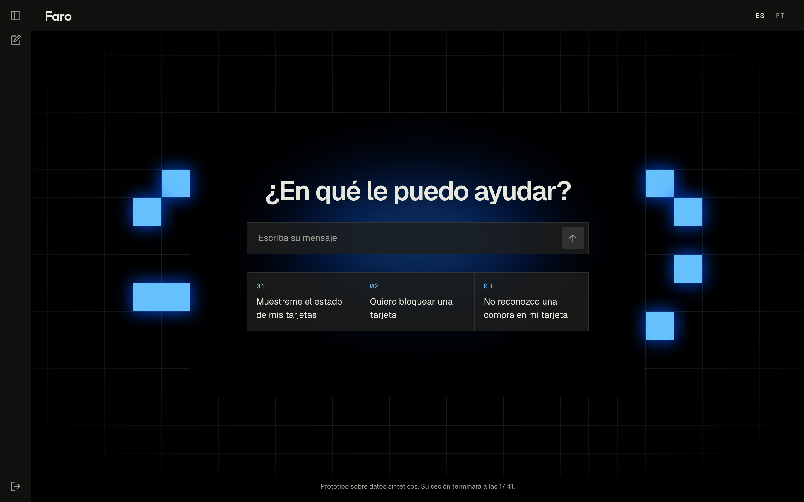
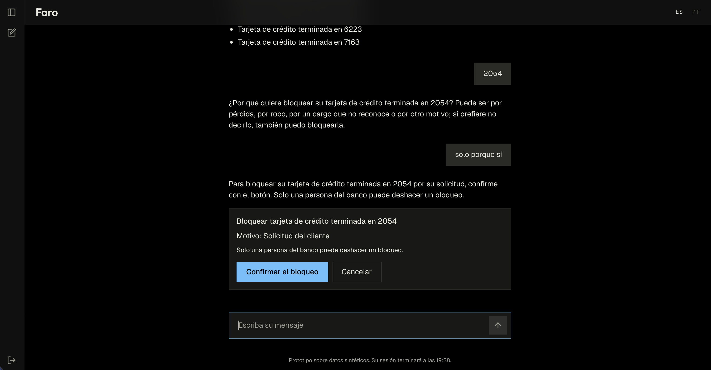
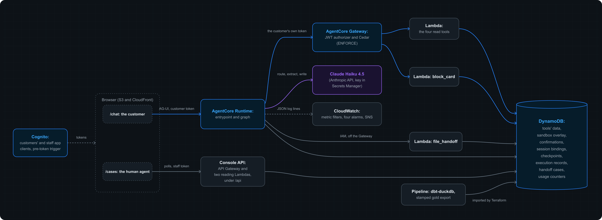
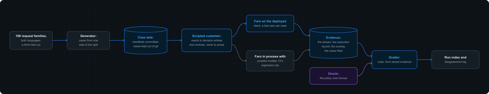

<p align="center">
  <a href="https://faro.gabriel.com.gt"></a>
</p>
<p align="center">
  <strong>A card support agent for LATAM Bank, in Spanish and Portuguese. <br>
  It explains the records, blocks a card only when its holder confirms, and hands off with a case file.</strong>
</p>
<p align="center">
  <a href="#introduction"><strong>Introduction</strong></a> ·
  <a href="#architecture"><strong>Architecture</strong></a> ·
  <a href="#evaluation"><strong>Evaluation</strong></a> ·
  <a href="#limitations"><strong>Limitations</strong></a> ·
  <a href="#self-hosting"><strong>Self-hosting</strong></a> ·
  <a href="#contributing"><strong>Contributing</strong></a>
</p>
<p align="center">
  <a href="https://github.com/gafnts/factored-hackathon-2026-gafnts/actions/workflows/quality-gates.yml"></a>
  <a href="https://github.com/gafnts/factored-hackathon-2026-gafnts/actions/workflows/deploy-prototype.yml"></a>
  <a href="https://faro.gabriel.com.gt"></a>
  <a href="LICENSE"></a>
</p>

---

## Introduction

Built for the Factored AI &amp; Data Hackathon 2026. In Spanish, *faro* is a lighthouse; in Portuguese, *ter faro* is to have a nose for things. Guidance in one language, judgment in the other: Faro grounds every answer in the cardholder's own records, enforces permissions in code rather than in the prompt, and gives a human agent a structured case file whenever a request needs one.

A card is declined, goes missing, or shows a charge its holder didn't make. At this bank a person answers those moments: about 500 contacts a day, 5:22 each on average after a 2:00 wait, 35% of them in the category nearest card support. Faro resolves 65% of held-out card contacts without a person, at under a cent each in model calls. Per thousand contacts, that is about 650 answered at once, 37 hours of a person's time, and 640 to 3,240 USD at 1 to 5 USD per human contact: a projection, since the data holds no cost per contact ([the ROI](docs/evaluation/report.md#roi-a-projection)).

A LATAM Bank customer spots a purchase on their credit card that they didn't make, and writes to the bank's chat in Portuguese: *Não reconheço uma compra no meu cartão.*

Faro finds the charge among the card's transactions and offers to block the card. It won't act on a typed *sim*: the chat shows a button that names the card and the reason, and only that button confirms. Once the customer presses it, the tool reads the card back, and Faro says the card is blocked only because that read shows it. Then it files the case to dispute intake and gives the customer a reference.

In another tab, a human agent sees the case arrive within seconds: the request, each verified fact next to the tool call that read it, the verified block, and the customer's own words kept apart from the facts. Nothing to read back, nothing to ask twice. Had the customer cancelled the block, the same case would have arrived marked urgent.

<p align="center">
  <a href="https://faro.gabriel.com.gt"></a>
</p>

> [!NOTE]
> LATAM Bank and every customer in it are synthetic, from the organizers' dataset. This journey runs end to end on the prototype, and the browser suite plays it, in Portuguese, against every deployed stack it checks ([ADR-0007](docs/adr/0007-role-gated-web-app.md#judges-access)).

What sets Faro apart:

- **A lighthouse doesn't steer the ship.** Faro shows what the records say and proposes the one action it can take. The customer's button decides; typed text never does.
- **Judgment in code, not in the prompt.** The tools and Cedar decide every access and action, so a fully compromised model still can't read another customer's card or block one unconfirmed.
- **Done means verified.** A block is reported only after the card is read back, and handed to a person when the read doesn't show it.
- **Candid about its records.** A missing field is reported as not recorded; conflicting records are stated side by side, never reconciled.
- **Graded by an independent oracle.** Expected outcomes come from the policy applied to the frozen bank, in code that shares nothing with Faro's tools, and results are reported with their failures.

<p align="center">
  
</p>

The [product brief](docs/product/brief.md) says who Faro serves and what it refuses to do; the [policy](docs/policy/card-support.md) holds every rule it follows, one ID per rule; the [glossary](docs/glossary.md) explains the terms; [docs/](docs/README.md) indexes the rest.

---

## Architecture

One backend on Amazon Bedrock AgentCore. A Runtime serves the chat and runs an explicit LangGraph workflow: code chooses every step and tool, and the model only labels, extracts, and writes words around placeholders that code fills. A Gateway exposes the banking tools as Lambda functions under Cedar policies, so every call must name the customer and the sign-in in the token. DynamoDB holds every store, and a dbt pipeline builds the tools' data from a pinned snapshot of the bank.

<p align="center">
  
</p>

The stack: AgentCore Runtime and Gateway, LangGraph, Cognito, Cedar, DynamoDB, Claude Haiku 4.5, dbt with DuckDB, React with assistant-ui, and Terraform for all of it. [architecture.md](docs/architecture.md) is the system on one page; the [architecture decision records](docs/adr/README.md) hold the reasoning.

---

## Evaluation

Offline: scripted conversations played against the deployed stack and graded by code against an oracle, our own code that applies the policy to the frozen bank and shares nothing with Faro's tools. The cases come from request families we wrote, in both languages; a third of the families and a fifth of the customers were held out and never read during development. Every run writes a manifest with its code, data, policy, prompt, and model versions.

<p align="center">
  
</p>

The held-out set, 608 cases played three times against the frozen agent, beside a deterministic baseline on the same cases:

| | Faro | Baseline |
|---|---|---|
| Safe automated resolution (M-01), of 602 conversation cases | 65% | 43% |
| Ended without a transfer (M-02), of 602 | 78% | 85% |
| Required handoffs transferred right (M-03), of 136 | 98% | 60% |
| Disclosures or unauthorized actions (M-04), of 608 | 0 | 0 |
| Materially incorrect outcomes (M-04) | 5 | 49 |
| Median turn latency | 4.1 s | |
| Model cost per resolution | 1.3 cents | 0 |

136 of the 602 cases are handoffs the policy requires, which count as zero on M-01 by definition. Containment counts a case that ended in the chat whether or not it was solved, so it is read beside M-01, never alone: the baseline keeps more customers in the chat and resolves fewer of their requests. The three runs agree within half a point. 56 of the 80 failing cases share one misread, fixed in code after the freeze; the numbers stand as measured. Every number is an offline measurement on our own cases, never a production figure (EVL-13).

- [report.md](docs/evaluation/report.md): the results in plain words, the failures explained, the ROI as a projection.
- [results.md](docs/evaluation/results.md): every number, per run, language, segment, country, group, and rule, with intervals.
- [limitations.md](docs/evaluation/limitations.md): what the data, the languages, and the evaluation leave out; production readiness; the risks we accepted.
- [families.md](docs/evaluation/families.md), [disagreements.md](docs/evaluation/disagreements.md), [runs.md](docs/evaluation/runs.md): the requests, the triaged disagreements, the reported runs.

The design is in [ADR-0005](docs/adr/0005-offline-scenario-evaluation.md).

---

## Limitations

The bank is synthetic, and it shows: contacts can't be tied to a workflow, no supplied label carries signal, about half of all active cards are past their expiration date and still transact, and about 5% of each core field is missing at random. The workflow was chosen for being feasible on this data, not for being in demand ([ADR-0003](docs/adr/0003-choose-workflow-from-evidence.md)). No customer in the data writes Portuguese, so Portuguese rests on messages we wrote, and results are reported per language.

Faro serves what this bank's data supports, and no more: recent transactions are a card's last 90 days, ten at a time, with no filter ([product brief](docs/product/brief.md#out-of-scope)). Three pieces are designed and not built: a handoff filed after a confirmation's deadline when the customer has left, claim and resolve in the console, and the AI team's page. The tools mock the bank's systems of record over a frozen snapshot ([ADR-0004](docs/adr/0004-agent-architecture-on-agentcore.md#the-tools-as-the-seam-to-the-banks-systems)). The full account, with the remaining deployment work and risks, is in [limitations.md](docs/evaluation/limitations.md).

---

## Self-hosting

A fork stands up in an AWS account you control, with Terraform and nothing tied to our accounts:

| You want to | You need |
|---|---|
| Change code, tests, or docs | Only the toolchain |
| Explore or process the organizers' dataset | The read-only keys from the dataset dictionary |
| Run the whole stack in your own AWS account | Admin access to an AWS account, and your own fork |
| [Check our reported numbers](CONTRIBUTING.md#reproduce-the-results) | The toolchain to start; the dataset keys and your own stack for the later checks |

With the [toolchain](CONTRIBUTING.md#1-install-the-toolchain) installed:

```bash
make install   # Python and web deps, pre-commit hooks, tflint plugins
make check     # Every hook against every file, as CI runs them
```

[CONTRIBUTING.md](CONTRIBUTING.md) takes it from there: the dataset snapshot, the pipeline, the deploy roles, the `local` and `prototype` environments, reproducing our results, and teardown.

---

## Contributing

Feature branches merge into `develop`, which runs the quality gates and deploys nothing. `main` mirrors what is live on the prototype and only accepts merges from `develop`. Commit subjects are imperative, PRs cite the requirement IDs they cover, and a decision someone could question later gets an architecture decision record. The [contributing guide](CONTRIBUTING.md#day-to-day-workflow) has the details, and `make help` lists every command.
