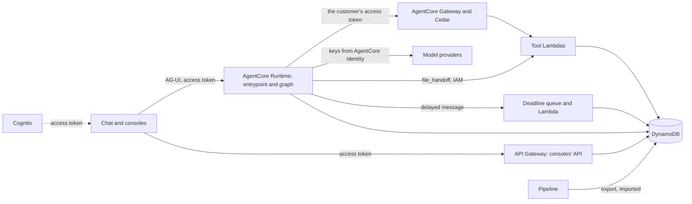
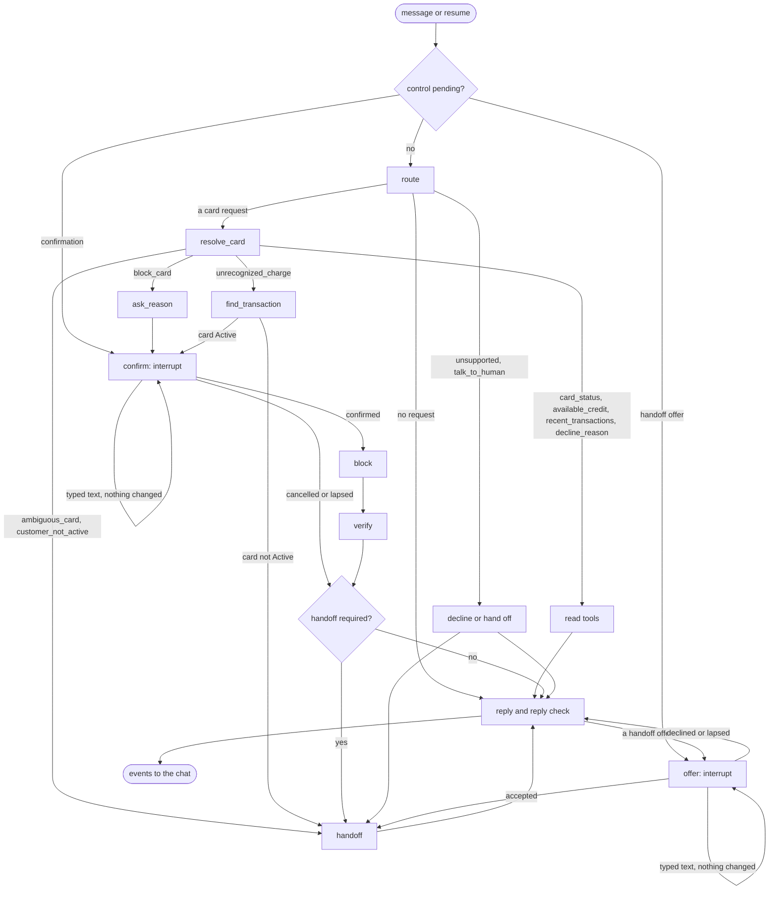

# ADR-0004: Explicit LangGraph workflow on AgentCore, with policy enforced in Gateway tools and Cedar

## Status

Proposed (2026-09-27).

Some decisions are still open. Each is marked **Open** where it arises and listed under [Open decisions](#open-decisions) with the option we lean towards, which the rest of this record assumes; we settle them before accepting it. What only a deployed stack can show is listed under [To verify on the first deploy](#to-verify-on-the-first-deploy).

## Context

The [card support policy](../policy/card-support.md) says what the agent does (POL-01 to POL-51). This record says what runs where, so that every rule is enforced in code, outside the model's prose (CTL-04). Eight forces shape it:

- **The judges will attack the deployed tool.** Prompt injection, impersonation with a customer number, reading another customer's records, and reusing an expired session are the obvious tries ([Reading between the lines](../hackathon-requirements.md#reading-between-the-lines)). Identity (SEC-04), record isolation (SEC-05), and confirmation (CTL-02) must hold even when the model is fully compromised.
- **The model is the least trusted part we run.** It reads text written by the customer and by the bank's records (a merchant name, for example), and either can carry instructions (POL-10).
- **The bank is frozen.** The snapshot is the bank at business date 2026-06-17, read as of 2026-06-18 06:00 ([ADR-0003](0003-choose-workflow-from-evidence.md)); sessions, tokens, and logs live on the wall clock.
- **The bank's systems are simulated.** Mock banking tools are allowed only with documented contracts and limitations (SEC-06), money never moves (SEC-07), and the submission must give an honest account of what production would take (SCP-08, OPS-11). The tools' data and the sandbox stand in for the bank's systems of record, so what they mock and where they fall short must be written down, and replacing them must not reach past the tools.
- **Frontier models are reachable only through their providers here.** Bedrock blocks them on this account (S1), so the agent calls the Anthropic, OpenAI, and Google APIs. The organizers permit any tools ("You're free to use any language and/or set of tools you deem necessary!", SL 19; SEC-01), and SEC-03 itself expects external model requests, forbidding only private customer records, credentials, and restricted data in them. The dataset holds none: the organizers' dataset summary calls it "completely synthetic data generated for educational purposes. No real customer information is included." (p. 5; SEC-02). That is the one reason these calls are acceptable. A bank wouldn't send customer data to third-party APIs; a real deployment would reach the same models through the bank's own cloud accounts (Bedrock, in-region).
- **A fork must stand up without us** (OPS-07): Terraform only, nothing tied to our own accounts. The pinned AWS provider (6.66.0) covers every AgentCore resource used here.
- **The load is small.** The prototype serves a few judges at a time and evaluation runs of a few hundred cases, and even every contact the bank's contact center takes, sent to the agent, would peak at a few dozen runtime sessions ([traffic analysis](../analysis/traffic.md), a projection). Capacity limits are explained, not engineered away (OPS-08).
- **The stack is settled** (2026-09-27): AgentCore Runtime running an explicit LangGraph graph, assistant-ui over AG-UI, Cognito with one group per role, AgentCore Gateway with Lambda tools and Cedar policies. LangSmith is optional, and the evaluation runs without it.

Five spikes (S1 to S5) tested the risky pieces before this record was written. Their code isn't part of this repository, so their findings are recorded here, in [Spike findings](#spike-findings).

## Decision

Build one backend on AgentCore. A Runtime serves the chat over AG-UI and runs an explicit LangGraph graph; a Gateway exposes Lambda tools under Cedar policies; DynamoDB holds the tools' data, the sandbox, the confirmations, the checkpoints, and the records (decisions 1 to 3). The model classifies, extracts, and writes. Code decides every step, and the tools and Cedar decide every access and action (AI-04, CTL-04).

### Components

| Component | Runs on | Does | Trusted with |
|---|---|---|---|
| Customer chat | assistant-ui (`useAgUiRuntime`), static files on S3 and CloudFront | Signs in, sends messages, renders replies and the confirm and handoff controls from structured events | Nothing: the server checks everything it sends |
| Consoles | The same site; API Gateway and Lambda behind a JWT authorizer that accepts staff tokens only ([ADR-0007](0007-role-gated-web-app.md)) | The human agent's handoff queue, where each handoff is read with its evidence, then claimed and resolved; the AI team's page, which shows the evaluation report | Reading, by Cognito group, and a handoff's status |
| Identity | Cognito user pool (Essentials tier), one group per role, and one app client for customers and one for staff | Signs people in; a pre-token trigger copies the admin-written `custom:customer_id` into the access token, and refuses a token when the app client doesn't match the user's group ([ADR-0007](0007-role-gated-web-app.md#sign-in)) | Who the customer is |
| Agent | AgentCore Runtime: AG-UI mode, direct code deployment, Python 3.13 | The entrypoint (checks before the graph) and the graph | The conversation; never the last check on access or actions |
| Tool access | AgentCore Gateway (MCP, JWT authorizer) with a Cedar policy engine in `ENFORCE` mode | Validates the customer's token again and checks that every call names the token's customer and sign-in | Record isolation |
| Tools | Three Lambda functions, split by what they may write: two behind the Gateway (the reads, the block), and `file_handoff`, which the Runtime invokes directly | Reads, the block, filing a handoff | The policy's hard rules |
| Deadline handoffs | An SQS queue with delayed messages, and a Lambda | Files, after a confirmation's deadline, a draft handoff still owed: the customer left, or the turn failed (decision 7) | Lapsing a pending confirmation and filing a draft still owed |
| Stores | DynamoDB, on demand | The tools' data (read-only to them), the sandbox overlay, confirmations, session bindings, checkpoints, execution records, handoffs, usage counters | State; IAM limits who writes what |
| Pipeline | dbt-core with dbt-duckdb, run by `make` ([ADR-0006](0006-batch-medallion-pipeline.md)) | Builds the tools' data from the pinned snapshot and exports it, stamped | What the tools can see at all |
| Models | The providers' APIs; keys in AgentCore Identity | Routing, extraction, replies, handoff text | Nothing |

Access and actions are decided by two layers that don't trust the one above them. Cedar checks that each tool call names the customer in the token, and each tool checks the rest: the card's status, the confirmation, the window. The graph can route wrongly without a customer seeing another's records or a card being blocked unconfirmed, and the model can answer wrongly without the graph taking a step the policy doesn't allow. The line between them: access and actions live in the tools and Cedar, where they hold even if the graph is wrong; conversation rules (which card, when to ask, when to hand off) live in the graph's code; and nothing is left to the prompt.

### A turn, end to end

1. The chat sends the customer's message to the Runtime's AG-UI endpoint with the Cognito access token, the conversation's thread ID, and the runtime session ID it keeps for the sign-in.
2. The Runtime's JWT authorizer turns away a missing, expired, or foreign token before our code runs (401 with an AG-UI `RUN_ERROR`, S4). It checks the issuer and the customers' app client, whose tokens the pre-token trigger issues to customers only, so a staff member's token never reaches the agent, and it can also require a claim, which we set to the customer group on the first deploy (`cognito:groups`; documented, not yet tried).
3. The entrypoint, before the graph:
   1. reads `sub`, `customer_id`, and `origin_jti` from the token the Runtime already validated, and refuses a token without `customer_id`;
   2. binds the runtime session ID to `sub` and refuses a request from anyone else ([Threads and runtime sessions](#threads-and-runtime-sessions));
   3. replaces the client's thread ID with a key derived from `sub`;
   4. masks card numbers in the incoming text ([Card numbers](#card-numbers));
   5. turns a typed message sent while a confirmation or a handoff offer is pending into a structured resume ([The confirmation](#the-confirmation));
   6. fetches the model key from AgentCore Identity and keeps the token, the key, and the claims in context variables, never in the graph's config, because LangGraph writes `configurable` values into checkpoints (S4);
   7. opens the turn's execution record.
4. The graph runs, calling the reads and the block through the Gateway with the customer's own access token, and filing any handoff through `file_handoff`, which the Runtime invokes directly ([Where the tools run](#the-graph)).
5. The Gateway validates the token, Cedar checks `customer_id`, and the Lambda answers from the tools' data and the sign-in's overlay.
6. Replies go back as AG-UI events, limited to what the chat renders ([What the chat receives](#what-the-chat-receives)); the wrapper's raw LangChain events are turned off, since they double the stream and expose internals (S4).

The execution record holds every model call (model, prompt version, tokens, latency, cost), tool call, decision, interrupt, and resume, stamped with the sign-in, thread, role, source (demo or evaluation), business date, and the policy, prompt, schema, and snapshot versions. It is the system's own trace, its audit log (OPS-02), and the evaluation's source (ADR-0005). Each turn ends with a decision entry, written before the run's last event: the turn's outcome class (answer, clarify, abstain, decline, block, or hand off) and what the agent waits for next, if anything (which card, a reason, the confirm control, or the handoff control). The evaluation's scripted customer reacts to that entry, never to the reply's prose. Demo users are created by an admin script from development-split personas; their credentials reach the judges with the submission, never the repository.

### The graph

**A workflow with model steps.** In the engineering sense the graph is a workflow, not an agent: code decides the control flow, and the model never picks the next step, a tool, or when to stop. The model classifies, extracts among the values a step allows, and writes. We still call the system an agent in the product sense: a customer service agent that holds a conversation over several turns, keeps its state, and acts on the bank by blocking a card. The agency left to the model is the router's label and the extraction's choice among allowed values.

We chose code over an open loop because the policy is explicit and the requests fit eight labels (DSN-03, DSN-05); a loop would add flexibility only where the policy declines. The graph buys conversation rules that tests cite (CTL-04), an injection that can at worst mislabel or misextract within typed outputs, outcomes that are correct and not only safe (M-01, M-03), evaluation and model comparison per node, and a bounded cost and latency per turn (M-05). It doesn't buy access or the block: Cedar and the tools hold those whatever runs above them, so a loop over the same tools would keep customers apart too ([Alternatives considered](#alternatives-considered)). ADR-0005's optional [naive agent](0005-offline-scenario-evaluation.md#the-naive-agent) measures the difference.

An explicit `StateGraph`, with no prebuilt agent loop: code chooses each tool from the label, and the model fills only the fields a node asks for, through structured output. It is used in four places:

- **Routing** a new request to the eight labels (POL-04 to POL-06). The router returns every supported request it finds, plus a separate yes or no on whether the message holds one at all, because a choice over labels alone picks the least bad label even for a greeting (S5). Code applies POL-05's order and queues the rest.
- **Extraction:** card hints (type, last four digits), a block reason, a date phrase, and which listed transaction the customer means, each constrained to the values the step allows (a transaction ID from the tool's result, "none", or "several").
- **Replies,** written from the turn's tool results in the conversation's language.
- **Handoff text:** the payload's three free-text fields.

Everything else is code: which tool runs and with which `customer_id` (always the token's), when to ask, abstain, decline, block, or hand off, the reply language, the question count, and the retries.

| Node | Kind | Does | Rules |
|---|---|---|---|
| `route` | Model, code | Labels new requests, orders several, tracks the language | POL-04 to POL-06, POL-50, POL-51 |
| `resolve_card` | Tool, extraction, code | Matches what the customer said to their cards; asks, lists, or hands off | POL-12 to POL-17 |
| read tools | Tool, code | Call the label's tool; keep fields the model mustn't see away from it | POL-01, POL-02, POL-18 to POL-32 |
| `find_transaction` | Tool, extraction | Lists the window's candidates; the model may pick one listed ID, "none", or "several" | POL-27, POL-39 |
| `ask_reason` | Code | Asks for a block reason, in fixed text | POL-35 |
| `confirm` | Code, interrupt | Creates the confirmation, shows the control, waits | POL-36 |
| `offer` | Code, interrupt | Shows the handoff control after the reply that offers a handoff, waits | POL-45 |
| `block` | Tool | Uses the confirmation: writes, reads back, retries | POL-33, POL-34, POL-37 |
| `verify` | Tool | Reads the card again for the reply's and the handoff's evidence | POL-37 |
| `handoff` | Code, model, tool | Builds, validates, and files the payload | POL-45 to POL-47 |
| `reply` | Model, code | Writes the reply with placeholders, fills them, adds the outcomes' fixed text, and checks it | POL-11, POL-18, POL-20, POL-37, POL-45 |

**Offered handoffs** (POL-17, POL-24, POL-31, POL-32, POL-36, POL-38, POL-42, POL-48) come with the handoff control (POL-45). After the reply that offers one, `offer` interrupts with `{kind: "handoff_offer", offer_id, reason_code}`, and the chat renders the control from it in fixed text, as it does the confirm control. Only the control's resume, `{kind: "accept" | "decline", offer_id}`, answers it, and `offer` takes it only when the ID is the thread's pending offer and the request comes from the sign-in that saw it. Typed text arrives as a `message` resume, as during a confirmation: a new request ends the offer and goes to the router, and anything else shows the control again. The offer lives in the graph's private state, not in a table, since no tool acts on it: accepting it runs `handoff`. When POL-36 offers a handoff while its confirmation is pending, one interrupt carries both controls, and accepting the handoff ends the confirmation unused.

**Tools.** Every tool takes `customer_id` and the sign-in (`origin_jti`), both filled by the graph from the token, never by the model. The sign-in chooses the overlay a tool reads and writes, and Cedar checks it against the token as it checks `customer_id` (to verify on the first deploy):

| Tool | Returns |
|---|---|
| `list_cards` | The customer's cards (type, last four digits, status, conflict flags), and whether the customer is served in full, without naming a status the policy withholds (POL-12) |
| `get_card` | One card's status, expiration, and conflict flags, the overlay read over the tools' data |
| `get_available_credit` | Available credit, or zero and the amount over the limit, or the reason there is no figure |
| `find_transactions` | The 90-day window, newest first, 10 at a time with a cursor; a code's meaning only on a `Declined` transaction; never `is_fraud` |
| `block_card` | The block's verified outcome, with the read-back as evidence (it also takes the card, the reason, and the confirmation) |
| `file_handoff` | The handoff's reference and the `is_fraud` facts it added, after checking the payload's customer against the token and validating the payload against the schema; off the Gateway, invoked by the Runtime |

**Where the tools run.** Three Lambda functions, split by what they may write: one serves the four read tools, one `block_card`, and one `file_handoff`. The first two are Gateway targets that declare their tools, and each handler dispatches on the name the Gateway passes in the invocation's client context (`bedrockAgentCoreToolName`, as `<target>___<tool>`; spike S3's Lambda read it). Cedar's actions stay per tool, so each tool is still permitted or denied on its own. One function could serve every tool, but it would carry every tool's write permissions, and the read tools would no longer be read-only ([access controls](#operations)). The three share one package: the tools' logic is a library over a store interface, and the handlers wrap it, so the tests and ADR-0005's harness call the same code the Gateway and the Runtime do.

**The Gateway holds only what a customer may do alone.** The customer's access token lives in their browser ([ADR-0007](0007-role-gated-web-app.md)), and the Gateway accepts it, so a customer can call its tools without the agent; Cedar can't tell those calls from the agent's, which carry the same token. Every tool on the Gateway is therefore safe to call that way: the reads return only what the customer may see, never `is_fraud`, and `block_card` acts only on a confirmation that the Runtime alone brings to `confirmed`. Filing a handoff isn't: a customer could put a forged case, with made-up verified facts, in a human agent's queue. So `file_handoff` is off the Gateway, a Lambda that the Runtime invokes with its IAM role, which no customer holds. The Runtime forwards the customer's token, and the Lambda validates it and checks that the payload's `customer_id` is the token's, so the check Cedar makes on the other tools still happens below the graph. The same Lambda reads `is_fraud` from the tools' data for each transaction the payload names and adds it as a verified fact, with that read as its evidence. It returns the reference and the facts it added, which the execution record keeps as that call's result; the graph's state, the model, and the chat never see them (POL-40).

**Retries and denials** (OPS-04 to OPS-06). Read nodes retry a failed call up to two more times (a node retry policy of three attempts), then offer `tool_failure` (POL-48). Model calls retry the same way, after the provider's `retry-after` or a jittered backoff (decision 18), and one that still fails ends the turn with a fixed reply and the same offer, since the model can't write it. A Cedar denial arrives as HTTP 200 carrying JSON-RPC error `-32002` (spike S3). It isn't a failure: it is never retried and becomes a refusal (POL-49).

**Facts and outcomes in replies.** The model writes a reply's words, never its figures or its account of an action (**Open**, decision 8):

- **Facts as placeholders.** Code formats every fact for the conversation's language and the customer's country, and the model sees each under a name (`{credit.available}`, `{card.expiration}`), never its value. It writes the names, and code fills them in. A figure can then appear only beside the fact that holds it, which a check over numbers alone can't ensure: the right amount stated for the wrong card would pass it (POL-18, AI-03).
- **Outcomes in fixed text.** Whether a card was blocked, whether the block was verified, and a handoff's reference reach the customer in fixed sentences in the conversation's language, which code chooses from the tool's result and the confirmation record; the model's words never report an action (AI-05, POL-37, POL-45).
- **The reply check.** Before a reply leaves the graph, code checks it: every placeholder names one of the turn's facts, no number stands outside a filled placeholder (the window, the page size, and counts are facts too), and the reply holds no run of 13 or more digits, no `is_fraud` or `fraud_score` value, and no customer status the policy withholds. A reply that fails is replaced by a fixed one built from the same facts (OPS-05), and the failure is recorded. How often replies fall back is monitored and reported by the evaluation, since a strict check trades wording for safety. The check needs the whole reply, so replies are sent once written rather than token by token.

### The confirmation

A block needs a confirmation record that the server creates when the graph reaches `confirm`; the block tool refuses to act without one (POL-36, CTL-02). No tool the model sees and no output it writes reaches the record, so the model can't create, resolve, or use a confirmation.

| Field | Holds |
|---|---|
| `confirmation_id` | A random UUID, never shown to the model |
| `thread`, `sub`, `origin_jti` | The conversation, the user, and the sign-in (Cognito's `origin_jti` is tied to the sign-in's refresh token, so it survives token refreshes and changes at the next sign-in; to verify on the first deploy) |
| `customer_id`, `card_id`, `reason` | What the customer confirms, from verified state |
| `status` | `pending`, then `confirmed` and `consumed`, or `cancelled` or `lapsed`, with what lapsed it (a message or the time limit) |
| `expires_at` | Wall clock, five minutes after creation (**Open**, decision 10) |
| `confirmed_at`, `attempts`, `outcome` | When the control confirmed it, how many writes the block made, and whether the read-back showed `Blocked` |

- **Created** by `confirm`, with a conditional put, before it interrupts with `{kind: "block_confirmation", confirmation_id, card: {type, last_four}, reason, expires_at}`. The chat renders the control from that payload, with fixed text in the conversation's language, so the model writes nothing the control says. A thread has at most one pending confirmation.
- **Confirmed or cancelled** only by the control, which resumes the run with `{kind: "confirm" | "cancel", confirmation_id}` through AG-UI's `RunAgentInput.resume` (`ag-ui-langgraph` turns it into LangGraph's `Command(resume=...)`). `confirm` accepts it only when the ID is the thread's pending one, the record's `thread`, `sub`, and `origin_jti` match the request, and it hasn't expired; a conditional update then records the answer. A stale control (a confirmation cancelled, lapsed, used, or from an earlier sign-in) changes nothing, and the chat disables controls whose confirmation is no longer pending.
- **Typed text never confirms.** `ag-ui-langgraph` 0.0.45 answers a new message on a thread paused at an interrupt, sent without a resume, by re-emitting the interrupt and ending the run, so the message never reaches the graph or the checkpoint (read in its `prepare_stream`). The entrypoint therefore turns such a message into a resume of kind `message` that carries the masked text, and `confirm` applies POL-36. A new request, or another card or reason, lapses the record and moves on, to the router or to a new confirmation; anything else, a typed yes included, shows the control again, and the second time also offers a handoff, unless POL-39 already requires one. Typed text can end a confirmation, and only the control can grant one.
- **Used** by the block tool, whose call carries `confirmation_id` with the card and the reason, all filled by the graph. In one DynamoDB transaction, the tool moves the record from `confirmed` to `consumed`, on the condition that the customer, card, and reason match and the record hasn't expired, and writes `Blocked` to the overlay of the confirmation's sign-in, whatever sign-in the call names. It then reads the overlay back with a strongly consistent read; if that doesn't show `Blocked`, it writes and reads again, up to three writes in all (POL-37), counts them in `attempts`, and records the `outcome`. A second call with the same confirmation writes nothing unless the first left no outcome (a crash mid-call); then it reads first and continues within the same three writes. No confirmation blocks twice, and no block runs without one.
- **Lapsed** also when the time limit passes (the next request, or the deadline Lambda of decision 7, finds it expired) or the sign-in ends, which the record's `origin_jti` and expiry make checkable.

The guarantee against a block the customer didn't confirm rests on the Runtime's code, which the tests cover, and not on IAM: the Runtime's role can write the record, the deadline Lambda's can lapse one, and the evaluation harness's can write one for ADR-0005's naive agent only. What no longer matters is the model.

**A required handoff after a wait.** Two rules require a handoff once a confirmation ends, even when the customer has left: POL-39 after the block offered for an unrecognized charge, however the offer ends, and POL-38 after a `lost` or `stolen` block whose confirmation lapses unused at its time limit or with the session (`block_lapsed`). A customer who leaves while the control is pending would otherwise leave no handoff, and so would a turn that fails after the customer's answer. **Open** (decision 7), lean: when `confirm` shows either, it also saves a draft handoff with everything code knows, and sends a message to an SQS queue delayed until a minute after the confirmation's deadline, so that a turn still running then finishes first (SQS delays reach 15 minutes).

- **The Runtime files the draft** when its turn ends in a handoff the policy requires: POL-39's, or POL-37's for a block that isn't verified.
- **A Lambda reading the queue files any draft still owed.** It lapses the confirmation if it is still pending, reads the card back itself, as `verify` does, and decides from the confirmation record, which the control's answer and the block write as they happen. A POL-39 draft is filed however the confirmation ended, with the block's outcome, that read as its evidence, and the priority POL-47 gives. A `lost` or `stolen` draft is filed unless the customer cancelled, moved on with a new request, or the card reads back `Blocked`: as `block_lapsed` if the block was never confirmed, and as `action_not_verified` if it was. Its free text is fixed.
- **Each case is filed once.** The Runtime and the Lambda file through the same conditional update from `draft` to `filed`; the Runtime, if second, gives the filed case's reference. A draft that no one files expires with the table's time to live.

A customer who returns after the deadline hears that the card wasn't blocked and that the case is with a person. POL-44's one question is optional, so the graph hands those off at once and needs no deadline.

### Where each rule is enforced

Each rule's enforcement point, with the prompt never among them. The places are Cognito, the Runtime's and the Gateway's JWT authorizers, the entrypoint, the graph, the deadline Lambda (decision 7), the tools, Cedar, the pipeline, and the frontend. Every rule gets at least one test that cites its ID, and evaluation cases cite the rules they exercise (ADR-0005).

| Rule | Enforced in | How |
|---|---|---|
| POL-01 | Tool | The card tools return `product_status`; `get_available_credit` computes the figure |
| POL-02 | Tool | A fixed table maps `05`, `14`, `51`, and `54` to their meanings; any other or missing code gets none |
| POL-03 | Tool, Cedar | `block_card` requires an `Active` card, the token's customer (Cedar), and a confirmed confirmation; the read-back decides the reply |
| POL-04 | Graph | The router's output type holds the eight labels only; code picks outcomes after the tools answer |
| POL-05 | Graph | Code orders the requests the router finds and queues the rest |
| POL-06 | Graph, entrypoint | A pending question routes the answer to the node that asked; typed text during a confirmation or a handoff offer becomes a `message` resume |
| POL-07 | Cognito, entrypoint, graph, Cedar | `customer_id` comes only from the admin-written claim, and the entrypoint refuses a token without it; the graph fills every tool's `customer_id` from it; Cedar denies any other |
| POL-08 | Cedar, tool | Cedar denies another customer's ID; tools look up records under the caller's customer only, so another's card reads as not found; `file_handoff`, off the Gateway, checks the payload's customer against the forwarded token |
| POL-09 | Authorizers, frontend, graph | Both JWT authorizers reject an expired token; the chat asks the customer to sign in; `confirm` and `offer` refuse a resume from another sign-in, and `confirm` one after the confirmation expires |
| POL-10 | Graph, tool | No rule lives in text: the model picks no tool and no customer, its outputs are typed, and tool results reach it as data |
| POL-11 | Pipeline, entrypoint, graph, tool | The tools' data holds last four digits only; the entrypoint masks typed numbers; the reply check and the handoff schema reject runs of 13 or more digits; the chat's stream carries no private state |
| POL-12 | Tool, graph | For a `Closed` or `Suspended` customer, `get_available_credit` and `find_transactions` refuse, while `list_cards` and `get_card`, which a block needs, mark the customer as restricted without naming the status; the graph hands off everything but a block |
| POL-13 | Graph, tool | Code matches extracted hints against `list_cards` |
| POL-14 | Graph | Code asks, listing the cards that fit |
| POL-15 | Graph | Code compares the types of cards that share the last four digits |
| POL-16 | Graph | Code lists the customer's cards |
| POL-17 | Graph | A question counter in state |
| POL-18 | Tool, graph | Tools compute every figure; the model writes placeholders that code fills, and the reply check accepts no other number |
| POL-19 | Tool, graph | The business clock comes from the published data, never the system clock; code resolves the extracted date phrase against it |
| POL-20 | Pipeline, tool | `amount_usd` isn't published; every amount carries its currency code |
| POL-21 | Tool | `get_card` returns these fields |
| POL-22 | Tool | `get_available_credit` gives no figure for a debit or inactive card, with the reason |
| POL-23 | Tool | Zero available, and the amount over the limit |
| POL-24 | Tool, graph | "Limit not recorded"; the graph offers `missing_data` |
| POL-25 | Tool | The window, order, and page size are fixed in `find_transactions` |
| POL-26 | Pipeline | `last_transaction_date` isn't published |
| POL-27 | Tool, graph | The tool returns the window's candidates; the model may pick only a listed ID; code lists the newest five when several fit |
| POL-28 | Tool | A code's meaning only on `Declined` |
| POL-29 | Tool | The meaning table is the only explanation offered; ADR-0005's judge checks replies for added causes |
| POL-30 | Pipeline, tool | Conflict flags computed in the pipeline travel with the record, and the tools return both facts |
| POL-31 | Graph | `record_conflict` is offered only when the customer asks |
| POL-32 | Tool, graph | A missing field comes back as not recorded; the graph abstains and offers `missing_data` |
| POL-33 | Tool, pipeline | `block_card` writes only the overlay; the tools' data is written only by Terraform's import of a gold export, into a new table |
| POL-34 | Tool | `block_card` reads the status, overlay over data, before writing |
| POL-35 | Tool, graph | The reason is an enum on the tool and the confirmation; the graph asks for it |
| POL-36 | Graph, entrypoint, tool, frontend | The confirmation record and interrupt; typed text as a `message` resume; the tool requires and uses the record; the chat renders the control from the payload |
| POL-37 | Tool, graph | Three writes at most under one confirmation, each after a read-back; the graph hands off `action_not_verified` |
| POL-38 | Graph, deadline Lambda | Offers the handoff after a verified `lost` or `stolen` block; files `block_lapsed` when such a block's confirmation lapses unused (decision 7) |
| POL-39 | Graph, deadline Lambda | The offer, then one required handoff, which records a block not verified or a read that failed, with the deadline of decision 7 |
| POL-40 | Pipeline, tool | `fraud_score` isn't published; no Gateway tool returns `is_fraud`, and only `file_handoff` reads it, into the case |
| POL-41 | Graph, tool | Hands off; no unblock tool exists |
| POL-42 | Graph | Declines with the reason and offers the handoff |
| POL-43 | Graph, tool | Declines; no tool reads accounts or loans |
| POL-44 | Graph | Hands off at once |
| POL-45 | Graph, entrypoint, frontend | Required or offered, from a table in code; an offer is accepted only through the handoff control's resume; the reply gives the handoff's reference in fixed text |
| POL-46 | Graph, tool | Code builds the payload; the graph and `file_handoff` validate it against the schema |
| POL-47 | Graph, tool | Code sets the queue and priority; the schema ties the queue to the reason code |
| POL-48 | Graph | Three attempts per read or model call, then `tool_failure` offered in fixed text |
| POL-49 | Graph | JSON-RPC `-32002` is classified as a denial and never retried |
| POL-50 | Graph | Code identifies each message's language with a confidence threshold, keeps the conversation's language otherwise, and sets it for the reply |
| POL-51 | Graph | A fixed reply in Spanish, with one sentence in Portuguese |

### Card numbers

Two layers keep full card numbers away from the agent (POL-11, SEC-03):

- **The tools' data never holds one.** The pipeline publishes only the last four digits of `product_number` (**Open**, decision 6), so no tool, model, handoff, or log can return a full number. Full numbers stay in the pipeline's bronze and silver layers, which only the pipeline and the evaluation's oracle read, and which never leave the machine that builds them ([ADR-0006](0006-batch-medallion-pipeline.md)).
- **What the customer types is masked before anything stores it.** LangGraph writes a run's input to the checkpointer before any node runs (the pending write at step -1 and the channel values at step 0; checked 2026-09-27), so a redaction node, or LangChain's `PIIMiddleware` (a hook before the model call), would still leave the number in DynamoDB. The entrypoint therefore masks every incoming message before the graph sees it. The detector is ours: a run of 13 or more digits, spaced, dashed, or neither, with no Luhn check, the same pattern the handoff schema rejects. LangChain's `credit_card` detector keeps only Luhn-valid numbers, and only 9.95% of the snapshot's card numbers pass Luhn, so it would miss about nine in ten. A match keeps its last four digits (`****4821`), which is all the policy uses (POL-13).

The masked text is what the checkpoint, the execution record, the model, and the chat's message snapshot hold, so the customer sees their own message masked after the turn. AgentCore does no content masking of its own. Two gaps remain: whether AgentCore's request logging or tracing records a request body before our entrypoint runs, which the first deploy checks ([To verify on the first deploy](#to-verify-on-the-first-deploy)), and personal data other than card numbers, which a customer may type and which the synthetic records make low-risk here (**Open**, decision 11).

### What the chat receives

The chat should receive the replies and the two controls, and nothing else. `ag-ui-langgraph` 0.0.45 sends more by default (read in its source on 2026-09-28):

- **State snapshots.** At node exits and at the end of a run it emits a `STATE_SNAPSHOT` of the graph's state, filtered only by the graph's output schema, and a `StateGraph` declared without one outputs its whole state. Whatever the graph keeps for its own steps would reach the customer's browser: tool results, conflict flags, a draft handoff.
- **Model output as it streams.** Every streamed model call becomes text or tool-call events unless its run's metadata sets `emit-messages` and `emit-tool-calls` to false. The router's and the extraction's structured output, the handoff's free text, and a reply before its check would all reach the chat; S4's replies arrived that way, 11 to 25 deltas each.

The reply check reads the reply alone and would see none of it, so three layers keep the stream to what the chat renders (POL-11, POL-40, CTL-04):

1. **A public state.** The graph's output schema holds `messages` only, and `messages` holds the customer's masked messages and the agent's checked replies, never a tool result. Tool results, flags, confirmations, offers, and drafts live in state the output schema leaves out.
2. **No streamed model calls.** Every model call runs with `emit-messages` and `emit-tool-calls` off, and a reply reaches the chat once, after its check (decision 8); the first deploy checks that the chat renders a reply sent whole.
3. **An allowlist in the entrypoint.** The entrypoint passes on only the event types the chat renders (the run's start, end, and errors; text messages; the messages snapshot; and the controls' interrupts) and drops the rest, so an event type added by a later version of the wrapper is dropped, not sent.

A test runs every path of the graph through the wrapper and the entrypoint, and fails if any event, of any type, carries a key the public state leaves out, a label or an extracted field, an `is_fraud` value, or a reply before its check. ADR-0005's grader reads every event the harness receives too, not only the reply.

### Threads and runtime sessions

Three identifiers are in play. The sign-in is the policy's session: it starts when the customer signs in and ends at sign-out or when its refresh token expires, and `origin_jti` names it. The thread is one conversation, and a sign-in can hold several. The runtime session is the microVM that AgentCore runs the agent in.

- **Threads (a verified hole).** `ag-ui-langgraph` 0.0.45 takes the thread ID from the client's `RunAgentInput`, loads that thread's state, and sends back a `MESSAGES_SNAPSHOT` of it, and `DynamoDBSaver` keys checkpoints by thread ID only (`actor_id` scopes only `AgentCoreMemorySaver`). A customer who sent another customer's thread ID would get that conversation back and append to it; only the UUID's randomness protected it. The entrypoint replaces the thread ID with a key derived from the verified `sub` and the client's ID (a UUIDv5 of both, for example) before the wrapper sees it, and events sent back keep the client's ID. Another customer's thread ID then names a different, empty thread (**Open**, decision 12).
- **Runtime sessions.** AgentCore validates a runtime session ID's format, not that it belongs to the caller, and leaves session-to-user binding to the application ([AgentCore Runtime security best practices](https://docs.aws.amazon.com/bedrock-agentcore/latest/devguide/runtime-security-best-practices.html)). The chat calls the Runtime directly, so the entrypoint acts as that backend: on a session's first request it records `sub` against the session ID with a conditional put, and it refuses, before anything else, a request whose `sub` differs. The chat draws session IDs from a secure random source (the Runtime requires at least 33 characters) and keeps one per sign-in, so one warm microVM serves the sign-in's conversations. The process keeps no customer data across requests: claims, token, and key live in context variables for the request only.
- **Ending a runtime session.** [`StopRuntimeSession`](https://docs.aws.amazon.com/bedrock-agentcore/latest/devguide/runtime-stop-session.html) accepts the customer's bearer token and reaches AgentCore, not our entrypoint, so the session binding can't refuse it: a customer who knew another's runtime session ID could end that session, which costs its owner a cold start and nothing else, since the checkpoint holds the conversation. Session IDs are random and at least 33 characters long; whether AgentCore ties the call to the session's caller is left to check on the first deploy. The evaluation harness ends each case's session this way (ADR-0005).
- **Regression tests** (SEC-05, EVL-04). With two signed-in customers, B sends A's thread ID, then A's runtime session ID. B sees none of A's messages, A's checkpoint is unchanged, the second request is refused, and both attempts are recorded. They run as a unit test on the entrypoint (an in-memory checkpointer and two sets of claims) and as an integration test against the deployed stack with two test users.

### State: a frozen master snapshot with an event cutoff

ADR-0003 reads everything as of one instant and says that every table then shows the bank at the same moment. That holds for event tables, which are cut at the as-of instant by each event's own timestamp. It doesn't hold for the master tables: `customers` and `products` carry no history, so a row that existed at the as-of instant arrives with its status and balances as they were at delivery, and 6.23% of active cards were [updated after the as-of instant](../analysis/card-support.md#6-dates). The state the tools read is therefore **a frozen master snapshot with an event cutoff**:

- **Customers and cards:** every row registered or opened by the as-of instant, with its values as delivered. A row updated after the as-of instant carries a flag, defined by the data contracts and computed by the pipeline in its silver layer ([ADR-0006](0006-batch-medallion-pipeline.md)). It is flagged, never corrected: there is nothing to roll it back to.
- **Card transactions:** only those dated at or before the as-of instant, by their own timestamp, never `process_date`.
- No rule reads the flag. The tools return it with the record, the execution record keeps it, and the evaluation reports results with and without flagged cards (ADR-0005).

This corrects ADR-0003's sentence. ADR-0003 stays as accepted, and the corrected wording lives here and in the data contracts (**Open**, decision 13).

### The handoff

- **Code builds the payload** (CTL-05): identifiers, versions, business date, language, queue, priority, trigger, reason code, rules, the request's label, the verified facts (each tied to the recorded tool call that read it), the actions (from the confirmation records and the block's outcome), and the evidence. `is_fraud` isn't among them: `file_handoff` adds it when it files the case ([Where the tools run](#the-graph)).
- **The model writes three fields only:** `request.summary`, `customer_statements`, and `unresolved_questions`, in Spanish, through a small schema of their own. Provider strict modes don't accept the full schema's `if`/`then` and `not`, and a model that fills identifiers or facts is exactly what the payload must not depend on.
- **It is validated twice:** by the graph before filing, and by `file_handoff` before storing, both against [the handoff schema](../../src/banking_agent/policy/handoff.schema.json).
- **It is never dropped** (OPS-05). Free text that fails validation (a run of digits, a length), or that the model couldn't write (POL-48), is replaced by fixed text per reason code. A payload that still fails points to a bug in code, or to a record holding what the schema rejects: it is filed with each fact, action, or statement that fails on its own left out, so what is filed always validates, and flagged with each failing field's path and the rule it broke, never its value, since a value the schema rejects may be a card number (POL-11). The console shows it as such, an alarm fires, and the customer still gets the reference.
- **It is filed as a case.** `file_handoff` stores the validated payload unchanged in a case record that adds a short reference, the one the reply gives (POL-45), and a status (`filed`, `claimed`, `resolved`) that only a human agent changes, in the console ([ADR-0007](0007-role-gated-web-app.md)); a deadline handoff is saved first as a `draft` (decision 7). No one approves or rejects a handoff: code decides it, and the customer accepts an offered one with the handoff control.
- **The JSON Schemas are the source of truth** (**Open**, decision 9), the payload's and the case record's: the graph's Pydantic models are tested against them, and the console's TypeScript types are generated from them.

### Two clocks

| Clock | Value | Drives | Read from |
|---|---|---|---|
| Business | Business date 2026-06-17; as-of instant 2026-06-18 06:00 | "Today", every window, relative dates, expiration, "as of" in replies, a handoff's `business_date` | Metadata the pipeline publishes with the tools' data, stamped with the snapshot |
| Wall | Now, in UTC | Tokens and sessions, the confirmation's time limit, deadlines, rate limits, logs, `created_at`, `called_at`, `confirmed_at` | The system clock |

The snapshot's timestamps are naive and read as the bank's own clock. No tool reads the system clock for banking logic, and a test runs the tools with the wall clock moved years ahead and expects the same answers.

### Models

- **Calls:** `init_chat_model` with `provider:model` strings (a bare `gemini-*` name resolves to Vertex AI). Keys live in AgentCore Identity, written through write-only attributes, never in Terraform state or saved plans (S1, S4). `langchain` joins the dependencies for `init_chat_model`, and it caps `langgraph` below 1.3.
- **Settings:** structured output with `method="json_schema"` on every provider (Anthropic's default forces a tool call at about twice the tokens); text read through `message.text`, never `.content`; reasoning set explicitly per node (Gemini 3.8 Flash reasons by default, rejects `minimal`, and accepts `low`); an output budget of 2,048 tokens, which truncated nothing in S2.
- **One provider per conversation:** tool-call history carries provider-specific blocks (Gemini's thought signatures), and switching mid-conversation is untested.
- **Recorded:** `usage_metadata` from every call (output tokens include reasoning; cache fields differ by provider) and the `model_name` the provider returns. The grid uses dated model IDs where they exist.
- **Assignment** (**Open**, decision 4): chosen by ADR-0005's model grid, which runs S2's three models at one small size (Claude Haiku 4.5, gpt-5.4-mini, Gemini 3.8 Flash), each configuration using one family for every model node, the router included; one larger model from the family that does best is an optional step. The grid runs in ADR-0005's harness, outside the deployed stack, which holds the chosen provider's key only and never switches providers. ADR-0005's router comparison evaluates the component and doesn't replace the chosen configuration's router. The chat renders Markdown, which Anthropic writes unasked.
- **Data:** synthetic only, which is the one reason these APIs are allowed (SEC-01 to SEC-03; see [Context](#context)). The Gemini key must be on the paid tier, since the unpaid tier lets Google use prompts. If Bedrock becomes available, models are called in us-east-1 or through `us.` profiles, never `global.`, and the Claude 4.x request quotas need raising (S1).

### Stores

DynamoDB tables, on demand (**Open**, decisions 1 to 3). The sandbox is keyed by sign-in, so each judge's sign-in and each evaluation case starts clean.

| Table | Keyed by | Written by | Kept |
|---|---|---|---|
| Tools' data | Customer, then record | Terraform's import of a gold export, only | Until the import of a newer export replaces the table |
| Sandbox overlay | Sign-in, then card or fixture | `block_card`; the evaluation harness, for fixtures and faults only | 24 hours |
| Confirmations | Confirmation | The graph; `block_card`; the deadline Lambda, to lapse one; the evaluation harness, for ADR-0005's naive agent only | 24 hours; the outcome is copied into the execution record |
| Session bindings | Runtime session | The entrypoint | 8 hours, the Runtime's longest session |
| Checkpoints | Derived thread key | The graph (`DynamoDBSaver`) | 7 days |
| Execution records | Sign-in, then event | The entrypoint and the graph | 90 days |
| Handoff cases | Handoff, indexed by queue and status, and by reference | `file_handoff`, drafts included; the deadline Lambda, to file a draft; the console, a case's status only | 90 days |
| Usage counters | Sign-in or user, then window | The entrypoint (decision 21) | Until the window ends: a minute or a day |

The tools' data holds, per customer, the customer's status and country, the cards with their last four digits, and the card transactions of the 90-day window with their conflict flags: only what the tools read. It is created from the pipeline's gold export, stamped with the snapshot and pipeline version ([ADR-0006](0006-batch-medallion-pipeline.md)). The overlay also carries the evaluation's fixtures (a built transaction, an unlisted code, an injected merchant name) and fault plans (a tool that fails N times); only the harness's role can write them, and tools honor them only in the sign-in they were written for (ADR-0005).

### The tools as the seam to the bank's systems

The tools' data and the sandbox overlay are a mock of the bank's systems of record (SEC-06): the card management system for cards, their status, limits, and transactions; core banking for the customer's status; and the contact center's case system for handoffs. The pipeline fills the mock from the frozen snapshot. Nothing above the tools knows it: the graph, Cedar, and the confirmation see only the tools' contracts (names, inputs, outputs, and errors), so a real deployment would replace what each Lambda calls and keep its contract.

**Reads would come from the systems of record, not from a data lake.** A bank's analytical layers lag its systems by at least a batch, so a card blocked a minute ago, or credit an authorization used a second ago, wouldn't show there. The tools would call the systems' APIs, or read an operational store fed from them by change data capture with a stated lag, and the analytical pipeline would feed analysis, evaluation, and models, never a reply. In the prototype the two coincide only because the bank is frozen.

**Writes would go to the system of record, and it would decide.** Each piece of the prototype and what it stands for:

| In the prototype | In a bank |
|---|---|
| Read tools answer from the tools' data, stamped with the snapshot | They call the card system and core banking through the bank's integration layer; the "as of" in a reply (POL-19) becomes the time of the read |
| `block_card` writes `Blocked` to the sign-in's overlay | It calls the card system's status change with the reason; the card system records it, and authorizations are declined from then on |
| The confirmation is used once, in one transaction with the write | `confirmation_id` becomes the call's idempotency key, so a retry, or a crash between the write and the record, can't block twice or lose the outcome |
| The read-back reads the overlay with a strongly consistent read | It reads the card system; a change accepted but applied later reads as not yet `Blocked`, which POL-37 already treats as unverified and hands off (`action_not_verified`) |
| The Gateway validates the customer's token and Cedar checks the customer; the Lambda gets only the tool's input, never the token | The bank's API checks the customer too. A Lambda target never receives the caller's token, so a Gateway request interceptor, which can read it, would exchange it for a credential the bank accepts (OAuth token exchange) and add it to the call it forwards; Cedar stays as the first check |
| `file_handoff` writes a case to the handoff cases table, where our console claims and resolves it | It opens a case in the bank's case system with the payload attached; the reference the customer hears, the case's status, and the follow-up with the customer are that system's |
| The execution record is the only audit | The card system keeps its own audit of the change, and the execution record stores its reference, so the two can be joined |
| Nothing flows back: the overlay is never merged, and the snapshot stays frozen | The change reaches the bank's analytical layers through their own feeds, where evaluation and monitoring read it |

**What the mock can't show** (SEC-06), stated with the tools' contracts:

- The bank never moves: no authorization arrives, no balance changes, and "today" is always the business date.
- A write is seen only by the sign-in that made it and disappears after 24 hours; nothing reacts to a block (no declined authorization, no notification, no replacement card).
- No real system's latency or outages: failures exist only as the evaluation's fault plans, which make a tool fail and recover, never write late or in part.
- Master records carry their values as delivered, flagged when updated after the as-of instant ([State](#state-a-frozen-master-snapshot-with-an-event-cutoff)).
- Handoffs reach our console, not a case system. A person can claim and resolve one there, but resolving changes nothing at the bank, and the customer never hears back.
- No tool moves money or unblocks a card (SEC-07, POL-41), and none would in production without its own policy and confirmation.

**The contracts** (**Open**, decision 16): each tool's input and output as a JSON Schema, kept beside the handoff schema and tested against the Lambdas' responses, with each tool's errors listed (not found, refused, denied by Cedar, failed). The Gateway's tool schema holds only types, descriptions, properties, required fields, and array items, with no `enum`, `pattern`, or bounds, so each target declares a reduced copy generated from the full schema, and each Lambda validates its input against the full schema before it acts (the block's reason, POL-35, is an enum only there). They and the limitations above are the documentation SEC-06 asks for, and the table above is the core of the production write-up (SCP-08).

### Operations

**Tracing (OPS-01).** The execution record ties each turn to the Runtime's request and session IDs and each tool call to the Gateway's, and it is what the evaluation grades: with the structured logs, it is the prototype's trace. AgentCore Observability could add OpenTelemetry spans in CloudWatch once CloudWatch Transaction Search is enabled for the account and the agent is instrumented, but no spike tried it and the execution record already ties the same calls together, so the spans are production work (OPS-11), not the prototype's. The SDK's logs are JSON with request and session IDs (S2), and they carry masked text only. LangSmith stays off unless `LANGSMITH_TRACING` is set.

**Monitoring (OPS-03).** CloudWatch metrics and alarms, described rather than built into a dashboard: Runtime errors and turn latency (p50, p95); active runtime sessions and model tokens a minute against their quotas; Gateway authorizer rejections and Cedar denials (a rise may mean probing); tool errors and retries; any `action_not_verified` and any handoff that needed the fallback (an alarm on each); the share of replies that fell back to fixed text (decision 8); provider errors and rate limiting; tokens and cost per conversation, from the execution record; turns per user a day, with an alarm near the cap of decision 21; and failures of the deadline Lambda, if decision 7 adopts it. Every metric is split by source (demo or evaluation), so evaluation runs never pass for live traffic (EVL-13). The alarms and metrics are defined in Terraform and live in the account, which the judges can't reach; the AI team's page in the site shows the evaluation report instead ([ADR-0007](0007-role-gated-web-app.md)), and no dashboard is shared.

**Capacity (OPS-08).** The [traffic analysis](../analysis/traffic.md) measures the bank's traffic among development customers and projects this design's load from it, under the assumptions it lists (turns per conversation, model calls per turn, tokens per call). Every load figure below is that projection, not a measurement (EVL-13).

- **The traffic.** Development customers make about 504 contacts a day (706 on the busiest), flat across three years. The week has a shape (each weekday carries 16% to 17% of it, each weekend day 8% to 9%) and the day has none: every hour carries about 1/24 of the volume in every country, so the busiest clock hour (51 contacts) is chance, not a peak hour. Contacts never exceed 1.5 times the same weekday's median; digital sessions do, up to 3.05 times, so demand that followed app use would peak harder than the contact center does. A contact takes 5:22 on average.
- **The load.** Three scenarios bracket the share of contacts that would reach the agent (the 10% that arrive as chats, the 35% marked `Transaccional`, and every contact), at this bank's size (the development figures times 1.25), 10×, and 100×, over a flat day as measured and over 12 business hours as an assumption. With every contact at this bank's size, the peak holds about 10 conversations and 25 runtime sessions, 22 model requests and 63,000 tokens a minute, and 37 new sessions an hour, and the model calls cost 23 to 30 USD a day at list price. At 100×: 385 conversations, 1,356 runtime sessions, 862 requests and 2.4 million tokens a minute. Business hours about double the rates.
- **The documented limits.** AgentCore Runtime's [quotas](https://docs.aws.amazon.com/bedrock-agentcore/latest/devguide/bedrock-agentcore-limits.html) in us-east-1 are 5,000 active runtime sessions per account, 25 new ones per second, and 1,000 data-plane requests per second, and the Gateway's 200 tool calls per second (all adjustable), with 2 vCPU and 8 GB per runtime session; a runtime session ends after 15 minutes idle or 8 hours in all (both configurable), and a stream lasts at most 60 minutes. No documented default binds at 100× in any scenario. The first to bind is Bedrock's default for Claude Haiku 4.5, 5 million tokens a minute, at about 110× this bank's traffic (every contact, business hours) to 2,200× (chats, flat day); then the 5,000 runtime sessions, at 190× to 3,800×. Lambda's 1,000 concurrent executions, the Gateway's rate, and DynamoDB on demand (40,000 request units per second per table) are thousands of times away. Gateway rate limits fail open by design, so they would limit load, never access.
- **The limit that binds in practice is an account's applied quota.** S1 found Bedrock applying 50 requests a minute for Haiku 4.5 on our account, which this bank's traffic reaches at 1.7× (every contact, business hours) to 33× (chats, flat day). The direct providers' limits on our keys suffice for the prototype. The same per-minute limits set the evaluation's parallelism (ADR-0005). Raising the quotas before a launch, and what the agent does when a provider throttles it, are **Open** (decisions 17 to 19).
- **Sessions and cold starts.** At 100×, about seven in ten runtime sessions at the peak are idle, kept by the 15-minute idle timeout after their conversation ends, which is what brings the session quota second. A new runtime session costs a cold start, about 7 s to the first byte and 10 to 11 s in all with a tool call in S4 (single samples), which one runtime session per sign-in pays once; opening it at sign-in, so the first message finds it warm, is **Open** (decision 20). Warm latency is measured by the evaluation (M-05).
- **One sign-in could spend every customer's quota, and one credential the budget.** Model calls, not tools, are the scarce resource: a scripted client could use up a provider's per-minute quota for everyone else, and a credential that leaks could sign in again and again. A limit per sign-in and a daily cap per user are **Open** (decision 21).
- **Spend is capped where it is spent.** Each model provider's key carries a spend limit where the provider offers one, and an AWS Budgets alert watches the account. The daily cap per user bounds what one credential can spend, and these bound the total, whoever holds the credentials.

**Trade-offs under load (DSN-02).**

- **Latency against cost.** A session opened at sign-in spares the first message its cold start, at the price of a session for customers who sign in and never write (decision 20). The idle timeout trades a returning customer's cold start against sessions held open.
- **Autonomy against oversight.** A provider that keeps throttling past the retries turns into an offered handoff, not a customer left waiting (decision 18), so a quota shortfall becomes human work.
- **Accuracy against latency.** The reply check (decision 8) is code and adds no model call, so load doesn't raise its cost; it keeps the customer waiting for the whole reply, which a throttled provider lengthens.
- **Cost.** Every contact through the agent would cost 23 to 30 USD a day in model calls at this bank's size, before prompt caching (a projection; ADR-0005 measures cost per case).

**Access controls (OPS-09).**

- **Cognito:** only admins create users (`allow_admin_create_user_only`), since the app clients' IDs are public in the site's configuration and self sign-up would hand anyone a token; one group per role (customer, human agent, AI team) and two app clients (customers and staff), with a pre-token trigger that refuses a token, at sign-in and at refresh, when the app client doesn't match the user's group, since any user can otherwise sign in through either client; `custom:customer_id` is written by admins only, because spike S3 found that a user could rewrite it when the app client left `write_attributes` unset; token revocation on; access tokens valid 15 minutes and refresh tokens 60 minutes, so a sign-in lasts an hour, and the access token last refreshed in it up to 15 minutes more (**Open**, decision 10).
- **Runtime:** a JWT authorizer with the discovery URL, the customers' app client, and the customer group as a required claim; only `Authorization` is forwarded to the agent.
- **Gateway:** a JWT authorizer, and Cedar in `ENFORCE` mode, which denies by default and filters `tools/list`. It holds only the tools a customer may call without the agent, since the customer's token reaches it from the browser too ([Where the tools run](#the-graph)). `exception_level` stays off in `prototype`, since `DEBUG` hands the caller the denial's reason (**Open**, decision 14).
- **IAM:** every role sits under the deploy boundary with least privilege per component. The Runtime's role reaches its own tables, the deadline queue (decision 7), key providers, and logs, and may invoke `file_handoff`. The read tools' function only reads the tools' data and the overlay; `block_card`'s also writes the overlay and the confirmations; `file_handoff`'s writes handoff cases, drafts included, and reads the tools' data for `is_fraud`; the deadline Lambda's reads the confirmations and the overlay, lapses a pending confirmation, and files a draft still owed; console Lambdas only read, except the one that claims and resolves, which may update a case's status attributes and nothing else (an IAM condition on `dynamodb:Attributes`), never its payload. `GetWorkloadAccessTokenForUserId` and `InvokeAgentRuntimeForUser` are denied, as AgentCore advises when a JWT is always present.
- **The evaluation harness** (ADR-0005) has a role of its own: admin actions on the user pool for its test users (create them, write `custom:customer_id`, add them to the customer and evaluation groups, delete them), which IAM scopes to the pool and not to a group, so the harness's code deletes only users in the evaluation group; writes of fixtures and fault plans to the overlay, and of the confirmation records its [naive agent](0005-offline-scenario-evaluation.md#the-naive-agent) asks for; invoking `file_handoff` for that agent's handoffs, with the case's token; and reads of the execution records, the overlay, the confirmations, and the handoff cases. It reaches the Runtime and the Gateway only with its test users' tokens, so the authorizers and Cedar treat it as any customer, and those users keep decision 21's limits.
- **Keys** stay in AgentCore Identity, never in state or plans.
- **Consoles:** the console API accepts the staff app client only, and each route checks the caller's group; the AI team's page calls no route, since it shows the committed evaluation report; no console route blocks, unblocks, or changes a card.
- **Known limit:** the authorizers validate a token's signature and expiry, so a revoked token should keep working until it expires (to verify on the first deploy), and an access token refreshed just before its sign-in ends keeps working up to 15 minutes after. A sign-out, or a sign-in's end, therefore takes effect within the 15-minute access token (POL-09).

**Data retention (OPS-10).** The table retention above is enforced with DynamoDB time to live. Logs are kept 30 days, on log groups Terraform creates before Lambda and the Runtime can create their own (S4 found that self-created groups had no retention and survived a destroy). Evaluation results per case stay in the evaluation bucket for 90 days, and the committed report holds aggregates only (SEC-03). Each provider's API data policy applies to what it receives. `make destroy` removes every table and log group.

**Deployment.** The `prototype` stack in Terraform: the Runtime as a direct code deployment (a zip of Linux arm64 wheels in S3), the Lambdas, the deadline queue, the tables (the tools' data created from the pipeline's export, ADR-0006), Cognito, the Gateway with its Cedar policies, the consoles' API, and the static site, deployed by `deploy-prototype.yml` on each merge to `main`. After each deploy, a smoke test plays a few development regression cases against the deployed stack (a read, a confirmed block, a handoff, and an access attempt), graded by code alone with no judge (ADR-0005), with the harness's permissions; a failure fails the workflow once the deploy is done, so it flags the deploy rather than holding it back. No scheduled run repeats it between deploys: the monitoring above covers live turns. The custom domain is optional configuration, so a fork serves the site from its CloudFront domain (**Open**, decision 15).

### To verify on the first deploy

What only the deployed stack can show, and what changes if it fails:

- **The customer group as a required claim.** The Runtime's JWT authorizer is documented to require a claim, but no spike has tried `cognito:groups`. If it can't, the pre-token trigger still issues the customers' app client's tokens to customers only ([ADR-0007](0007-role-gated-web-app.md#sign-in)), the entrypoint still refuses a token without `customer_id`, and the claim is dropped from the authorizer.
- **`origin_jti` across token refreshes.** The confirmation binds to the sign-in through it, as documented. If a refresh changes it, a refresh during a pending confirmation lapses it; the five-minute confirmation and the 15-minute access token make that rare, and the limit is stated.
- **The sign-in in Cedar.** Whether the Gateway hands Cedar the token's `origin_jti`, as it hands it `customer_id` (S3). If it doesn't, the graph alone fills the sign-in, and a customer who calls the Gateway without the agent could read another sign-in's overlay of their own records by naming its `origin_jti`, a random ID never shown; `block_card` still writes only under the confirmation's sign-in. The limit is stated.
- **Revoked tokens.** Expected to validate until they expire, so a sign-out takes effect within the 15-minute access token ([Operations](#operations)). If they're rejected at once, the known limit goes.
- **Request bodies in AgentCore's logs.** Whether AgentCore's request logging or tracing records a body before the entrypoint masks it (decision 11). If it does, that logging is turned off.
- **`StopRuntimeSession` and its caller.** Whether AgentCore ties the call to the session's caller. If it doesn't, the risk stands as stated in [Threads and runtime sessions](#threads-and-runtime-sessions): a cold start for the session's owner, nothing more.
- **The chat in a real browser.** Whether assistant-ui's `useAgUiRuntime` sends AG-UI resume entries and renders a reply sent whole. If not, the chat sends the controls' resumes with the AG-UI client itself and renders replies on its own; nothing on the server changes.

### Open decisions

We settle these before accepting this record. Each names the option we lean towards, which the rest of the record assumes, and any alternative still in play.

1. **The tools' data.** Lean: DynamoDB keyed by customer, created from the pipeline's export and stamped with the snapshot and pipeline version (how it is filled is ADR-0006's decision 1); each tool reads one customer's partition. Alternative: DuckDB files in S3 read by the Lambdas, simpler to publish but loaded on every cold start.
2. **Sandbox overlay and execution records.** Lean: DynamoDB, with the overlay per sign-in and a time to live.
3. **Checkpointer.** Lean: `DynamoDBSaver`, in the same store as the overlay and records, with contents that can be audited (S4). Alternative: `AgentCoreMemorySaver`, which scopes by `actor_id` natively but whose encoding S4's scan couldn't read.
4. **Models.** Lean: ADR-0005's grid (S2's three models at one size, with one larger model from the best family as an optional step) for routing, extraction, replies, and handoff text, one family per configuration, run in ADR-0005's harness with three direct provider keys; the deployed stack holds the chosen provider's key only. OpenRouter stays out: it lists every model here, but tool calling, structured output, streaming, and usage through it are untested, and it adds an intermediary to the data path.
5. **Jev.** Lean: outside the runtime path, and in ADR-0005 only as an optional experiment, the first one dropped (S5's recommendation was to keep it off the runtime path unless it won a comparison).
6. **Card numbers in the tools' data.** Lean: last four digits only.
7. **A required handoff after a wait.** Lean: a draft handoff and a delayed SQS message, for POL-39's block offer and for a `lost` or `stolen` block (POL-38, `block_lapsed`): the Runtime files the draft when its turn requires the handoff, and after the deadline a Lambda files any draft the confirmation record shows is still owed, including after a turn that failed; one conditional update files each case once. POL-44 hands off without its optional question. Alternatives: a general outbox that recovers every unfinished turn, which covers far more than the two rules that need it; hand off before offering the block (POL-39's order changes, and the payload, filed and never changed afterwards, can't show the block's outcome); or report the gap as a limitation, which isn't one: a customer who leaves mid-offer would leave POL-39's required handoff unfiled, a missed transfer that ADR-0005 counts as unsafe (M-04), so it would take amending POL-39, the case record, and ADR-0005's cases together.
8. **Facts and outcomes in replies.** Lean: facts as placeholders that code fills, action outcomes and a handoff's reference in fixed text that code chooses, and a check of every reply before it is sent, giving up token-by-token streaming for it; how often replies fall back is recorded and reported. Alternatives: a check over numbers alone, which can't tell a right figure stated for the wrong fact; or streaming and checking afterwards, which can't take back what the customer already read. Load doesn't move the lean: the check is code and adds no model call, and what the customer waits for is the model's generation, longer when a provider throttles.
9. **The handoff's source of truth.** Lean: the JSON Schema, with the Pydantic models tested against it and the console's TypeScript types generated from it. The case record that wraps the payload has a schema of its own, used the same way, so the payload's schema stays at version 1.
10. **Timings.** Lean: a confirmation lasts 5 minutes; access tokens 15 minutes and refresh tokens 60 minutes, so a sign-in lasts an hour, and its last access token up to 15 minutes more.
11. **Masking.** Lean: our own detector in the entrypoint, for card numbers. Alternative for wider personal data: Bedrock's `ApplyGuardrail`, which works with any model (sensitive-information filters plus custom patterns) at one extra call per message.
12. **Thread scoping.** Lean: the derived thread key and the session binding in the entrypoint, with the regression tests above.
13. **The state contract.** Lean: "a frozen master snapshot with an event cutoff", with rows updated after the as-of instant flagged. With it: whether ADR-0003 gains a one-line pointer to this correction when this record is accepted.
14. **The Gateway's `exception_level`.** Lean: off in `prototype`; the agent handles `-32002` the same either way.
15. **Frontend hosting.** Lean: S3 and CloudFront on a subdomain of `gabriel.com.gt`, whose DNS stays on Netlify ([ADR-0001](0001-deploy-to-us-east-1.md)): an ACM certificate in us-east-1, validated by a record we add there by hand, and a CNAME to the distribution. The subdomain is chosen with the product's name; until then, and in any fork, the site is served from its CloudFront domain. The site's routes, sign-in, and consoles are [ADR-0007](0007-role-gated-web-app.md)'s.
16. **The tools' contracts.** Lean: a JSON Schema per tool for its input and output, tested against the Lambdas, with its errors listed, as decision 9 does for the handoff; the Gateway target declares a reduced copy, since its schema has no `enum`, `pattern`, or bounds, and each Lambda validates the full one. Alternative: Pydantic models as the source, with the schemas generated from them.
17. **Model quotas.** Lean: before any launch, request the chosen model's quotas in the production account, sized from the traffic analysis's busiest projected minute with room to spare (every contact over business hours at 10×, for example), since an account's applied quota can sit far below the documented default (S1). The prototype keeps the limits of our direct keys, which suffice for it.
18. **A model call that fails.** Lean: a call answered with a 429 or a server error, or that times out, is retried within the turn, after the provider's `retry-after` or a jittered backoff, twice at most (OPS-04); then the turn ends with a fixed reply that the agent can't help with that now, and offers a handoff (`tool_failure`, POL-48; OPS-05), and the execution record counts it. No queue: a chat turn can't wait minutes for a slot. Alternative: a queue in front of the model calls, which smooths bursts but leaves the customer without an answer while it drains.
19. **A fallback provider.** Lean: none in the prototype. One provider serves a conversation, since tool-call history carries provider-specific blocks, so a fallback could take only new conversations, and it would need its own evaluation run (ADR-0005). Alternative: send new conversations to a second provider after repeated 429s or 5xx responses from the first.
20. **Warm sessions.** Lean: the chat opens the runtime session at sign-in with a request the entrypoint answers without running the graph (binding the session to `sub` as any first request does), so the first message doesn't pay the cold start; the idle timeout stays at 15 minutes, since sessions are far from their quota. Alternative: accept the cold start on each sign-in's first message.
21. **Limits per sign-in and per user.** Lean: the entrypoint refuses a sign-in's turns beyond a fixed rate (10 a minute, for example) and a user's turns beyond a daily cap (500 a day, for example, well above a day of grading), each with a fixed reply, counted in DynamoDB with a time to live and recorded. The rate keeps any sign-in from spending a model quota every customer shares (DSN-01); the cap bounds what one credential can spend, however often it signs in. Gateway rate limits stay unset, since tools aren't the scarce resource. Alternative: rely on the account's quotas, the providers' spend limits, and decision 18.

## Alternatives considered

**A prebuilt agent loop** (`create_agent`, a ReAct loop). The model would choose the tools, their arguments, and when to stop. Cedar and the tools' own checks would still hold, so access and the block would stay as safe; what would move into the prompt and the tool descriptions is the conversation policy (which request comes first, when to ask and how often, when to hand off), which tests could then only sample (CTL-04). The explicit graph costs more code, and gives up flexibility only on requests outside the eight labels, which the policy declines anyway. ADR-0005's optional naive agent measures this alternative.

**The model reads the customer's yes** (the policy's first draft). A misread "sí", or a message claiming that the customer had confirmed, could block a card, and nothing outside the model could tell. We chose a control and a record the server owns instead.

**The confirmation resolved outside the Runtime** (the chat calling a separate API that marks the record confirmed). The Runtime couldn't then confirm on its own, but it already holds the customer's token to call the Gateway (S4), so it could call that API too: little gain for another component.

**A proxy between the chat and the Runtime** (API Gateway and Lambda). It would own the session-to-user binding, as AgentCore suggests, at the cost of another hop and a streaming component; the entrypoint binds sessions itself.

**`useLangGraphRuntime` with our own `stream`, `create`, and `load`** (the plan before S4). AG-UI through the Runtime's native mode needs no adapter of our own.

**Masking in a graph node or `PIIMiddleware`.** Too late: the checkpointer already holds the input.

**Gateway interceptors** (Lambda functions that rewrite tool calls). The tools already return last four digits only.

**Bedrock models.** Blocked by entitlement on this account, and likely on a fresh one (S1).

## Consequences

Positive:
- Access and the block hold even if the model, or the graph's routing, is wrong: Cedar and the tools decide them.
- A customer who calls the Gateway with their own token gets only what the chat already offers them: no internal flag, and no way to file a case.
- Typed text can't block a card or accept an offered handoff, and a confirmation can't be replayed or moved to another card, reason, conversation, or sign-in.
- A handoff the policy requires after a confirmation is filed even when the customer leaves or the turn fails, and filed once.
- No full card number exists where the agent can read it, and a typed one is masked before any store sees it.
- The chat's stream carries replies and the two controls only: no tool result, flag, label, or unchecked reply reaches the browser.
- Every rule has a named place in code, which tests and evaluation cases cite.
- Another customer's thread or runtime session ID gets nothing, and a regression test keeps it that way.
- Everything is Terraform on one provider version, and a fork stands up without our accounts.
- Replacing the mock with a bank's systems changes what the tools call, not the graph, Cedar, or the confirmation, and the confirmation already serves as the idempotency key a real write needs.
- The execution record, not a vendor's trace, is the evaluation's source, so the evaluation runs without LangSmith.

Negative:
- More code than a prebuilt agent: an entrypoint around `ag-ui-langgraph`, an explicit graph, and a confirmation record with a lifecycle of its own. `ag-ui-langgraph` is at 0.0.x, and the entrypoint depends on how it handles interrupts.
- `ag-ui-langgraph` streams the graph's state and every model call by default, so keeping them off the stream is our code's job, and its test's, with each new version of the wrapper.
- The model providers receive the conversation, which only synthetic data makes acceptable.
- The mock can't show what a real system adds: latency, outages, late or partial writes, and what follows a block. The fault plans simulate only a tool's failures.
- The guarantee that a block was confirmed rests on the Runtime's code, not on IAM.
- `file_handoff` sits off the Gateway, so Cedar doesn't check its calls; its customer check is the Lambda's own code, and its tests'.
- The Gateway declares only a reduced copy of each tool's schema, with no enums or patterns, so the full contract is enforced in the Lambdas, not at the Gateway.
- If decision 8 holds, the customer waits for a whole reply instead of watching it stream.
- A sign-in's end takes up to 15 minutes to reach the Runtime and the Gateway, and so does a sign-out, if revoked tokens keep validating as expected.
- If decision 7 holds, a queue and a Lambda exist only for the handoffs a confirmation can leave owed, when the customer leaves or a turn fails.
- Each sign-in pays a cold start of several seconds: at sign-in if decision 20 holds, on its first message otherwise.
- An account's applied model quota, not AgentCore, is the first limit a bank's traffic would meet, so it has to be raised before a launch (decision 17), and a provider that throttles turns conversations into handoffs (decision 18).
- Several spike results are thin: the latencies are single samples, the Memory scan was inconclusive, and the chat hasn't run in a real browser yet. The first deploy runs it there, including whether assistant-ui sends AG-UI resume entries ([To verify on the first deploy](#to-verify-on-the-first-deploy)).
- The S3 spike found that Terraform can't assume the deploy role from an `aws login` profile, so the fork instructions (OPS-07) need a note, or `make` needs the same workaround.

## Spike findings

Each spike ran on 2026-09-27 against the project's account in us-east-1 with made-up text and made-up identities only. The stacks that S3 and S4 created were applied and destroyed by hand as the local deploy role, and the account was checked clean afterwards.

### S1: Bedrock access and quotas

- One Converse call per model: 29 of 37 were callable, among them Claude Haiku 4.5, Sonnet 4.6, and Opus 4.6, gpt-oss, Nova 2, Mistral, Llama 4, Qwen3, and the Titan and Cohere embeddings.
- Claude Opus 5.5, Fable 5.1, and Sonnet 5, the GPT-6 models, and Grok 4.6 were blocked by entitlement ("not available for this account"), whatever their quotas said. A fresh account is likely gated the same way, and a fork must also submit Anthropic's use-case form.
- The Claude 4.x request quotas bind first (Haiku 4.5 and Sonnet 4.6 at 50 requests per minute, Opus 4.6 at 25; adjustable).
- **Outcome:** the frontier models are called through the providers' APIs. Runtime doesn't care which model the agent calls (public network mode reaches the internet), AgentCore Identity stores API keys, and provider 6.66.0's `aws_bedrockagentcore_api_key_credential_provider` takes the key through a write-only attribute.

### S2: packages and providers

- `langgraph` 1.2.12, `langchain` 1.4.2, `langchain-anthropic` 1.7.4, `langchain-openai` 1.6.6, `langchain-google-genai` 4.4.0, and `bedrock-agentcore` 1.23.1 resolve together with uv on CPython 3.13 next to the existing dependencies, forcing no pin; the existing tests pass. `bedrock-agentcore` caps `pydantic` below 2.41.3, and `langsmith` comes in as a dependency of `langchain-core`.
- An explicit two-node graph (agent and tool) ran in Spanish and Portuguese on Claude Haiku 4.5, gpt-5.4-mini, and Gemini 3.8 Flash: every tool call was valid, every reply followed its tool result, and each model labeled one Spanish and one Portuguese message correctly through structured output over the eight labels.
- `usage_metadata` arrived on every call, streamed or not. Gemini reasoned on every call at default settings (48 to 170 tokens) and streamed replies in about two chunks; Claude and OpenAI streamed 11 to 22 chunks. Claude's content is a list of blocks, OpenAI's a string.
- A minimal `BedrockAgentCoreApp` served `/ping` and `/invocations` locally, answered as server-sent events when the entrypoint yields, logged JSON with request and session IDs, and read the session ID from its header.
- Latency, single samples: a tool-call turn took 0.8 to 2.7 s and the reply after it about 1 to 2 s; router calls took 0.8 to 1.4 s on Haiku and gpt-5.4-mini, and 1.9 to 9.3 s on Gemini 3.8 Flash.

### S3: Cognito claim to Cedar

- On an Essentials pool, a version 2 pre-token trigger copies `custom:customer_id` into the access token. The Gateway (JWT authorizer limited to the app client) hands it to Cedar as a tag, and a policy that permits a tool only when `principal.getTag("customer_id") == context.input.customer_id` allowed a user's own ID and denied another customer's ID, a lowercase variant, and a user without the claim.
- **A hole, closed:** with `write_attributes` unset on the app client, a user rewrote their own `custom:customer_id` through `UpdateUserAttributes`; their next token carried the other customer's ID, and the Gateway served that customer's card. Listing only `locale` in `write_attributes` blocked it. The rewrite stays as a regression case (EVL-04).
- A denial is HTTP 200 with JSON-RPC error `-32002`; no token gets 401, and an ID token gets 403, so callers must send the access token. `tools/list` is filtered by policy, and `exception_level = "DEBUG"` exposes the denial's reason.
- Setup facts: the Gateway's role needs `GetPolicyEngine`, `AuthorizeAction`, and `PartiallyAuthorizeActions`, or every call is denied; a policy names the Gateway's ARN and is validated against the live Gateway, so it follows the target; tool actions are named `<target>___<tool>`. The deploy role created all 13 resources, so deploying Cognito, Lambda, and the Gateway needs no IAM changes.

### S4: browser to Runtime

- **AG-UI** through the Runtime's native mode (`server_protocol = "AGUI"`), with the SDK's `AGUIApp` and `ag-ui-langgraph` 0.0.45 wrapping the explicit graph; the chat side is assistant-ui's `useAgUiRuntime`. `ag-ui-langgraph` imports `fastapi` without declaring it, so it is added explicitly.
- **Deployment:** a 35 MB zip of Linux arm64 wheels in S3, runtime `PYTHON_3_13`, no container registry.
- **Auth:** the managed endpoint answers the browser's CORS preflight itself, so the chat calls the Runtime directly with the Cognito access token. No token and an ID token both got 401 with an AG-UI `RUN_ERROR`.
- **The Gateway as the customer:** with `Authorization` on the header allowlist, the agent forwarded the customer's own token; the customer's card was served, and a `customer_id` spoofed by the agent's code was denied by Cedar.
- **Model key:** `IdentityClient.get_api_key` returned the key from AgentCore Identity in about 155 ms. The handler reads the workload token from both headers the SDKs use and sets `DOCKER_CONTAINER=1`, so a missing token fails loudly instead of falling back to a local identity.
- **Streaming:** replies arrived as 11 to 25 `TEXT_MESSAGE_CONTENT` deltas. Cold starts were about 7 s to the first byte and 10 to 11 s in all with a tool call; warm latency wasn't measured.
- **Checkpointers:** `DynamoDBSaver` and `AgentCoreMemorySaver` both resumed a thread in a new runtime session, from a new message alone, so the checkpoint is the source of truth (a client that resends history must echo server message IDs, or turns duplicate). LangGraph wrote `configurable` values into the DynamoDB checkpoints; neither the token nor the key was found there, since they lived in context variables.
- **Leftovers:** log groups that Lambda and the Runtime create on their own had no retention and survived the destroy, and were deleted by hand.

### S5: Jev as judge and router

- `langchain-typesafe` 0.0.1a3 (a third alpha, MIT) resolves with the S2 stack. Through OpenRouter, `jev-latest` resolves to `typesafe/jev-1.13-20260917`, which can be pinned; the integration keeps token counts but drops OpenRouter's cost. About $0.00002 per call.
- **Router:** 30 of 30 easy messages right at confidence 1.0 (five per language across every label, three repeats), a p50 of 0.22 s. A vague message got 0.70; two injections kept the right label but moved 0.30 and 0.12 of the probability to the injected one; a greeting went to `unsupported` at 0.97, so a message outside every label needs a separate gate.
- **Judge:** six replies against a mock tool result, three repeats, four typed questions: every run right, including a wrong status, a wrong expiry year, an invented credit limit, and a Spanish reply to a Portuguese message; repeats moved by 0.02 at most.
- **Limits TypeSafe states:** English is its main training language, and it is weak on counting, numbers, and date comparison. Few cases, all written by us and mostly easy, so ADR-0005's validation decides.
