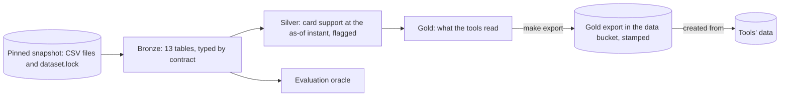

# ADR-0006: Batch medallion pipeline in dbt-duckdb, exported per snapshot to the tools' store

## Status

Proposed (2026-09-27).

Some decisions are still open. Each is marked **Open** where it arises and listed under [Open decisions](#open-decisions) with the option we lean towards, which the rest of this record assumes; we settle them before accepting it. What only a deployed stack can show is listed under [To verify on the first deploy](#to-verify-on-the-first-deploy).

## Context

Data engineering is scored on its own terms: repeatable, deterministic preparation (DML-01), data contracts with strict schema enforcement (DML-02), quality checks (DML-03), lineage (DML-04), an update and freshness policy chosen for the inputs and the workflow and justified (DML-05), and, since the data is static, update correctness shown on a labeled fixture (DML-06). [ADR-0004](0004-agent-architecture-on-agentcore.md) makes the pipeline the only writer of the tools' data and leaves its shape to this record. Six forces shape it:

- **The input is a static, pinned snapshot.** [ADR-0002](0002-mirror-dataset-into-pinned-snapshots.md) pins 13 tables in 7,671 CSV files (5.35 GB, about 23.5 million rows): six master and reference tables as single files, and seven event tables in daily partitions. The [profile](../analysis/profiling.md) found one header version per table, no missing partition, no duplicate rows, and no value in the card support tables that fails its dictionary type, though some values fall outside the dictionary's lists (`México`, with its accent, in `country`). The dictionary still announces late partitions and schema changes, so the pipeline has to fail loudly when one arrives instead of absorbing it.
- **The bank is read at one instant.** The business date (2026-06-17) and the as-of instant (2026-06-18 06:00) come from [ADR-0003](0003-choose-workflow-from-evidence.md)'s rule over how late rows arrive. Events are cut by their own timestamp; master rows keep their values as delivered and are flagged when updated after the as-of instant ([ADR-0004's state contract](0004-agent-architecture-on-agentcore.md#state-a-frozen-master-snapshot-with-an-event-cutoff)). The pipeline is where that contract becomes code.
- **Two readers need different layers.** The tools' data holds only what the tools read (ADR-0004). The evaluation's oracle reads the typed copy of the snapshot, not the tools' tables, so that a transformation bug shows up as a disagreement ([ADR-0005](0005-offline-scenario-evaluation.md#the-oracle)).
- **The source holds full card numbers and personal data.** `product_number` holds full card numbers, and `customers` holds identity documents, emails, phones, and addresses. None of it may reach the tools, the models, or the repository (POL-11, SEC-03).
- **In a bank, this pipeline wouldn't serve the agent.** Its output fills a mock of the bank's systems of record ([ADR-0004](0004-agent-architecture-on-agentcore.md#the-tools-as-the-seam-to-the-banks-systems)). A bank's tools would call those systems, and its analytical pipeline would feed analysis, evaluation, and models. This one is sized for a batch over a frozen snapshot, not for serving.
- **A fork must run it** (OPS-07) with `make`, the pinned snapshot, and the roles the project already has.

## Decision

Build three layers with dbt-core and dbt-duckdb, as a full batch rebuild per snapshot run by `make pipeline`, in one DuckDB file on the machine that holds the snapshot. Export the gold layer to the data bucket as an immutable artifact stamped with the snapshot ID and the pipeline version, and create the tools' store from that export. Bronze is the only layer that reads the source files; bronze and silver never leave the machine that builds them.

### Layers

| Layer | Holds | Tables | Read by |
|---|---|---|---|
| Bronze | Every row of the snapshot, typed by its contract, with the key of the file it came from and the snapshot ID; nothing dropped, deduplicated, or corrected | All 13 | Silver; the evaluation's oracle |
| Silver | Card support at the as-of instant: customers registered, cards opened, and card transactions dated by then (by `transaction_date`, never `process_date`); values normalized (trimmed text, and one spelling per country, which [decides outcomes](#one-spelling-per-country)), each value it changes counted first as a bronze warning; flags for conflicting records (an active card past its expiration date), for rows updated after the as-of instant, and for the held-out split (DML-09), by ADR-0003's rule and tested against the shared split function the analysis and the evaluation use | Customers, cards, card transactions | Gold; the evaluation's case generator |
| Gold | What the tools read and nothing more: the last four digits in place of `product_number`; no `amount_usd`, `fraud_score`, or `last_transaction_date`; card transactions of the 90-day window only; `is_fraud`, which only `file_handoff` reads (ADR-0004); and one metadata row with the business date, the as-of instant, and the stamp | Customer status and country, cards, card transactions, metadata | The export, then the tools' store |

Bronze covers all 13 tables although card support reads three. The business-date rule, which the pipeline computes itself, reads all seven daily tables and takes the earliest cutoff across them, so the event tables are needed anyway; the four reference tables no step reads (branches, daily exchange rates, marketing campaigns, and service agents) are covered because contracts, quality checks, and lineage are judged on the data we were given. Silver and gold exist for card support only (SCP-01). Gold holds held-out and development customers alike, since held-out cases run against the deployed stack (ADR-0005); the split flag stays in silver.

### Contracts (DML-02)

- **Written per table** in dbt's YAML, from the data dictionary, and corrected by the profile where the delivery differs from it, each difference recorded with its reason: column names and order, types, nullability, accepted values, keys, and a personal-data tag per column (none, identity document, contact, financial, or card number).
- **Enforced at the edge.** Bronze reads each file with the contract's columns and types, never inferred ones. A header that differs from the contract (a column added, missing, or renamed), a value that doesn't cast to its type, or a file the lock doesn't list stops the build and names the file. Each file's header is compared with the contract before the file is read, since DuckDB's typed read accepts a renamed column when the count matches (tested on DuckDB 1.5.5). Nothing is read with `TRY_CAST`, so a value that doesn't fit stops the run instead of becoming a null. The profile found no such value in the card support tables, so the contract rejects nothing today and catches the schema changes the dictionary announces.
- **Held through the layers** by dbt's enforced model contracts (`contract: {enforced: true}`) on silver and gold, so no model changes the tools' shape without changing its contract.
- **Gold's contract is the data half of the tools' contracts** (ADR-0004): its columns are exactly what the tools read, and a test fails if a gold column is tagged as an identity document, a contact field, or a card number, the last four digits excepted; `customer_id`, which every tool reads, is none of these.

### Quality checks (DML-03)

Each check's severity is fixed before the first build.

- **Errors stop the build:** keys unique and not null; every transaction's product and every product's customer present; accepted values for statuses and product and transaction types; every partition's events dated within its processing day, as the profile measured; bronze's row count per file equal to the file's records, counted by Python's `csv` module with the contract's dialect, apart from DuckDB, since the check exists to catch DuckDB's reader dropping or merging rows (the transcripts' quoted fields hold line breaks, so their 1,097 files have 925,351 lines but 171,321 records); no gold transaction after the as-of instant or before the window.
- **Warnings are counted, never fixed:** the data quality facts the analysis already reports, among them active cards past their expiration date, missing values in the core fields, `last_transaction_date` disagreeing with the card's transactions, rows updated after the as-of instant, and values outside the dictionary's lists (among them `México`, which silver [spells one way](#one-spelling-per-country)). Each goes into the run's manifest with its count and share (**Open**, decision 4). A warning is a fact about the bank that the policy surfaces (POL-30, POL-32) and the limitations report (SCP-07); correcting it in silver would hide it.

### One spelling per country

Every Mexican customer's country is spelled `México`, and their card transactions name `México` 2,105,794 times and `Mexico` 18,412 times, a count in line with the other countries those transactions name (18,355 to 18,584 each for Argentina, Brazil, Colombia, Spain, and the USA). The generator's draws of a transaction's country seem to include the customer's own. For Colombian and Argentine customers, those draws are spelled like home and read as domestic; for Mexican ones, the missing accent made them read as abroad. Silver spells each country one way, so those 18,412 transactions are domestic, as the others' are, and the analysis reads them the same way: Mexico's share abroad is 4.19%, against 5.05% for Argentina and 5.08% for Colombia ([card support analysis](../analysis/card-support.md)).

The spelling therefore decides outcomes, not just text: POL-25 shows a transaction's country only when it isn't the customer's. The contract records the rule and its reason; the evaluation's oracle, which reads bronze's delivered spellings, applies the same rule in its own code ([ADR-0005](0005-offline-scenario-evaluation.md#the-oracle)); and the quirk is reported as a limitation of the data (SCP-07).

### Lineage (DML-04)

- **Models:** dbt's manifest traces every gold model through silver and bronze to a declared source, by model rather than by column (which column a gold column comes from is read in its model's SQL); `dbt docs` renders the graph, and a test fails if a gold model doesn't reach a source.
- **Rows:** each bronze row carries its file's key, which the lock ties to the file's SHA-256 and the organizers' ETag (ADR-0002).
- **Runs:** each build writes a manifest with the snapshot ID, the pipeline version, the dbt, dbt-duckdb, and DuckDB versions, row counts per model, a content hash per gold table (over its rows in key order, so it doesn't depend on file layout), and the results of every check. The pipeline version is a hash of the dbt project's files, so the same code always carries the same version. The manifest is committed under `docs/pipeline/`, one per snapshot and pipeline version, under the publication rule (aggregates only, counts under 10 suppressed; SEC-03), so a fork can compare its content hashes with ours and a PR adopting a snapshot can compare its warnings; the same manifest goes beside the export.
- **Replies:** the tools' store carries the stamp, each tool result returns it, and the execution record keeps it (ADR-0004). A figure in a reply traces back through the tool call, the gold row, its bronze row, and the source file to the organizers' object.

### Freshness and updates (DML-05)

**Batch, with a full rebuild per snapshot.** The inputs and the workflow both point there:

- The data arrives as daily files. Each processing day closes at a fixed cutoff the next morning (06:00 for transactions), and no row arrives after its processing day (profile). Nothing arrives between snapshots here, so a stream would have nothing to carry; streaming isn't required either.
- The workflow reads a frozen bank at one business date. Its freshness need is that every tool answers as of the same instant, which a batch gives by construction.
- The whole build fits one machine: 5.35 GB of CSV into DuckDB. Incremental models would add state to reason about and test, for no gain at this size (**Open**, decision 2).

**New data arrives only as a new snapshot,** through ADR-0002's lock and a reviewed change. The pipeline computes the business date and the as-of instant itself, with ADR-0003's rule, so a late partition moves them only once the day it completes is complete; a test pins snapshot `b3b8b248f604ef9a` to 2026-06-17 and 06:00. The held-out set is drawn on one snapshot (ADR-0005), so once its manifest is committed no new snapshot is adopted; a later one would make a new evaluation version.

**Replies state their freshness:** every fact is given as of the business date (POL-19).

**In a bank,** the same layers would run daily and incrementally, a partition adopted when its processing day closes, fed by change data capture from the systems of record instead of files. The tools wouldn't read them (ADR-0004), so the freshness a customer sees would be the systems of record's, and this pipeline's daily lag would bind analysis, evaluation, and monitoring only.

### Update correctness on a fixture (DML-06)

The supplied data is static, so a fixture shows that an update is handled correctly. It is a miniature snapshot with its own lock, written by us and labeled team-generated (SEC-02) in its path, in its files, and wherever a report cites it; it holds no organizer data, so it is committed. It comes in two versions and two broken variants. The second version adds a partition that completes a day the first version held only in part, a partition for the day after its last, and a card whose status and `last_updated` changed after the as-of instant. Each broken variant is the second version with one bad file: an extra column in one, and in the other a column renamed with the count unchanged. Tests build them all and check that:

- building the same version twice gives the same content hashes (DML-01);
- the second build equals a clean build of the second version, row for row, with nothing left over from the first;
- the business date moves only when the new day is complete, and events after the as-of instant stay out;
- the changed card keeps its delivered values and carries the updated-after flag;
- each broken variant stops the build and names its bad file;
- the export's items, their keys, and its stamp are the second version's, with nothing left over from the first.

That the tools' store then holds the second version only needs an import, which CI can't run without the account; a new table per import makes it so by construction, and the first deploy checks it ([To verify on the first deploy](#to-verify-on-the-first-deploy)).

### Where it runs and what leaves the machine

- **`make pipeline`** builds on the machine that holds the snapshot (after `make data`). The DuckDB file lives under `data/`, which is gitignored and never published, so bronze and silver, with their full card numbers and personal data, stay there. The file is rebuilt by each `make pipeline` and kept only there, beside the local snapshot, which holds the same data; deleting `data/` removes both (OPS-10). The oracle reads bronze from the same file.
- **`make export`** writes gold's items to the data bucket under `gold/<snapshot_id>/<pipeline_version>/items/`, a prefix of their own, since DynamoDB imports every object under the prefix it is given and fails the import on anything that isn't an item. The manifest goes beside them, at `gold/<snapshot_id>/<pipeline_version>/manifest.json`, last, as the completion marker, as ADR-0002 does for snapshots. The bucket's no-overwrite policy makes an export immutable, and exports are kept with the snapshots, until `make dataset-destroy` (OPS-10). Gold holds no full card number and no identity or contact field, so it is the only layer that leaves the machine.
- **CI** runs dbt's unit tests and the update fixture on every push, neither of which needs the snapshot. The full build on the snapshot runs by hand, before an export (**Open**, decision 3).
- **The tools' store is created from an export** (**Open**, decision 1). Terraform creates the tools' table with `aws_dynamodb_table`'s `import_table` from the export, in DynamoDB JSON, gzipped, with the export chosen by a variable that only a reviewed change sets, like the lock. DynamoDB imports only into a new table, so each export gets its own table, named by its pipeline version, and the tools switch when Terraform points them at it; `make destroy` removes it. The provider documents `import_table`; we confirm it on provider 6.66.0 before the first import ([To verify on the first deploy](#to-verify-on-the-first-deploy)).

The profile and the analysis reports keep reading the snapshot directly, every value as text (`make analysis`). A profile should measure the delivery before any contract shapes it, and the contracts and warnings are set from its numbers.

### To verify on the first deploy

- **`import_table` on provider 6.66.0.** The provider documents it, and no spike has run it; the first deploy confirms it, or a tiny export before then. If it fails, decision 1 falls back to its alternative, a publish script, by amendment.
- **The store holds one export.** The imported table holds exactly the chosen export's items, which the fixture's tests can't show without the account. If it doesn't, the import is wrong, not the export, and the tools can't be pointed at the table.

### Open decisions

We settle these before accepting this record. Each names the option we lean towards, which the rest of the record assumes, and any alternative still in play.

1. **Creating the tools' store.** Lean: Terraform imports each gold export into a new table, named by its pipeline version. Alternative: a publish script that batch-writes the export into one table and writes the stamp last; simpler, but a publish that fails halfway leaves two versions mixed, which the tools would have to detect from the stamp.
2. **Rebuild or increment.** Lean: a full rebuild per snapshot. Alternative: bronze incremental by source file, which is how a daily feed would run, and which the fixture would then exercise directly.
3. **Where the full build runs.** Lean: by hand, on the machine holding the snapshot; CI runs the unit tests and the fixture. Alternative: a CI job that downloads the snapshot from the data bucket and builds on every change to the models, moving about 5.35 GB per run.
4. **Warnings across snapshots.** Lean: warnings never stop the build; the manifest compares each count with the previous snapshot's, and the PR adopting a snapshot lists any that moved by more than 10%. Alternative: a band around each count, outside which the build fails.

## Alternatives considered

**An AWS lakehouse** (S3 with the Glue Data Catalog and Athena, or Iceberg tables under Lake Formation). It is where a bank's layers would live, but for 5.35 GB of static files it adds services, IAM, per-query cost, and setup a fork must repeat, and changes no result. The models are SQL, so moving them to dbt-athena or a Spark adapter is a change of adapter and dialect, which the production write-up states (SCP-08).

**Glue or EMR Spark jobs.** A cluster for a job one DuckDB process finishes. Glue brings data quality rules of its own, but the contracts, unit tests, and lineage across layers that dbt gives would still be ours to assemble, and every build would need the account.

**Python scripts in polars,** like the analysis. Quick to write, but contracts, tests, lineage, and documentation would all be ours to build, where dbt provides them.

**Snowflake or Databricks,** which the organizers suggest. Accounts and costs outside the project's AWS account, which every fork would have to open (OPS-07).

**Gold only,** from the files straight to the tools' tables. The oracle would lose its independent layer (ADR-0005), and the contracts would live in the same code that shapes the tools' data.

**Correcting the data in silver** (expired active cards, `last_transaction_date` taken from the transactions). The policy surfaces conflicting records instead of resolving them (POL-30), and a correction would hide what the limitations must report (SCP-07). Silver flags; it never fixes.

**Streaming or micro-batches.** Nothing arrives between snapshots, and a frozen business date needs one consistent instant.

## Consequences

Positive:
- Each of DML-01 to DML-06 has a mechanism and a test: contracts at the edge, checks at two severities, lineage from the organizers' object to the reply, a justified batch policy, and a labeled update fixture.
- Full card numbers and personal data never leave the machine that builds bronze and silver; only gold does.
- The oracle and the tools read different layers through different code.
- A fork runs the same build with `make data`, `make pipeline`, and `make export`, and can compare its content hashes with ours.
- The tools' data changes only through a reviewed change, like the snapshot it comes from.

Negative:
- Bronze carries contracts and checks for four reference tables that nothing downstream reads.
- A full rebuild re-reads 5.35 GB for any change, and this design never shows an incremental daily run.
- The full build runs by hand, so CI proves the models on fixtures, not on the snapshot.
- It is not what a bank would run: no shared catalog, no scheduler, no change data capture. The production write-up states the distance (SCP-08, OPS-11).
- Each export means a new table, and a moment when the tools switch from one to the next.
- The build's time on the full snapshot hasn't been measured; the first build measures it.
