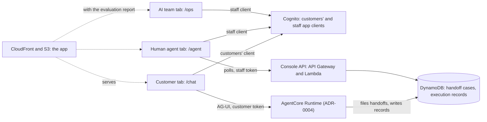

# ADR-0007: Role-gated web app on one CloudFront origin, with a polled handoff console

## Status

Proposed (2026-09-28).

Some decisions are still open. Each is marked **Open** where it arises and listed under [Open decisions](#open-decisions) with the option we lean towards, which the rest of this record assumes; we settle them before accepting it.

## Context

[ADR-0004](0004-agent-architecture-on-agentcore.md) puts the customer chat and two consoles on one static site, gives each role a Cognito group, and leaves the hosting to this record (its decision 15). This record says how the site is served, how each role signs in and what it sees, and what a human agent does with a handoff. Seven forces shape it:

- **Three roles use the site, and only one talks to the agent.** A customer chats with the agent, a human agent receives its handoffs, and the AI team watches the system. The Runtime serves customers only (ADR-0004), so the consoles need an API of their own. The consoles are also what makes the prototype a customer-service system rather than a chatbot (SCP-02).
- **The judges reach the system only through the submitted link** (OPS-12, SUB-02). They have no access to the AWS account, so what they should see has to be in the site. A frontend is scored; a dashboard earns nothing by itself ([Reading between the lines](../hackathon-requirements.md#reading-between-the-lines)).
- **A handoff is asynchronous by policy.** Code decides whether a handoff is required or offered, the customer accepts an offered one with the handoff control, and the reply says that a person will follow up, promising no outcome or time (POL-45). No person stands between the customer and a block (POL-36, POL-39), so the human agent's side is a queue of cases, not a gate.
- **The payload is a first-class artifact** (CTL-05). The demo should show it arriving in a person's queue, structured, with each fact next to the tool call that read it.
- **The judges will attack the site as well as the agent.** Text a customer wrote reaches an employee's browser through the payload, text the model wrote reaches the customer's browser as Markdown, and a customer's token must not open a console (SEC-05, CTL-04).
- **The custom domain is ours, and a fork must stand up without it** (OPS-07). `gabriel.com.gt` has its DNS on Netlify, not Route 53, and CloudFront takes certificates from us-east-1 only ([ADR-0001](0001-deploy-to-us-east-1.md)).
- **The load is a few people at a time:** judges, demos, and us. Freshness within seconds is enough (OPS-08).

## Decision

Serve one single-page app from S3 through CloudFront, on a subdomain of `gabriel.com.gt` once its name is chosen, with a route per role. Each browser tab signs in on its own, through one Cognito app client for customers and one for staff. Human agents use a small console API, which their console polls; the AI team's page shows the evaluation report. A handoff is a case that a human agent claims and resolves; no one approves or rejects it.

### Routes

| Route | For | Signs in through | Talks to | Shows |
|---|---|---|---|---|
| `/chat` | Customers (the `customer` group) | The customers' app client | The Runtime, over AG-UI | The chat in Spanish or Portuguese, the confirm and handoff controls, a handoff's reference, and the persona's card with suggested prompts |
| `/agent` | Human agents (`human_agent`) | The staff app client | The console API | The queues, each case's payload with every verified fact next to the tool call that read it, and the controls to claim and resolve a case |
| `/ops` | The AI team (`ai_team`) | The staff app client | Nothing: the report ships with the site | The evaluation report, labeled as an offline measurement |

A route only decides what the browser draws. What a token can reach is decided on the server: the Runtime accepts the customers' app client and the customer group only (ADR-0004), and the console API accepts the staff app client only and checks each route's group. A customer who opens `/agent` meets a sign-in form their credentials can't pass.

The consoles are in Spanish, the bank's working language, in which the payload's free text is written (POL-46). The chat's own text follows a language switch that starts from the browser's language; the agent's replies follow POL-50. Every page says it is a prototype over synthetic data (SEC-02).

### Hosting and the domain

- **The app** is static files in a private S3 bucket, which CloudFront reads through origin access control. A CloudFront Function serves `index.html` for any path without a file extension, so `/agent` loads the app while a missing asset still returns 404. A response headers policy sets the content security policy ([Rendering what others wrote](#rendering-what-others-wrote)), HSTS, and `X-Content-Type-Options`.
- **Configuration is read at load,** from a `config.json` written from Terraform's outputs: the user pool, both app clients, the Runtime's ARN, and the console API's URL. The same build then runs in any fork.
- **The custom domain is optional,** set by a `domain_name` variable (**Open**, decision 1). When it is set, Terraform requests an ACM certificate in us-east-1 with DNS validation and outputs the validation record, which we add by hand in Netlify's DNS. `aws_acm_certificate_validation` holds the distribution back until ACM issues the certificate, so the first apply with the domain set waits for that record. A CNAME in Netlify then points the subdomain at the distribution's domain. A distribution can carry several names, so a later rename can keep the old name working.
- **Without it,** the site is served on the distribution's own domain, which is what a fork submits. Terraform outputs the site's URL either way, and `deploy-prototype.yml` sets it as the environment's URL, the link SUB-02 asks for.
- **Cross-origin calls:** the console API allows the distribution's domain and the custom domain; the Runtime answers the browser's preflight itself (S4), as Cognito's API does for sign-in.
- **Deployment:** `deploy-prototype.yml` builds the app, uploads it once Terraform has applied, and invalidates the distribution (ADR-0004's deployment).

### Sign-in

- **Our own form, in the app** (**Open**, decision 2). It signs in with SRP through Amplify's auth library, calling Cognito's API directly: no user pool domain, no managed login, and no redirect. Admins create every user with a permanent password (ADR-0004), so there is no sign-up and no forced password change.
- **Tokens live in the tab's `sessionStorage`.** Each tab holds its own sign-in, so a customer in one tab and a human agent in another stay signed in side by side, and closing a tab drops its tokens. A reload keeps the sign-in; a new tab asks for one. A sign-in lasts at most an hour (ADR-0004's decision 10), and when it ends the tab asks the person to sign in again (POL-09).
- **Two app clients** separate customers from staff before any of our code runs:
  - **Customers':** the only client the Runtime's JWT authorizer accepts, so a staff token never reaches the agent, even if the customer group claim, which ADR-0004 requires but no spike has tried, were misconfigured. The evaluation's test users sign in through it too (ADR-0005).
  - **Staff:** the only client the console API's JWT authorizer accepts, so a customer's token gets 401 there.
  - **Both:** `write_attributes` limited to `locale`, which closes the hole spike S3 found; token revocation on; ADR-0004's token lifetimes.
- **Signing out** revokes the refresh token and clears the tab. An access token already issued keeps working until it expires, up to 15 minutes (ADR-0004's known limit).

### The console API

An API Gateway HTTP API with a JWT authorizer whose issuer is the user pool and whose audience is the staff app client. The authorizer can require scopes but not groups, so each route's Lambda checks `cognito:groups` for the route's group before anything else. A test calls every route with each role's token, an expired one, and none (SEC-05, EVL-04).

| Route | Group | Does |
|---|---|---|
| `GET /cases` | `human_agent` | Lists the demo's cases of one queue and status, newest first |
| `GET /cases/{reference}` | `human_agent` | One case: its status, its payload, and the recorded tool calls its evidence names |
| `POST /cases/{reference}/claim` | `human_agent` | Moves a `filed` case to `claimed`, by the caller |
| `POST /cases/{reference}/resolve` | `human_agent` | Moves a case the caller claimed to `resolved`, with a resolution |

- **IAM, per Lambda, under the deploy boundary.** The reading Lambdas read their tables only. The Lambda behind claim and resolve may call `UpdateItem` on the cases table for the status attributes alone (a condition on `dynamodb:Attributes`), so even a bug in it can't change a payload (**Open**, decision 3). No console Lambda reads CloudWatch.
- **Nothing in the console API acts on the bank.** No route blocks, unblocks, or changes a card, and none writes the tools' data, the sandbox overlay, or the confirmations.
- **A stage rate limit,** well above what the polling below needs, caps a runaway tab or script.

### Handoffs as cases

**No one approves or rejects a handoff.** Code decides whether one is required or offered, from the policy's table, and the customer accepts an offered one (POL-45). A person who approved handoffs would stand between an urgent case and the bank, adding the delay the policy avoids by filing at once, and a rejected handoff would mean nothing to a customer already told that a person will follow up. This is the trade-off between autonomy and oversight the policy already made (DSN-02): code acts where the policy is explicit, and a person picks up, after filing, every case the agent can't finish.

**The case record.** `file_handoff` validates the payload (ADR-0004) and writes one item per handoff, whose fields have a schema of their own, `handoff-case.schema.json`, beside the payload's (**Open**, decision 5):

| Field | Holds |
|---|---|
| `handoff_id` | The payload's UUID; the item's key |
| `reference` | Eight characters from Crockford's base32 alphabet (no `I`, `L`, `O`, or `U`), drawn at random, unique by a conditional put, and shown in two groups of four (`7K2M-9QXA`): what the reply gives the customer (POL-45), and what a human agent searches by |
| `payload` | The payload as filed, never changed afterwards; a draft's is completed once, when it is filed |
| `queue`, `priority`, `reason_code`, `language` | Copied from the payload, for the indexes and the queue's list |
| `source` | `demo` or `evaluation`, from the token's groups: set by the graph, as the execution record's is (ADR-0004), or by the evaluation harness for ADR-0005's naive agent, so an evaluation run's cases never reach a human agent's queue ([ADR-0005](0005-offline-scenario-evaluation.md)) |
| `status` | `draft`, `filed`, `claimed`, or `resolved` |
| `filed_at`, `claimed_at`, `resolved_at` | Wall clock |
| `claimed_by` | The human agent's `sub` and user name |
| `resolution` | `handled`, `duplicate`, or `not_actionable`, and a note in Spanish of up to 500 characters, under the payload's rule against runs of 13 or more digits (POL-11) |
| `flagged`, `validation_errors` | Set when parts of the payload failed validation after the fallback and were left out: each failing field's path and the rule it broke, never its value, so the console shows the case as flagged (ADR-0004) |
| `record` | The keys of the turn's execution record, from which the console reads the tool calls the evidence names |
| `expires_at` | 90 days after filing, or after saving for a draft, enforced with time to live (ADR-0004, OPS-10) |

The payload's schema stays at version 1. A status isn't a fact about the handoff: it changes after filing, and the payload is what the policy validates and a person reads as evidence (CTL-05).

**The lifecycle.** A case moves from `filed` to `claimed` to `resolved`, and never back. Each move is a conditional update on the current status, and a resolve also on `claimed_by` being the caller, so two people can't claim one case, only its claimer resolves it, and a stale screen changes nothing. Within a queue, the console lists `urgent` cases first. A deadline handoff starts a step earlier, as a `draft` the queue doesn't show (ADR-0004's decision 7): the Runtime files it when the turn requires the handoff, or the deadline Lambda when it is still owed, each through a conditional update from `draft` to `filed`, so it is filed once. A draft no one files (a `lost` or `stolen` block the customer saw blocked, cancelled, or moved on from) expires unfiled with the table's time to live.

**Indexes:** one by source, queue, and status, sorted by filing time, from which the queue reads the demo's cases only, and one by reference.

**Types from the schemas.** The console's types, reason codes included, are generated from the payload's and the case record's schemas (ADR-0004's decision 9), so a reason code the payload's schema adds, such as `block_lapsed`, fails the console's build until the console names it.

**What the customer sees:** the reference, and that a person will follow up (POL-45); never the case's status. In a bank, the case system tells the customer ([In a bank](#in-a-bank-ops-11)).

### Freshness: the consoles poll

- `/agent` asks for its queue every 3 seconds while its tab is visible; a hidden tab stops asking. A case appears in the queue within 3 seconds of being filed, and the console says when it last refreshed. It is a poll, not a push, and we call it one (**Open**, decision 4).
- A few open staff tabs make a few requests a second at most, which Lambda and DynamoDB on demand absorb without notice; the stage's rate limit caps anything more.
- Push is the production path: a DynamoDB stream on the cases table feeding AppSync Events, which the pinned provider supports ([Alternatives considered](#alternatives-considered)).

### The AI team's page

`/ops` shows ADR-0005's committed evaluation report, bundled with the site when it is built, labeled as an offline measurement on held-out cases (EVL-13) (**Open**, decision 6). It calls no API, so it holds no live number that could be read as a production result.

The live monitoring stays in the account, as ADR-0004 describes it (OPS-03): alarms and metrics defined in Terraform, which the judges can't reach and the site doesn't show. A live view (the alarms' states and the metrics over the last day, and recent turns with no message text and a pseudonym per sign-in, read through the console API) is production work; in a bank it belongs to the observability stack ([In a bank](#in-a-bank-ops-11)).

### Rendering what others wrote

- **The console renders every string in a case as text,** never as HTML or Markdown. The summary, the customer's statements, merchant names, and the resolution note can carry what a customer typed or what the bank's records hold (POL-10), and they reach an employee's browser. React escapes text by default, and no case field passes through raw HTML or a Markdown renderer. A test files a case whose free text holds a `<script>` and an `` tag and checks that the console shows both as text.
- **The chat renders the model's Markdown** (ADR-0004: Anthropic writes it unasked) with raw HTML off, no images, and links shown as plain text. An injected reply therefore can't make the browser fetch a URL that carries data out, and the content security policy blocks it if the renderer fails.
- **The content security policy** allows scripts and images from the site only, no inline scripts, connections to Cognito's API, the Runtime, and the console API only, and no framing (`frame-ancestors 'none'`). Tokens in `sessionStorage` can be read by any script the page runs, so this policy and the rendering rules are what protect them.

### Judges' access

- **Only they can use it.** The site is public, but nothing in it works without a sign-in, and only admins create users (ADR-0004), so without credentials the site shows its sign-in form and nothing else. Calls to the Runtime and the console API without a valid token are turned away before any of our code runs, so they make no model call, and Cognito locks an account out for a growing time after repeated failed sign-ins.
- **Credentials per role** reach the judges privately with the submission, never the repository (ADR-0004): several customer personas from development customers (ADR-0005), one human agent, and one member of the AI team, each with a long random password the admin script sets. The note that carries them says that a sign-in lasts an hour, and the README says that the credentials went to the organizers and that anyone else can deploy a fork (OPS-07).
- **Persona cards.** After sign-in, the chat shows the persona's card: a description and suggested prompts in both languages that reach each path, answered, clarified or declined, and handed off (SCP-03 to SCP-06). The admin script labels each persona user with an attribute only admins write, and the site holds one card per label, written in general terms ("a credit card and a debit card, and a declined purchase this week") with no identifier or value from the records, so the public site holds no customer data (SEC-03).
- **Many judges, one persona.** Each sign-in gets its own sandbox (ADR-0004), so two judges signed in as the same persona don't see each other's blocks. They share the persona's daily cap, set well above a day of grading, and one human agent's queue, where the reference in their chat finds their case.
- **A credential that leaks** is bounded, visible, and reversible. The daily cap per user (ADR-0004's decision 21) and the providers' spend limits bound what it can spend; an alarm fires near the cap; and the admin script resets its password and signs it out everywhere, which takes effect at the Runtime and the console API within the 15-minute access token.
- **After judging,** the admin script disables the judges' users, or `make destroy` removes the stack.
- **The demo** runs two tabs side by side. A customer reports a charge they don't recognize, in Portuguese, confirms the block with the control, and gets a reference; within a poll, the case is in `dispute_intake` as `normal`, since the card is verified blocked (POL-47), with the verified block among its actions and each fact next to the tool call that read it. Cancelling the block instead files the case as `urgent`.

### In a bank (OPS-11)

| In the prototype | In a bank |
|---|---|
| One origin serves customers and staff | The customer app is public; the consoles are internal apps behind the bank's single sign-on, managed devices, and network |
| Admins create users with passwords, in one user pool | Customers sign in through the bank's customer identity, with multi-factor authentication and a step-up before actions; staff through the workforce identity provider, federated |
| Tokens in the tab's `sessionStorage` | Tokens held by a backend for the frontend, behind an `HttpOnly` cookie |
| Our cases table, with claim and resolve | The bank's case or contact center system routes and assigns cases, tracks service levels, contacts the customer, and lets them follow the case |
| The consoles poll | The case system pushes updates, or AppSync Events fed by the table's stream |
| No person can join the chat | A live transfer to a person in the same conversation, through the contact center's chat, which needs a channel into the customer's conversation outside the agent's run |
| The AI team's page, with the evaluation report; alarms in the account | The bank's observability stack, with dashboards, alerting, and on-call |

### Open decisions

We settle these before accepting this record. Each names the option we lean towards, which the rest of the record assumes, and any alternative still in play.

1. **The hostname.** Lean: the product's name as a subdomain of `gabriel.com.gt`, chosen with its branding, with `tarjetas` (the workflow, in the bank's language) as the fallback; until then the site runs on its CloudFront domain, and the name only has to exist by the time the link is submitted (SUB-02). Other options: `soporte` (nearly the same word in Portuguese), `agente` (the same word in both languages, but it also names the human agent), and `banco` (reads as the bank's own site). Names with accents are out, since they become punycode.
2. **Sign-in.** Lean: our own form, with SRP through Amplify's auth library and tokens in the tab's `sessionStorage`. Alternative: Cognito's managed login with PKCE, sending `prompt=login` so each tab signs in on its own.
3. **Claim and resolve.** Lean: built once the read-only queue works. Alternative: a read-only queue, with the lifecycle described as production work; ADR-0004's IAM line and the mock's limitations would then say the consoles only read.
4. **Freshness.** Lean: polling the queue every 3 seconds. Alternative: push through AppSync Events.
5. **The case record.** Lean: a record with its own schema that wraps the payload, which stays at version 1. Alternative: a `status` in the payload's schema, at version 2, which would put state that changes after filing into the artifact the policy validates.
6. **The AI team's page.** Lean: the evaluation report alone, bundled with the site, with the monitoring defined in Terraform and described in ADR-0004. Alternative: a live view beside the report, with alarms and metrics from CloudWatch and recent turns with no text and a pseudonym per sign-in, read through the console API; it adds two routes, a Lambda that reads every metric in the account (`GetMetricData` can't be scoped), and an index on the execution records.

## Alternatives considered

**A subdomain per role** (`chat.`, `agente.`, `ops.`). Browsers would keep each role's tokens apart without the per-tab rule, and it is closer to how a bank separates its apps. One certificate can name all three hosts, but it still means three validation records and three CNAMEs in Netlify, three origins in every cross-origin rule, and a build that knows which host it serves, for a separation the server already enforces.

**Approving or rejecting handoffs.** Code decides the handoff, and a person in front of an urgent case only delays it ([Handoffs as cases](#handoffs-as-cases)).

**Cognito's managed login.** A redirect with PKCE to pages Cognito hosts, localized in Spanish and Brazilian Portuguese. Its session cookie keeps a sign-in for an hour on the Cognito domain, so a second tab signs in as the first tab's user unless it sends `prompt=login`; it needs a user pool domain, whose prefix must be unique in the Region, so every fork picks its own; and it needs callback and sign-out URLs for both origins. In a bank, it or the bank's own identity provider is the better choice, with multi-factor authentication and passkeys.

**Tokens in `localStorage`** (Amplify's default). One sign-in per browser: signing in as a human agent in one tab signs the customer out of the other, which breaks the side-by-side demo, and tokens outlive the tab.

**One app client for every role.** The Runtime and the console API would tell roles apart by the group claim alone, which no spike has tried at the Runtime, and a customer's token would pass the console API's authorizer and reach our code.

**Push through AppSync Events.** A DynamoDB stream on the cases table, a Lambda publishing to a channel namespace, and a channel authorizer for staff tokens. The pinned provider supports it (`aws_appsync_api`, `aws_appsync_channel_namespace`), and it is the production path, but it adds four resources and a second connection per console for updates a 3-second poll shows as quickly. API Gateway WebSockets would do the same with more of our own code.

**A person taking over the chat.** The Runtime streams one run per request (ADR-0004), so a person's messages would need a second channel into the customer's tab and a mode in the graph that silences the agent. In a bank, it belongs to the contact center's chat.

**Customers following their case's status.** A customer-scoped read outside the Gateway and Cedar, a second isolation boundary to test, and a change to POL-45, for a status nothing outside the prototype sets.

**A password in front of the site** (HTTP Basic Auth in a CloudFront Function). It would guard only the site's static files: the browser calls Cognito, the Runtime, and the console API on their own AWS hostnames, which the wall doesn't cover, and those already need a sign-in. The judges would get a second password, in a browser dialog before ours.

**Sharing a CloudWatch dashboard with the judges.** It is set up by hand in the console, which a fork can't reproduce from Terraform, and a public link lets anyone who has it call `GetMetricData` over every metric in the account. The judges see the evaluation report instead, and the monitoring is described.

## Consequences

Positive:
- One certificate, one distribution, one DNS record, and one build; a fork serves the site on its CloudFront domain with no DNS work.
- A customer and a human agent can be signed in side by side in one browser, so a handoff filed in one tab shows up in the other within seconds.
- Customer and staff tokens are told apart by app client before our code runs, at the Runtime and at the console API, and staff roles by group in every console route.
- The payload stays the validated artifact CTL-05 asks for; its case's status lives beside it, and IAM keeps the console from editing it.
- A human agent reads each verified fact next to the tool call that read it.
- Evaluation runs file their handoffs apart, so a human agent's queue holds only the cases customers filed in the chat.
- Live numbers and offline measurements are never shown as one: the site shows the evaluation report only, labeled offline.
- No console acts on the bank.

Negative:
- Customers and staff share an origin, which a bank wouldn't do; the server's checks, not the origin, separate them.
- Tokens in `sessionStorage` can be read by any script the page runs, so the content security policy and the rendering rules carry what an `HttpOnly` cookie would; each new tab signs in again.
- The sign-in form is ours to get right, errors and accessibility included, where managed login would have given us Cognito's.
- A case reaches the queue up to 3 seconds after filing, and every open queue makes a request every 3 seconds whether anything changed or not.
- Claiming and resolving change nothing at the bank, and no one tells the customer: the console shows a workflow, not a service.
- The judges see no live monitoring: it is described and defined in Terraform, not shown.
- The first apply with the custom domain waits for a record we add by hand in Netlify.
- Nothing technical stops a judge from sharing credentials; the caps make that a bounded cost, not an open one.
