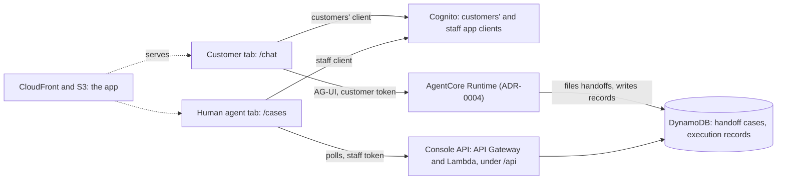

# ADR-0007: Role-gated web app on one CloudFront origin, with a polled handoff console

## Status

Accepted (2026-09-29). Its open decisions were settled that day, each on the option we leaned towards, and are listed under [Settled at acceptance](#settled-at-acceptance) with the alternatives we didn't take.

Amended as built, each correction applied in the section it names:

- 2026-09-29: the content security policy lets the page connect to the site itself, for `config.json` ([Rendering what others wrote](#rendering-what-others-wrote)).
- 2026-09-30: claim and resolve deferred from the prototype ([The console API](#the-console-api), [Handoffs as cases](#handoffs-as-cases)); the AI team's page not built ([The AI team's page](#the-ai-teams-page)); the reference made unique by its own item, `source` set by `file_handoff`, and `record` spanning turns ([Handoffs as cases](#handoffs-as-cases)); the custom domain in one change ([Hosting and the domain](#hosting-and-the-domain)); the console API on the site's origin, a reading Lambda per route, a scope on each route, the queue sorted by priority, the rows a case names, and the console's contract ([The console API](#the-console-api), [Handoffs as cases](#handoffs-as-cases)); a new conversation on request, none shown again ([Routes](#routes)).
- 2026-10-01: the persona label as a group, the cards in `web/src/personas.json`, the credentials file never printed, and the injected message as the site's one negative-path addition ([Judges' access](#judges-access)); the console set in Night ([Routes](#routes)).
- 2026-10-01: the amendments above folded into the sections they corrected, which now describe the site as built; this list is the map.
- 2026-10-02: the persona cards withdrawn for one opening template, the split's guards moved to the opening's suggestions in `web/src/texts.ts` ([Judges' access](#judges-access)); the language switch built into the bar ([Routes](#routes)).
- 2026-10-02: the console's route renamed from `/agent` to `/cases` and its bar retitled *Consola de casos*: on a site whose product is an agent, `/agent` read as the AI agent's page (the objection decision 1 already raised against `agente` as a hostname), where the page shows cases, as the console API under `/api/cases` already names them ([Routes](#routes)).
- 2026-10-02: the two language-labeled personas replaced by eight scenario personas named by their customers' synthetic names, each with a briefing generated from its records; the credentials file carries the briefings and the script renders the private note; the `persona-es` and `persona-pt` groups dropped from the pool, which no code read; `delete` added to the admin script ([Judges' access](#judges-access)).
- 2026-10-03: the chat draws a status answer's cards in frames, and a list of transactions as a statement, from the reply's own text ([Rendering what others wrote](#rendering-what-others-wrote)).
- 2026-10-03: the transaction a reply found is a statement of one row, and a decline's reason, on the line under it, the frame's last row ([Rendering what others wrote](#rendering-what-others-wrote)).
- 2026-10-03: the credit of several cards in one frame, a row per card ([Rendering what others wrote](#rendering-what-others-wrote)).

## Context

[ADR-0004](0004-agent-architecture-on-agentcore.md) puts the customer chat and the consoles on one static site, gives each role a Cognito group, and leaves the hosting to this record (its decision 15). This record says how the site is served, how each role signs in and what it sees, and what a human agent does with a handoff. Seven forces shape it:

- **Three roles use the site, and only one talks to the agent.** A customer chats with the agent, a human agent receives its handoffs, and the AI team watches the system. The Runtime serves customers only (ADR-0004), so the consoles need an API of their own. The consoles are also what makes the prototype a customer-service system rather than a chatbot (SCP-02).
- **The judges reach the system only through the submitted link** (OPS-12, SUB-02). They have no access to the AWS account, so what they should see has to be in the site. A frontend is scored; a dashboard earns nothing by itself ([Reading between the lines](../prerequisites.md#reading-between-the-lines)).
- **A handoff is asynchronous by policy.** Code decides whether a handoff is required or offered, the customer accepts an offered one with the handoff control, and the reply says that a person will follow up, promising no outcome or time (POL-45). No person stands between the customer and a block (POL-36, POL-39), so the human agent's side is a queue of cases, not a gate.
- **The payload is a first-class artifact** (CTL-05). The demo should show it arriving in a person's queue, structured, with each fact next to the tool call that read it.
- **The judges will attack the site as well as the agent.** Text a customer wrote reaches an employee's browser through the payload, text the model wrote reaches the customer's browser as Markdown, and a customer's token must not open a console (SEC-05, CTL-04).
- **The custom domain is ours, and a fork must stand up without it** (OPS-07). `gabriel.com.gt` has its DNS on Netlify, not Route 53, and CloudFront takes certificates from us-east-1 only ([ADR-0001](0001-deploy-to-us-east-1.md)).
- **The load is a few people at a time:** judges, demos, and us. Freshness within seconds is enough (OPS-08).

## Decision

Serve one single-page app from S3 through CloudFront, at `faro.gabriel.com.gt`, with a route per role. Each browser tab signs in on its own, through one Cognito app client for customers and one for staff. Human agents use a small console API on the same origin, which their console polls. A handoff is a case that a human agent reads with its evidence; no one approves or rejects it. Claim and resolve, and the AI team's page, are designed here and not built.

### Routes

| Route | For | Signs in through | Talks to | Shows |
|---|---|---|---|---|
| `/chat` | Customers (the `customer` group) | The customers' app client | The Runtime, over AG-UI | The chat in Spanish or Portuguese, the confirm and handoff controls, a handoff's reference, one opening with suggested prompts, the bar's language switch, and a new conversation on request |
| `/cases` | Human agents (`human_agent`) | The staff app client | The console API | The queues, and each case's payload with every verified fact next to the tool call that read it; claim and resolve are designed, not built |
| `/ops` | The AI team (`ai_team`) | The staff app client | Nothing: the report would ship with the site | Designed, not built: the evaluation report is a document in the repository ([The AI team's page](#the-ai-teams-page)) |

A route only decides what the browser draws. What a token can reach is decided on the server: the Runtime accepts the customers' app client and the customer group only (ADR-0004), and the console API accepts the staff app client only and checks each route's group. A customer who opens `/cases` meets a sign-in form their credentials can't pass: the pre-token trigger refuses them a token from the staff app client ([Sign-in](#sign-in)).

The console is in Spanish, the bank's working language, in which the payload's free text is written (POL-46). The chat's own text follows a language switch that starts from the browser's language; the agent's replies follow POL-50. Every page says it is a prototype over synthetic data (SEC-02). The customer's pages and the console are set in Night, as [the identity guide](../product/identity.md#two-modes) describes them.

**A new conversation on request.** The chat starts a new conversation when the customer asks, and shows none again once it is left. A new conversation draws a new client thread ID on the same runtime session: a sign-in can already hold several threads, each keyed by `sub` and the client's ID, and a confirmation belongs to its thread ([ADR-0004](0004-agent-architecture-on-agentcore.md#threads-and-runtime-sessions)), so nothing changes on the server. The chat lists no earlier conversations: after a new one or a reload, the earlier conversation is out of the customer's reach, though its checkpoint stays until it expires and any case it filed stays in its queue. Listing them would take a route that lists a customer's threads by `sub` and reads their checkpoints, with tests that no customer lists another's.

### Hosting and the domain

- **The app** is static files in a private S3 bucket, which CloudFront reads through origin access control. A CloudFront Function serves `index.html` for any path without a file extension, so `/cases` loads the app while a missing asset still returns 404. A response headers policy sets the content security policy ([Rendering what others wrote](#rendering-what-others-wrote)), HSTS, and `X-Content-Type-Options`.
- **The console API is on the same origin,** under `/api`: a CloudFront behavior sends those paths to the HTTP API as a second origin, with caching off and every viewer header but `Host` forwarded, `Authorization` among them. On one origin the browser makes no cross-origin call at all: the API needs no CORS rules, no request waits for a preflight, and the policy's `'self'` already covers it, where allowing the distribution's domain in the API's CORS rules while the policy names the API's URL would make each depend on the other in Terraform. The Runtime answers the browser's preflight itself (S4), as Cognito's API does for sign-in.
- **Configuration is read at load,** from a `config.json` written from Terraform's outputs: the user pool, both app clients, and the Runtime's ARN. The same build then runs in any fork, and a custom domain covers the API with no change.
- **The custom domain is optional** (decision 1). Every merge to `main` applies the stack, and an apply that waited for DNS couldn't show the record it waits for, since Terraform prints outputs only when an apply ends; but ACM's validation record belongs to the name and the account, not to one certificate, so while it stays in DNS any new request for the name validates against it. We requested a certificate for `faro.gabriel.com.gt` by hand, added its validation record in Netlify's DNS, and deleted that certificate once ACM issued it, which proved the record; the name's CNAME to the distribution's domain went in at the same time. One change then sets `domain_name` and `attach_domain`: Terraform requests the certificate in us-east-1 with DNS validation, `aws_acm_certificate_validation` passes against the record, and the distribution takes the alias and the certificate. The two variables stay, so a fork whose DNS doesn't hold the record yet takes two changes (`domain_name` first, which outputs the validation record to add by hand, then `attach_domain`), and Terraform outputs both records either way. A distribution can carry several names, so a later rename can keep the old name working.
- **Without it,** the site is served on the distribution's own domain, which is what a fork submits. Terraform outputs the site's URL either way, and `deploy-prototype.yml` sets it as the environment's URL, the link SUB-02 asks for.
- **Deployment:** `deploy-prototype.yml` builds the app, uploads it once Terraform has applied, and invalidates the distribution (ADR-0004's deployment).

### Sign-in

- **Our own form, in the app** (decision 2). It signs in with SRP through Amplify's auth library, calling Cognito's API directly: no user pool domain, no managed login, and no redirect. Admins create every user with a permanent password (ADR-0004), so there is no sign-up and no forced password change.
- **Tokens live in the tab's `sessionStorage`.** Each tab holds its own sign-in, so a customer in one tab and a human agent in another stay signed in side by side, and closing a tab drops its tokens. A reload keeps the sign-in; a new tab asks for one. A sign-in lasts an hour (ADR-0004's decision 10), and when it ends the tab asks the person to sign in again (POL-09); an access token refreshed just before then keeps working up to 15 minutes more (ADR-0004's known limit).
- **Two app clients, and a trigger that holds each user to theirs,** separate customers from staff before the Runtime or the console API runs any of our code. Any user of a pool can sign in through any of its app clients, and both client IDs are public in `config.json`, so the clients alone would separate tokens, not people. ADR-0004's pre-token trigger, which runs at every sign-in and every refresh, therefore refuses a token when the app client doesn't match the user's group: the customers' client issues tokens to the `customer` group only, and the staff client to `human_agent` and `ai_team` only. A user with no group, or with groups on both sides, gets no token.
  - **Customers':** the only client the Runtime's JWT authorizer accepts, so a staff member's token never reaches the agent, even if the customer group claim the authorizer also requires were misconfigured. The evaluation's test users sign in through it too (ADR-0005).
  - **Staff:** the only client the console API's JWT authorizer accepts, so a customer's token gets 401 there, and a customer who tries the staff client gets no token at all.
  - **Both:** `write_attributes` limited to `locale`, which closes the hole spike S3 found; token revocation on; ADR-0004's token lifetimes.
- **Signing out** revokes the refresh token and clears the tab. An access token already issued keeps working until it expires, up to 15 minutes (ADR-0004's known limit).

### The console API

An API Gateway HTTP API with a JWT authorizer whose issuer is the user pool and whose audience is the staff app client, served under the site's `/api` ([Hosting and the domain](#hosting-and-the-domain)). Cognito's access tokens name their app client in `client_id` rather than `aud`, which API Gateway checks against the audience, while an ID token's `aud` would name the staff client too; so each route also requires the scope `aws.cognito.signin.user.admin`, which access tokens carry and ID tokens don't. The authorizer can require scopes but not groups, so each route's Lambda checks `cognito:groups` for the route's group before anything else, reading the claim as the one string, groups between brackets and apart by spaces, that an HTTP API hands it (ADR-0004, Operations). A test calls every route with each role's token, an expired one, and none, and signs in across the clients both ways, a customer through the staff client and a staff member through the customers', expecting no token (SEC-05, EVL-04).

| Route | Group | Does |
|---|---|---|
| `GET /cases` | `human_agent` | Lists the demo's cases of one queue and status, urgent first and each priority's newest first, a page at a time |
| `GET /cases/{reference}` | `human_agent` | One case: its status, its payload, and of each recorded tool call its evidence names, what the execution record holds about the call and the rows of its result that the case's facts and actions name, not the whole result |
| `POST /cases/{reference}/claim` | `human_agent` | Designed, not built: moves a `filed` case to `claimed`, by the caller |
| `POST /cases/{reference}/resolve` | `human_agent` | Designed, not built: moves a case the caller claimed to `resolved`, with a resolution |

- **Two Lambdas read, split by what each may read, under the deploy boundary.** The queue's reads the queue index alone, and IAM holds it to the demo's partitions by the index's leading key (ADR-0004, Operations). The case's reads the cases table and, of the execution records, only the attributes a tool call's entry holds: never `input`, `text`, or `output`, where the record keeps the customer's messages, the replies, and the model's outputs. So IAM, and not only our code, keeps the conversation out of the console (CTL-05). No console Lambda reads CloudWatch.
- **Claim and resolve** (decision 3) were deferred for time. Their design: a third Lambda that may call `UpdateItem` on the cases table for the status attributes alone (a condition on `dynamodb:Attributes`), so even a bug in it can't change a payload. Today every case stays `filed`, and a human agent reads each case with its evidence without changing its status.
- **Nothing in the console API acts on the bank.** No route blocks, unblocks, or changes a card, and none writes the tools' data, the sandbox overlay, or the confirmations.
- **A stage rate limit,** well above what the polling below needs, caps a runaway tab or script.

### Handoffs as cases

**No one approves or rejects a handoff.** Code decides whether one is required or offered, from the policy's table, and the customer accepts an offered one (POL-45). A person who approved handoffs would stand between an urgent case and the bank, adding the delay the policy avoids by filing at once, and a rejected handoff would mean nothing to a customer already told that a person will follow up. This is the trade-off between autonomy and oversight the policy already made (DSN-02): code acts where the policy is explicit, and a person picks up, after filing, every case the agent can't finish.

**The case record.** `file_handoff` validates the payload (ADR-0004) and writes one item per handoff, whose fields have a schema of their own, `handoff-case.schema.json`, beside the payload's (decision 5):

| Field | Holds |
|---|---|
| `handoff_id` | The payload's UUID; the item's key |
| `reference` | Eight characters from Crockford's base32 alphabet (no `I`, `L`, `O`, or `U`), drawn at random and shown in two groups of four (`7K2M-9QXA`): what the reply gives the customer (POL-45), and what a human agent searches by. It is made unique by an item of its own in the cases table, keyed by the reference: filing puts it, on the condition that no such item exists, in one transaction with the case, and a reference already taken cancels the transaction, so `file_handoff` draws another |
| `payload` | The payload as filed, never changed afterwards; a draft's is completed once, when it is filed |
| `queue`, `priority`, `reason_code`, `language` | Copied from the payload, for the index and the queue's list |
| `queue_order` | The priority's rank and the filing time, the queue index's sort key |
| `source` | `demo` or `evaluation`, set by `file_handoff` from the groups of the customer's token it has just validated ([ADR-0004](0004-agent-architecture-on-agentcore.md#the-graph)), never by its caller, so a case's source always follows the token that filed it and an evaluation run's cases never reach a human agent's queue ([ADR-0005](0005-offline-scenario-evaluation.md)) |
| `status` | `draft`, `filed`, `claimed`, or `resolved`; only `draft` and `filed` occur today |
| `filed_at`, `claimed_at`, `resolved_at` | Wall clock |
| `claimed_by` | The human agent's `sub` and user name (designed) |
| `resolution` | `handled`, `duplicate`, or `not_actionable`, and a note in Spanish of up to 500 characters, under the payload's rule against runs of 13 or more digits (POL-11) (designed) |
| `flagged`, `validation_errors` | Set when parts of the payload failed validation after the fallback and were left out: each failing field's path and the rule it broke, never its value, so the console shows the case as flagged (ADR-0004) |
| `record` | The sign-in and the key prefix of each turn whose entries the payload's evidence cites, since a case's evidence spans turns: the search for a charge in one, the block and the filing in another. The console reads those turns and nothing else |
| `expires_at` | 90 days after filing, or after saving for a draft, enforced with time to live (ADR-0004, OPS-10) |

The payload's schema stays at version 1. A status isn't a fact about the handoff: it changes after filing, and the payload is what the policy validates and a person reads as evidence (CTL-05).

**The lifecycle** (designed; the moves aren't built). A case moves from `filed` to `claimed` to `resolved`, and never back. Each move is a conditional update on the current status, and a resolve also on `claimed_by` being the caller, so two people can't claim one case, only its claimer resolves it, and a stale screen changes nothing. The record keeps its `status`, `claimed_by`, and `resolution` fields, so restoring the two routes changes no schema; in a bank the lifecycle belongs to the case system either way ([In a bank](#in-a-bank-ops-11)). A deadline handoff starts a step earlier, as a `draft` the queue doesn't show (ADR-0004's decision 7, designed and not built): the Runtime files it when the turn requires the handoff, through a conditional update from `draft` to `filed`, and a draft no one files expires unfiled with the table's time to live.

**One index,** by source, queue, and status, sorted by `queue_order`, so one query lists a queue's urgent cases first and each priority's newest first; the queue reads the demo's cases only. A case is found by its reference through the reference's own item, with a strongly consistent read, so a case filed a moment ago is found at once; a secondary index by reference was dropped, since it can't make a value unique and its reads see writes only eventually.

**Types from the schemas.** The console's types come from a contract of the API's responses, `console.schema.json`, which refers to the payload's and the case record's schemas by their IDs rather than copying them (ADR-0004's decision 9), so a reason code the payload's schema adds, such as `block_lapsed`, fails the console's build until the console names it.

**What the customer sees:** the reference, and that a person will follow up (POL-45); never the case's status. In a bank, the case system tells the customer ([In a bank](#in-a-bank-ops-11)).

### Freshness: the consoles poll

- `/cases` asks for its queue every 3 seconds while its tab is visible; a hidden tab stops asking. A case appears in the queue within 3 seconds of being filed, and the console says when it last refreshed. It is a poll, not a push, and we call it one (decision 4).
- A few open staff tabs make a few requests a second at most, which Lambda and DynamoDB on demand absorb without notice; the stage's rate limit caps anything more.
- Push is the production path: a DynamoDB stream on the cases table feeding AppSync Events, which the pinned provider supports ([Alternatives considered](#alternatives-considered)).

### The AI team's page

Designed, not built (decision 6). `/ops` would show ADR-0005's committed evaluation report, bundled with the site when it is built, labeled as an offline measurement on held-out cases (EVL-13), calling no API, so it would hold no live number that could be read as a production result. Instead the report is a document in `docs/evaluation/`, linked from the README, and carries its own offline label; the site serves `/chat` and `/cases`. The `ai_team` group and the staff app client stay as designed, so the page can be added without a change to identity.

The live monitoring stays in the account, as ADR-0004 describes it (OPS-03): alarms and metrics defined in Terraform, which the judges can't reach and the site doesn't show. A live view (the alarms' states and the metrics over the last day, and recent turns with no message text and a pseudonym per sign-in, read through the console API) is production work; in a bank it belongs to the observability stack ([In a bank](#in-a-bank-ops-11)).

### Rendering what others wrote

- **The console renders every string in a case as text,** never as HTML or Markdown. The summary, the customer's statements, merchant names, and the resolution note can carry what a customer typed or what the bank's records hold (POL-10), and they reach an employee's browser. React escapes text by default, and no case field passes through raw HTML or a Markdown renderer. A test files a case whose free text holds a `<script>` and an `` tag and checks that the console shows both as text.
- **The chat renders the model's Markdown** (ADR-0004: Anthropic writes it unasked) with raw HTML off, no images, and links shown as plain text. An injected reply therefore can't make the browser fetch a URL that carries data out, and the content security policy blocks it if the renderer fails.
- **The chat draws the cards and the transactions the agent's code lists** when every item of a list is a line as that code writes it, in the words of `reply-words.json`, which `pnpm contracts` copies into the chat. A status answer's cards get a frame each: the card, its status, and its expiration. A customer who asks about their cards gets one for an only card too, since the agent lists it as it lists several (POL-14); a card asked about by itself is answered in a sentence, which stays text. A page of transactions, the charges a customer picks from, or the one a reply found becomes a statement in one frame, a row per transaction: the merchant or the type, the time, the amount, and the status. A decline's reason, on the line under the transaction it explains, is the frame's last row. An answer about the credit of several cards is one frame too, a row per card: the card, and its credit available flush right, or none, with the amount its balance exceeds its limit by. Any other list stays a list. The reply check keeps every digit the model writes inside a placeholder, so no line of the model's own can pass for a card. The reply's text doesn't change, so the execution record, the oracle, and a screen reader read the same list. We set aside a structured event for them: it would change the chat's contract and the evaluation's client, and the text would still have to carry the list.
- **The content security policy** allows scripts and images from the site only, no inline scripts, connections to the site itself (for `config.json` and the console API under `/api`), Cognito's API, and the Runtime only, and no framing (`frame-ancestors 'none'`). Tokens in `sessionStorage` can be read by any script the page runs, so this policy and the rendering rules are what protect them. The site serves its fonts itself, so no font host is allowed.

### Judges' access

- **Only they can use it.** The site is public, but nothing in it works without a sign-in, and only admins create users (ADR-0004), so without credentials the site shows its sign-in form and nothing else. Calls to the Runtime and the console API without a valid token are turned away before any of our code runs, so they make no model call, and Cognito locks an account out for a growing time after repeated failed sign-ins.
- **Credentials per role** reach the judges privately with the submission, never the repository (ADR-0004): eight customer personas from development customers (ADR-0005), one human agent, and one member of the AI team, each with a long random password the admin script (`make judges`) sets. A persona's username is its customer's synthetic name, `first.last` lowercased and unaccented; a name is identity data (ADR-0006), so it lives only in the pool and under the ignored `data/`, and the script prints counts and paths, never a username, a password, or an ID (SEC-03). The script writes the credentials and each account's briefing to `data/judges/<env>.json` with owner-only permissions, and renders the private note itself as `data/judges/<env>.md`: the site's address, the one-hour sign-in, then each account's username, password, and briefing, ready to send. The README says that the credentials went to the organizers and that anyone else can deploy a fork (OPS-07).
- **A scenario per persona, briefed.** Each customer persona is chosen by a fixed rule from the pinned snapshot for the shape of its records: two or more active credit cards with a listed decline in the last week (`declines`, the chat journey's customer), one card with recent purchases and a charge to dispute (`dispute`, the browser journey's customer), a heavily used card (`history`), a card with no movements in the window (`quiet`), credit and debit side by side (`mixed`), a card opened within the window (`newcomer`), a Premium-segment holder (`premium`), and a debit-only customer (`debit`). The selection writes each account's briefing with its credentials: English text from a template per scenario whose every value comes from the chosen customer's records, so it is true by construction, where the authored persona cards drifted from the data and were withdrawn (below). A briefing tells the judge who they are and what to try, and closes by saying they may write in Spanish or Portuguese, since the agent follows the message's language (POL-50) and the bar's switch sets the page's. The language-labeled pair (`persona-es`, `persona-pt`) and their groups are gone: the switch and POL-50 made the labels bookkeeping, and no code read the groups.
- **One opening for every sign-in.** The chat opens the same for every customer: the question, the composer, and three suggested prompts in the page's language, one per path the prototype can stage, answered, action after confirmation, and handed off (SCP-03 to SCP-05). We had built persona cards here, a description and four prompts per persona label (a Cognito group, `persona-es`, `persona-pt`), and withdrew them on 2026-10-02: the card restated the persona's records in authored copy that nothing kept true, the label added a per-account branch the UI no longer needs, and the language switch in the bar ([Routes](#routes)) already lets a judge see both languages from any account. The suggestions live in `web/src/texts.ts`, written in general terms with no identifier or value from the records, so the public site holds no customer data (SEC-03). That file is where the split's guards look for a held-out family's words (ADR-0005, The split), as they look in the agent's prompts: the suggestions are the one development artifact whose words a judge sends as messages, and the guard caught the earlier suggestions restating two held-out messages when it moved.
- **Many judges, one persona.** Each sign-in gets its own sandbox (ADR-0004), so two judges signed in as the same persona don't see each other's blocks. They share the persona's daily cap, set well above a day of grading, and one human agent's queue, where the reference in their chat finds their case. Eight personas multiply the fleet's worst case, still bounded per user by the cap and the provider's spend limit, and alarmed near the cap.
- **A credential that leaks** is bounded, visible, and reversible. The daily cap per user (ADR-0004's decision 21) and the provider's spend limit bound what it can spend; an alarm fires near the cap; and the admin script resets its password and signs it out everywhere, which takes effect at the Runtime and the console API within the 15-minute access token.
- **After judging,** the admin script disables or deletes the judges' users, or `make destroy` removes the stack.
- **The demo** runs two tabs side by side. A customer reports a charge they don't recognize, in Portuguese, confirms the block with the control, and gets a reference; within a poll, the case is in `dispute_intake` as `normal`, since the card is verified blocked (POL-47), with the verified block among its actions and each fact next to the tool call that read it. Cancelling the block instead files the case as `urgent`. The browser suite plays this journey against every deployed stack it checks, and adds the one negative path nothing else covers, an injection inside the customer's message; an injected merchant name is already played end to end and graded by the evaluation's `transactions.page.merchant_injection` cases (ADR-0005), so the site's tests don't repeat it.

### In a bank (OPS-11)

| In the prototype | In a bank |
|---|---|
| One origin serves customers and staff | The customer app is public; the consoles are internal apps behind the bank's single sign-on, managed devices, and network |
| Admins create users with passwords, in one user pool | Customers sign in through the bank's customer identity, with multi-factor authentication and a step-up before actions; staff through the workforce identity provider, federated |
| Tokens in the tab's `sessionStorage` | Tokens held by a backend for the frontend, behind an `HttpOnly` cookie |
| Our cases table, read in a queue; claim and resolve designed | The bank's case or contact center system routes and assigns cases, tracks service levels, contacts the customer, and lets them follow the case |
| The consoles poll | The case system pushes updates, or AppSync Events fed by the table's stream |
| No person can join the chat | A live transfer to a person in the same conversation, through the contact center's chat, which needs a channel into the customer's conversation outside the agent's run |
| The evaluation report in the repository; alarms in the account | The bank's observability stack, with dashboards, alerting, and on-call |

### Settled at acceptance

Each decision left open while this record was proposed, as settled on 2026-09-29, with any alternative we didn't take. Where the build corrected one, the section it names has the correction.

1. **The hostname.** The product's name as a subdomain of `gabriel.com.gt`, `faro.gabriel.com.gt` once branding named it, set through `domain_name` and `attach_domain` ([Hosting and the domain](#hosting-and-the-domain)); names with accents are out, since they become punycode. Not taken: `tarjetas` (the fallback), `soporte` (nearly the same word in Portuguese), `agente` (also names the human agent), and `banco` (reads as the bank's own site).
2. **Sign-in.** Our own form, with SRP through Amplify's auth library and tokens in the tab's `sessionStorage`. Not taken: Cognito's managed login with PKCE, sending `prompt=login` so each tab signs in on its own.
3. **Claim and resolve.** Built once the read-only queue works; deferred for time ([The console API](#the-console-api)). Not taken: a read-only queue, with the lifecycle described as production work, which is where the build stands.
4. **Freshness.** Polling the queue every 3 seconds. Not taken: push through AppSync Events.
5. **The case record.** A record with its own schema that wraps the payload, which stays at version 1. Not taken: a `status` in the payload's schema, at version 2, which would put state that changes after filing into the artifact the policy validates.
6. **The AI team's page.** The evaluation report alone, bundled with the site; not built, the report is a document in the repository ([The AI team's page](#the-ai-teams-page)). Not taken: a live view beside the report, with alarms and metrics from CloudWatch and recent turns with no text and a pseudonym per sign-in, read through the console API; it adds two routes, a Lambda that reads every metric in the account (`GetMetricData` can't be scoped), and an index on the execution records.

## Alternatives considered

**A subdomain per role** (`chat.`, `agente.`, `ops.`). Browsers would keep each role's tokens apart without the per-tab rule, and it is closer to how a bank separates its apps. One certificate can name all three hosts, but it still means three validation records and three CNAMEs in Netlify, three origins in every cross-origin rule, and a build that knows which host it serves, for a separation the server already enforces.

**Approving or rejecting handoffs.** Code decides the handoff, and a person in front of an urgent case only delays it ([Handoffs as cases](#handoffs-as-cases)).

**Cognito's managed login.** A redirect with PKCE to pages Cognito hosts, localized in Spanish and Brazilian Portuguese. Its session cookie keeps a sign-in for an hour on the Cognito domain, so a second tab signs in as the first tab's user unless it sends `prompt=login`; it needs a user pool domain, whose prefix must be unique in the Region, so every fork picks its own; and it needs callback and sign-out URLs for both origins. In a bank, it or the bank's own identity provider is the better choice, with multi-factor authentication and passkeys.

**Tokens in `localStorage`** (Amplify's default). One sign-in per browser: signing in as a human agent in one tab signs the customer out of the other, which breaks the side-by-side demo, and tokens outlive the tab.

**One app client for every role.** The Runtime and the console API would tell roles apart by the group claim alone, and a customer's token would pass the console API's authorizer and reach our code. The pre-token trigger couldn't help either: with one client, it can't tell which side a sign-in is for.

**The console API on its own origin.** It needs CORS rules that name the distribution's domain while the content security policy names the API's URL, so each depends on the other in Terraform, and every call waits for a preflight; on the site's origin under `/api`, neither exists.

**Push through AppSync Events.** A DynamoDB stream on the cases table, a Lambda publishing to a channel namespace, and a channel authorizer for staff tokens. The pinned provider supports it (`aws_appsync_api`, `aws_appsync_channel_namespace`), and it is the production path, but it adds four resources and a second connection per console for updates a 3-second poll shows as quickly. API Gateway WebSockets would do the same with more of our own code.

**A person taking over the chat.** The Runtime streams one run per request (ADR-0004), so a person's messages would need a second channel into the customer's tab and a mode in the graph that silences the agent. In a bank, it belongs to the contact center's chat.

**Customers following their case's status.** A customer-scoped read outside the Gateway and Cedar, a second isolation boundary to test, and a change to POL-45, for a status nothing outside the prototype sets.

**A password in front of the site** (HTTP Basic Auth in a CloudFront Function). It would guard only the site's static files: the browser calls Cognito and the Runtime on their own AWS hostnames, which the wall doesn't cover, and those already need a sign-in. The judges would get a second password, in a browser dialog before ours.

**Sharing a CloudWatch dashboard with the judges.** It is set up by hand in the console, which a fork can't reproduce from Terraform, and a public link lets anyone who has it call `GetMetricData` over every metric in the account. The judges read the evaluation report instead, and the monitoring is described.

## Consequences

Positive:
- One certificate, one distribution, one DNS record, and one build; a fork serves the site on its CloudFront domain with no DNS work.
- A customer and a human agent can be signed in side by side in one browser, so a handoff filed in one tab shows up in the other within seconds.
- A customer can't get a staff token, nor a staff member a customer's: the trigger holds each user to their side's app client, the authorizers tell the tokens apart before our code runs, and every console route checks the staff role by group.
- The payload stays the validated artifact CTL-05 asks for; its case's status lives beside it, and the console's Lambdas can't write it.
- A human agent reads each verified fact next to the tool call that read it, and IAM keeps the conversation's text out of the console.
- Evaluation runs file their handoffs apart, by the token that filed them, so a human agent's queue holds only the cases customers filed in the chat.
- Live numbers and offline measurements are never shown as one: the site shows no number, and the report is labeled offline.
- No console acts on the bank.
- The API on the site's origin needs no CORS rules and no preflight, and a custom domain covers it with no change.

Negative:
- Customers and staff share an origin, which a bank wouldn't do; the server's checks, not the origin, separate them.
- Tokens in `sessionStorage` can be read by any script the page runs, so the content security policy and the rendering rules carry what an `HttpOnly` cookie would; each new tab signs in again.
- The sign-in form is ours to get right, errors and accessibility included, where managed login would have given us Cognito's.
- A case reaches the queue up to 3 seconds after filing, and every open queue makes a request every 3 seconds whether anything changed or not.
- Claim and resolve, and the AI team's page, are designed and not built: the console shows a queue, not a workflow, and the judges read the evaluation report in the repository, not on the site.
- The judges see no live monitoring: it is described and defined in Terraform, not shown.
- A fork whose DNS doesn't hold the validation record takes the custom domain in two changes, with a record added by hand between them.
- A customer can't go back to an earlier conversation: a new one or a reload leaves it behind, and the chat says so.
- Holding each user to their side's app client rests on our pre-token trigger; a bug in it would reopen sign-ins across the clients, with the group checks at the Runtime and in every console route still behind it.
- Nothing technical stops a judge from sharing credentials; the caps make that a bounded cost, not an open one.
