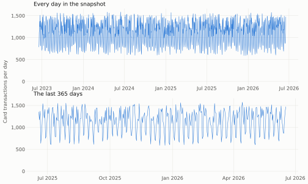
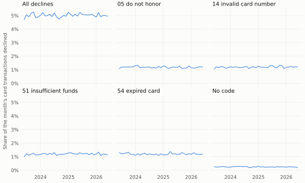
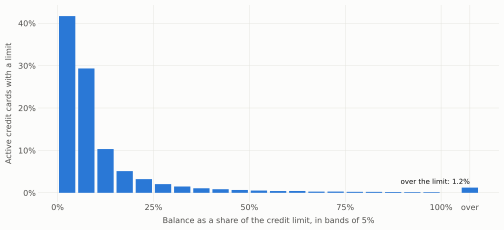
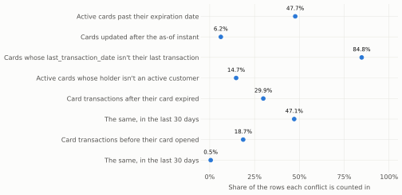

# Card support

Snapshot `b3b8b248f604ef9a`, as of **2026-06-18 06:00:00** (business date 2026-06-17), computed by `make analysis` with DuckDB 1.5.5. It feeds the card support policy and the evaluation ADR, which cite it.

It reads development customers only. The held-out fifth of [ADR-0003](../adr/0003-choose-workflow-from-evidence.md), customers whose `customer_id` has an MD5 divisible by 5 (29,825 of the 150,000 registered by the as-of instant), is set aside before anything is read, so the policy and its personas never see them (DML-09); 120,175 customers remain. A window such as "the last 30 days" is 30 × 24 hours ending at the as-of instant, counted by each event's own timestamp. Row counts from 1 to 9 appear as `<10` (SEC-03); [card-support.json](card-support.json) holds the same numbers for code.

## Findings for the policy

- **Card numbers are shaped like real ones.** Of 112,349 cards, 112,349 (100.00%) have a `product_number` of digits only, 16 digits long and starting with `4`; 112,349 (100.00%) are distinct, and 11,179 (9.95%) pass the Luhn check real card numbers satisfy, where random check digits would pass one in ten. The tools show the last four digits only, and nothing this analysis publishes prints more (section 1).
- **Confirming a card by its last four digits (CTL-02) needs a fallback**: <10 customers hold two active cards of the same type that end in the same four digits (<10 counting cards in any status).
- **Holding several cards is common.** Of 65,796 customers with an active card, 13,420 hold two or more active credit cards and 2,681 two or more active debit cards, so a request that doesn't say which card is clarified before it is answered (AI-02).
- **`last_transaction_date` disagrees with the card's transactions.** It equals the card's latest transaction on 0 of 112,349 cards; it is earlier on 75,667 and later on 9,943, missing on 9,617 cards that have transactions, and present on 0 that have none. Where both exist, the median gap is 472.3 days. Recency is read from the transactions (section 6).
- **Card dates conflict with card activity.** 45,418 (47.69%) active cards are past their expiration date. In the last 30 days, 16,611 (47.12%) card transactions fall after their card's expiration date and 192 (0.54%) before its opening date. The tools surface these as conflicts and resolve none (section 6).
- **14,030 (14.73%) active cards belong to customers who aren't active** (Closed 1,869, Inactive 9,400, and Suspended 2,761): the policy decides what the agent does when the signed-in customer's own record isn't active (section 1).
- **Only a declined transaction is explained by its code.** Pending and reversed transactions carry the same four codes (23,568 and 11,967 of them), and approved ones carry `00` (section 3).
- **Decline codes and fraud marks are unrelated to the fields recorded with the transaction.** The largest bias-corrected Cramér's V is 0.008 between the code and `hour` (against 0.563 with `transaction_status`), and 0.002 between `is_fraud` and `country` (against 0.709 with `fraud_score`, which is drawn from it). An explanation cites the code and nothing else, and `is_fraud` stays the bank's flag only (sections 3 and 4).
- **Mexico has no pesos.** Every card of a Mexican customer is in USD. 1,239,966 (100.00%) of 1,239,966 card transactions are in their card's currency. `amount_usd` converts ARS at 350 (the bank's daily rate: 343 to 357) and COP at 4,000 (the bank's daily rate: 3,920 to 4,079.9), so amounts are shown in the card's currency and `amount_usd` is never quoted (section 7).
- **Most active cards have no transaction in the last 30 days.** Of 95,227 active cards, the last transaction falls within 8.0% in 7, 30.8% in 30, 66.2% in 90, and 98.7% in 365 days; among cards with any in the window, 99% have at most 3 in 30 days and 4 in 90 days. The transactions tool's window and page size follow from these (section 2).
- **Available credit can be negative or unknown.** 797 (1.17%) active credit cards carry a balance above their limit, and 3,441 (5.05%) have no limit; the available-credit answer needs wording for both (section 5).
- **A debit card's `current_balance` isn't an account balance.** Products carry no link from a card to an account, and 13 of 27,023 active debit cards hold a balance equal to one of their holder's accounts. Available credit stays unsupported on debit cards (section 5).
- **Natural cases stay thin among development customers.** A decline with no listed code backs 75, 231, and 972 customers in 30, 90, and 365 days, and a transaction marked `is_fraud` on an active card backs 27, 87, and 360 (sections 3 and 4).

## 1. Cards and holders

73,019 of the 120,175 development customers hold a card, credit (`Tarjeta Crédito`) or debit (`Tarjeta Débito`).

| Card type | Active | Blocked | Closed | Suspended | All |
|---|---|---|---|---|---|
| `Tarjeta Crédito` | 68,204 | 4,028 | 6,502 | 1,608 | 80,342 |
| `Tarjeta Débito` | 27,023 | 1,687 | 2,602 | 695 | 32,007 |

Cards per holder, in any status, and active cards of one type per holder of one:

| Cards held | Holders |
|---|---|
| 1 | 44,081 (60.37%) |
| 2 | 20,671 (28.31%) |
| 3 | 6,496 (8.90%) |
| 4 | 1,473 (2.02%) |
| 5 or more | 298 (0.41%) |

| Active cards of the type | `Tarjeta Crédito` | `Tarjeta Débito` |
|---|---|---|
| 1 | 38,649 | 21,467 |
| 2 | 11,058 | 2,501 |
| 3 | 2,045 | 167 |
| 4 | 286 | 12 |
| 5 or more | 31 | <10 |

Customers with an active card, by country and segment (for personas and segment sampling, EVL-12):

| Country | Basic | Plus | Premium | Student |
|---|---|---|---|---|
| Argentina | 7,799 | 3,317 | 1,282 | 656 |
| Colombia | 11,967 | 4,878 | 2,052 | 948 |
| Mexico | 19,615 | 8,293 | 3,393 | 1,596 |

Active cards by their holder's `customer_status`:

| `customer_status` | Active cards |
|---|---|
| Active | 81,197 (85.27%) |
| Closed | 1,869 (1.96%) |
| Inactive | 9,400 (9.87%) |
| Suspended | 2,761 (2.90%) |

### Card numbers

Measured in SQL; no number, and no part of one beyond its first digit, leaves the query.

| Measure | Cards |
|---|---|
| Cards | 112,349 |
| Distinct `product_number`s | 112,349 (100.00%) |
| Digits only | 112,349 (100.00%) |
| Lengths | 16 |
| Starting with `4` | 112,349 (100.00%) |
| Passing the Luhn check | 11,179 (9.95%) |

| Customers holding two cards that end in the same four digits | Customers |
|---|---|
| Any cards | <10 |
| Active cards | <10 |
| Active cards of the same type | <10 |

## 2. Activity

1,239,966 card transactions over the whole snapshot. A day is the 24 hours ending at the as-of time of day, as the windows count them.

| Period | Days | Card transactions | Mean per day | Fewest in a day | Most in a day |
|---|---|---|---|---|---|
| 2025-06-18 to 2026-06-17 | 365 | 414,226 | 1,134.9 | 590 | 1,573 |
| 2024-06-18 to 2025-06-17 | 365 | 411,337 | 1,127 | 597 | 1,570 |
| 2023-06-17 to 2024-06-17 | 367 | 414,403 | 1,129.2 | 606 | 1,583 |

The rest of this section reads the last 365 days, unless it says otherwise.

| Weekday | Card transactions |
|---|---|
| Monday | 65,447 (15.80%) |
| Tuesday | 66,887 (16.15%) |
| Wednesday | 69,684 (16.82%) |
| Thursday | 64,840 (15.65%) |
| Friday | 67,963 (16.41%) |
| Saturday | 39,883 (9.63%) |
| Sunday | 39,522 (9.54%) |

Active cards by how recent their last transaction is, over the whole snapshot:

| Card type | Active cards | Last transaction within 7 days | Last transaction within 30 days | Last transaction within 90 days | Last transaction within 365 days | No transaction |
|---|---|---|---|---|---|---|
| `Tarjeta Crédito` | 68,204 | 5,475 (8.03%) | 21,061 (30.88%) | 45,151 (66.20%) | 67,336 (98.73%) | 0 |
| `Tarjeta Débito` | 27,023 | 2,179 (8.06%) | 8,288 (30.67%) | 17,853 (66.07%) | 26,692 (98.78%) | 0 |

Transactions per active card, among cards with one in the window:

| Window | Active cards with a transaction | Median | 90th percentile | 99th percentile |
|---|---|---|---|---|
| 30 days | 29,349 | 1 | 2 | 3 |
| 90 days | 63,004 | 1 | 3 | 4 |

| `channel` | `Tarjeta Crédito` | `Tarjeta Débito` | Share of all |
|---|---|---|---|
| ATM | 89,405 | 35,458 | 30.1% |
| App | 44,376 | 17,637 | 15.0% |
| Branch | 8,758 | 3,452 | 2.9% |
| POS | 103,530 | 40,891 | 34.9% |
| Transfer | 5,981 | 2,365 | 2.0% |
| Web | 44,702 | 17,671 | 15.1% |

| `transaction_type` | `Tarjeta Crédito` | `Tarjeta Débito` | Share of all |
|---|---|---|---|
| Payment | 44,060 | 17,646 | 14.9% |
| Purchase | 207,916 | 82,238 | 70.0% |
| Withdrawal | 44,776 | 17,590 | 15.1% |

Transactions made outside the customer's country, and where:

| Customer country | Card transactions | Abroad |
|---|---|---|
| Argentina | 82,071 | 4,144 (5.05%) |
| Colombia | 124,062 | 6,297 (5.08%) |
| Mexico | 208,093 | 8,717 (4.19%) |

| `transaction_country` | Card transactions abroad |
|---|---|
| Argentina | 3,022 (15.77%) |
| Brazil | 3,820 (19.94%) |
| Colombia | 2,635 (13.75%) |
| Mexico | 2,050 (10.70%) |
| Spain | 3,681 (19.21%) |
| USA | 3,950 (20.62%) |

## 3. Declines

62,242 (5.02%) card transactions are declined over the whole snapshot. Every declined share below is of card transactions; the codes are read with their ISO 8583 meanings, as ADR-0003's rule reads them.

| `transaction_status` | `00` | `05` | `14` | `51` | `54` | (missing) |
|---|---|---|---|---|---|---|
| `Approved` | 1,083,509 | 0 | 0 | 0 | 0 | 56,769 |
| `Declined` | 0 | 14,722 | 14,854 | 14,804 | 14,822 | 3,040 |
| `Pending` | 0 | 5,979 | 5,973 | 5,803 | 5,813 | 1,256 |
| `Reversed` | 0 | 2,970 | 2,991 | 2,992 | 3,014 | 655 |

| Field | Value | Card transactions | Declined |
|---|---|---|---|
| `channel` | `ATM` | 372,472 | 18,842 (5.06%) |
| `channel` | `App` | 185,751 | 9,213 (4.96%) |
| `channel` | `Branch` | 37,127 | 1,926 (5.19%) |
| `channel` | `POS` | 433,532 | 21,742 (5.02%) |
| `channel` | `Transfer` | 24,868 | 1,239 (4.98%) |
| `channel` | `Web` | 186,216 | 9,280 (4.98%) |
| `transaction_type` | `Payment` | 185,553 | 9,282 (5.00%) |
| `transaction_type` | `Purchase` | 868,267 | 43,699 (5.03%) |
| `transaction_type` | `Withdrawal` | 186,146 | 9,261 (4.98%) |
| `merchant_category` | `Entertainment` | 123,476 | 6,229 (5.04%) |
| `merchant_category` | `Food` | 205,716 | 10,264 (4.99%) |
| `merchant_category` | `Health` | 82,608 | 4,162 (5.04%) |
| `merchant_category` | `Other` | 124,392 | 6,318 (5.08%) |
| `merchant_category` | `Services` | 164,576 | 8,243 (5.01%) |
| `merchant_category` | `Transport` | 123,758 | 6,250 (5.05%) |
| `merchant_category` | (missing) | 415,440 | 20,776 (5.00%) |
| `product_type` | `Tarjeta Crédito` | 888,444 | 44,550 (5.01%) |
| `product_type` | `Tarjeta Débito` | 351,522 | 17,692 (5.03%) |
| `abroad` | `false` | 1,183,265 | 59,493 (5.03%) |
| `abroad` | `true` | 56,701 | 2,749 (4.85%) |
| `country` | `Argentina` | 246,670 | 12,258 (4.97%) |
| `country` | `Colombia` | 371,617 | 18,448 (4.96%) |
| `country` | `Mexico` | 621,679 | 31,536 (5.07%) |
| `segment` | `Basic` | 741,902 | 37,231 (5.02%) |
| `segment` | `Plus` | 310,264 | 15,585 (5.02%) |
| `segment` | `Premium` | 127,197 | 6,442 (5.06%) |
| `segment` | `Student` | 60,603 | 2,984 (4.92%) |

How much the code of a declined transaction depends on each field, as Cramér's V with Bergsma's bias correction (0 when independent, 1 when one determines the other; a missing value counts as one of its own). By Cohen's convention, below 0.1 is negligible. For scale, the code against `transaction_status` over every card transaction reads 0.563.

| Field | Values | Declines read | Cramér's V |
|---|---|---|---|
| `channel` | 6 | 62,242 | 0.006 |
| `transaction_type` | 3 | 62,242 | 0.000 |
| `merchant_category` | 7 | 62,242 | 0.000 |
| `product_type` | 2 | 62,242 | 0.000 |
| `abroad` | 2 | 62,242 | 0.000 |
| `country` | 3 | 62,242 | 0.004 |
| `segment` | 4 | 62,242 | 0.004 |
| `amount_decile` | 10 | 62,242 | 0.000 |
| `hour` | 24 | 62,242 | 0.008 |
| `weekday` | 7 | 62,242 | 0.000 |
| `month` | 37 | 62,242 | 0.005 |

Declines with no code, or a code outside `05` do not honor, `14` invalid card number, `51` insufficient funds, and `54` expired card, which the rule can't explain:

| Window | Declines | Customers |
|---|---|---|
| Last 30 days | 76 | 75 |
| Last 90 days | 232 | 231 |
| Last 365 days | 980 | 972 |

## 4. `is_fraud`

Where the bank's flag falls, over the whole snapshot:

| Field | Value | Card transactions | Marked `is_fraud` |
|---|---|---|---|
| `channel` | `ATM` | 372,472 | 385 (0.10%) |
| `channel` | `App` | 185,751 | 190 (0.10%) |
| `channel` | `Branch` | 37,127 | 45 (0.12%) |
| `channel` | `POS` | 433,532 | 413 (0.10%) |
| `channel` | `Transfer` | 24,868 | 31 (0.12%) |
| `channel` | `Web` | 186,216 | 174 (0.09%) |
| `transaction_type` | `Payment` | 185,553 | 182 (0.10%) |
| `transaction_type` | `Purchase` | 868,267 | 872 (0.10%) |
| `transaction_type` | `Withdrawal` | 186,146 | 184 (0.10%) |
| `merchant_category` | `Entertainment` | 123,476 | 135 (0.11%) |
| `merchant_category` | `Food` | 205,716 | 199 (0.10%) |
| `merchant_category` | `Health` | 82,608 | 85 (0.10%) |
| `merchant_category` | `Other` | 124,392 | 125 (0.10%) |
| `merchant_category` | `Services` | 164,576 | 163 (0.10%) |
| `merchant_category` | `Transport` | 123,758 | 118 (0.10%) |
| `merchant_category` | (missing) | 415,440 | 413 (0.10%) |
| `product_type` | `Tarjeta Crédito` | 888,444 | 882 (0.10%) |
| `product_type` | `Tarjeta Débito` | 351,522 | 356 (0.10%) |
| `abroad` | `false` | 1,183,265 | 1,177 (0.10%) |
| `abroad` | `true` | 56,701 | 61 (0.11%) |
| `country` | `Argentina` | 246,670 | 223 (0.09%) |
| `country` | `Colombia` | 371,617 | 350 (0.09%) |
| `country` | `Mexico` | 621,679 | 665 (0.11%) |
| `segment` | `Basic` | 741,902 | 746 (0.10%) |
| `segment` | `Plus` | 310,264 | 307 (0.10%) |
| `segment` | `Premium` | 127,197 | 122 (0.10%) |
| `segment` | `Student` | 60,603 | 63 (0.10%) |
| `transaction_status` | `Approved` | 1,140,278 | 1,148 (0.10%) |
| `transaction_status` | `Declined` | 62,242 | 65 (0.10%) |
| `transaction_status` | `Pending` | 24,824 | 19 (0.08%) |
| `transaction_status` | `Reversed` | 12,622 | <10 |

Cramér's V between `is_fraud` and each field, as in section 3. For scale, `is_fraud` against `fraud_score` in bands of 10 (drawn from it) reads 0.709.

| Field | Values | Card transactions | Cramér's V |
|---|---|---|---|
| `channel` | 6 | 1,239,966 | 0.001 |
| `transaction_type` | 3 | 1,239,966 | 0.000 |
| `merchant_category` | 7 | 1,239,966 | 0.000 |
| `product_type` | 2 | 1,239,966 | 0.000 |
| `abroad` | 2 | 1,239,966 | 0.000 |
| `country` | 3 | 1,239,966 | 0.002 |
| `segment` | 4 | 1,239,966 | 0.000 |
| `amount_decile` | 10 | 1,239,966 | 0.002 |
| `hour` | 24 | 1,239,966 | 0.000 |
| `weekday` | 7 | 1,239,966 | 0.002 |
| `month` | 37 | 1,239,966 | 0.002 |

Transactions marked `is_fraud` on active cards:

| Window | Marked transactions | Customers |
|---|---|---|
| Last 30 days | 27 | 27 |
| Last 90 days | 87 | 87 |
| Last 365 days | 362 | 360 |

## 5. Balances

Active credit cards. Utilization is `current_balance` over `credit_limit`, for cards with a limit above zero.

| Active credit cards | Cards |
|---|---|
| All | 68,204 |
| With a limit | 64,763 (94.95%) |
| Without a limit | 3,441 (5.05%) |
| Balance above the limit | 797 (1.17%) |
| Balance of zero | 1,498 (2.20%) |
| Negative balance | 0 |

| Percentile | 10th | 25th | 50th | 75th | 90th | 99th |
|---|---|---|---|---|---|---|
| Utilization | 1.9% | 3.5% | 5.9% | 11.4% | 25.6% | 109.9% |

| Credit cards by `product_status` | Cards | Without a limit |
|---|---|---|
| `Active` | 68,204 | 3,441 (5.05%) |
| `Blocked` | 4,028 | 188 (4.67%) |
| `Closed` | 6,502 | 329 (5.06%) |
| `Suspended` | 1,608 | 80 (4.98%) |

| Active debit cards | Cards |
|---|---|
| All | 27,023 |
| With a `credit_limit` | 0 |
| Balance of zero | 570 (2.11%) |
| Negative balance | 0 |
| Balance equal to one of the holder's accounts | 13 (0.05%) |

`current_balance` on active cards, in each card's currency:

| Card type | Currency | Active cards | 10th percentile | Median | 90th percentile |
|---|---|---|---|---|---|
| `Tarjeta Crédito` | ARS | 12,162 | 197,180.70 | 524,143.53 | 859,205.02 |
| `Tarjeta Crédito` | COP | 18,363 | 2,186,193.30 | 6,022,880.86 | 9,869,165.79 |
| `Tarjeta Crédito` | USD | 37,679 | 541.39 | 1,499.48 | 2,470.25 |
| `Tarjeta Débito` | ARS | 4,878 | 103,654.41 | 278,710.08 | 457,870.85 |
| `Tarjeta Débito` | COP | 7,362 | 1,217,063.54 | 3,217,418.00 | 5,282,012.00 |
| `Tarjeta Débito` | USD | 14,783 | 289.38 | 796.27 | 1,313.94 |

## 6. Dates

A card is past its expiration date when `expiration_date` is before the business date; a transaction is before opening or after expiration by its calendar date.

| `product_status` | Cards | No `expiration_date` | Past expiration | Expires before opening | Updated after the as-of instant |
|---|---|---|---|---|---|
| `Active` | 95,227 | 4,712 (4.95%) | 45,418 (47.69%) | 0 | 5,937 (6.23%) |
| `Blocked` | 5,715 | 244 (4.27%) | 2,785 (48.73%) | 0 | 323 (5.65%) |
| `Closed` | 9,104 | 466 (5.12%) | 4,279 (47.00%) | 0 | 572 (6.28%) |
| `Suspended` | 2,303 | 100 (4.34%) | 1,132 (49.15%) | 0 | 135 (5.86%) |

`last_transaction_date` against the card's latest transaction at the as-of instant:

| Comparison | Cards |
|---|---|
| Equal | 0 |
| Recorded earlier | 75,667 (67.35%) |
| Recorded later | 9,943 (8.85%) |
| Recorded, but the card has no transaction | 0 |
| Not recorded, but the card has transactions | 9,617 (8.56%) |
| Neither | 17,122 (15.24%) |

Where both exist, they are 42.8 days apart at the 10th percentile, 472.3 days apart at the median, and 1,633.1 days apart at the 90th.

| Card transactions | All | Before their card opened | After their card expired |
|---|---|---|---|
| Whole snapshot | 1,239,966 | 231,406 (18.66%) | 370,537 (29.88%) |
| Last 365 days | 414,226 | 25,874 (6.25%) | 173,060 (41.78%) |
| Last 90 days | 103,547 | 1,626 (1.57%) | 47,573 (45.94%) |
| Last 30 days | 35,256 | 192 (0.54%) | 16,611 (47.12%) |

## 7. Currency

| Customer country | ARS | COP | USD |
|---|---|---|---|
| Argentina | 20,093 | 0 | 2,200 |
| Colombia | 0 | 30,377 | 3,418 |
| Mexico | 0 | 0 | 56,261 |

1,239,966 (100.00%) card transactions are in their card's currency.

| `currency` | Card transactions | With `amount_usd` | `amount` over `amount_usd`: 1st, 50th, 99th percentile | Bank's daily rate from USD: lowest to highest |
|---|---|---|---|---|
| ARS | 222,481 | 211,360 (95.00%) | 350, 350, 350 | 343 to 357 |
| COP | 334,256 | 317,546 (95.00%) | 3,999.4, 4,000, 4,000.6 | 3,920 to 4,079.9 |
| USD | 683,229 | 0 | n/a | n/a |

## 8. Missing values

Each field measured in the rows that should carry it: `credit_limit` and `days_past_due` on credit cards, `merchant_name` and `merchant_category` on purchases, `transaction_category` on everything but withdrawals, and `amount_usd` outside USD.

| Field | Rows read | Populated | Share |
|---|---|---|---|
| `products.product_number` | 112,349 | 112,349 | 100.00% |
| `products.product_status` | 112,349 | 112,349 | 100.00% |
| `products.currency` | 112,349 | 112,349 | 100.00% |
| `products.current_balance` | 112,349 | 112,349 | 100.00% |
| `products.opening_date` | 112,349 | 112,349 | 100.00% |
| `products.credit_limit` | 80,342 | 76,304 | 94.97% |
| `products.interest_rate` | 112,349 | 101,206 | 90.08% |
| `products.expiration_date` | 112,349 | 106,827 | 95.08% |
| `products.days_past_due` | 80,342 | 76,284 | 94.95% |
| `products.last_transaction_date` | 112,349 | 85,610 | 76.20% |
| `transactions.transaction_type` | 1,239,966 | 1,239,966 | 100.00% |
| `transactions.transaction_status` | 1,239,966 | 1,239,966 | 100.00% |
| `transactions.response_code` | 1,239,966 | 1,178,246 | 95.02% |
| `transactions.is_fraud` | 1,239,966 | 1,239,966 | 100.00% |
| `transactions.fraud_score` | 1,239,966 | 991,981 | 80.00% |
| `transactions.channel` | 1,239,966 | 1,239,966 | 100.00% |
| `transactions.transaction_country` | 1,239,966 | 1,239,966 | 100.00% |
| `transactions.merchant_name` | 868,267 | 824,874 | 95.00% |
| `transactions.merchant_category` | 868,267 | 824,526 | 94.96% |
| `transactions.transaction_category` | 1,053,820 | 1,001,482 | 95.03% |
| `transactions.amount_usd` | 556,737 | 528,906 | 95.00% |

Whether one gap makes another likelier: rows missing both fields against the count expected if gaps fell independently. A ratio near 1 means they do.

Card purchases:

| Fields | Rows | First missing | Second missing | Both missing | Expected if independent | Ratio |
|---|---|---|---|---|---|---|
| `response_code`, `merchant_name` | 868,267 | 43,215 | 43,393 | 2,184 | 2,159.7 | 1.01 |
| `response_code`, `merchant_category` | 868,267 | 43,215 | 43,741 | 2,178 | 2,177.1 | 1.00 |
| `response_code`, `transaction_category` | 868,267 | 43,215 | 43,280 | 2,121 | 2,154.1 | 0.98 |
| `response_code`, `fraud_score` | 868,267 | 43,215 | 173,571 | 8,510 | 8,638.9 | 0.99 |
| `merchant_name`, `merchant_category` | 868,267 | 43,393 | 43,741 | 2,144 | 2,186 | 0.98 |
| `merchant_name`, `transaction_category` | 868,267 | 43,393 | 43,280 | 2,150 | 2,163 | 0.99 |
| `merchant_name`, `fraud_score` | 868,267 | 43,393 | 173,571 | 8,721 | 8,674.5 | 1.01 |
| `merchant_category`, `transaction_category` | 868,267 | 43,741 | 43,280 | 2,240 | 2,180.3 | 1.03 |
| `merchant_category`, `fraud_score` | 868,267 | 43,741 | 173,571 | 8,801 | 8,744 | 1.01 |
| `transaction_category`, `fraud_score` | 868,267 | 43,280 | 173,571 | 8,641 | 8,651.9 | 1.00 |

Credit cards:

| Fields | Rows | First missing | Second missing | Both missing | Expected if independent | Ratio |
|---|---|---|---|---|---|---|
| `credit_limit`, `interest_rate` | 80,342 | 4,038 | 7,976 | 423 | 400.9 | 1.06 |
| `credit_limit`, `expiration_date` | 80,342 | 4,038 | 3,999 | 209 | 201 | 1.04 |
| `credit_limit`, `days_past_due` | 80,342 | 4,038 | 4,058 | 179 | 204 | 0.88 |
| `interest_rate`, `expiration_date` | 80,342 | 7,976 | 3,999 | 370 | 397 | 0.93 |
| `interest_rate`, `days_past_due` | 80,342 | 7,976 | 4,058 | 430 | 402.9 | 1.07 |
| `expiration_date`, `days_past_due` | 80,342 | 3,999 | 4,058 | 210 | 202 | 1.04 |

## 9. Context

Complaints and contacts by development customers, dated by their own timestamps, in 12-month periods ending at the as-of instant. Context for demand patterns (PRB-02), not attribution: contacts can't be tied to a workflow (see the [profile](profiling.md#contact-attribution)), and a complaint names a card only through `affected_product_id`.

| Complaint category | Last 12 months | 12 to 24 months before | Earlier |
|---|---|---|---|
| Branch | 3,565 (646 on a card) | 3,507 (706 on a card) | 3,609 (687 on a card) |
| Fees | 3,515 (629 on a card) | 3,657 (706 on a card) | 3,668 (704 on a card) |
| Service | 3,593 (662 on a card) | 3,463 (620 on a card) | 3,445 (649 on a card) |
| Technical | 3,511 (634 on a card) | 3,623 (684 on a card) | 3,561 (675 on a card) |
| Transactions | 3,662 (664 on a card) | 3,555 (659 on a card) | 3,566 (634 on a card) |

| Contact reason | Last 12 months | 12 to 24 months before | Earlier |
|---|---|---|---|
| Comercial | 14,864 | 14,425 | 14,788 |
| Producto | 40,434 | 40,283 | 40,185 |
| Queja | 31,485 | 31,067 | 31,098 |
| Retención | 5,465 | 5,359 | 5,657 |
| Transaccional | 64,032 | 64,053 | 64,194 |
| Técnico | 27,650 | 27,268 | 27,489 |
