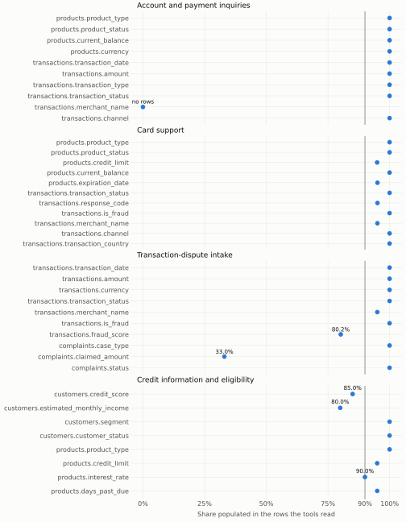
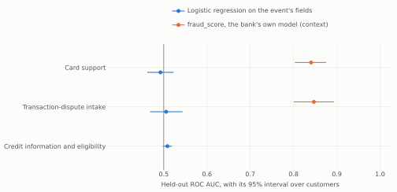

# Workflow selection

Snapshot `b3b8b248f604ef9a`, as of **2026-06-18 06:00:00** (business date 2026-06-17), computed by `make analysis` with DuckDB 1.5.5 under the rule in [ADR-0003](../adr/0003-choose-workflow-from-evidence.md). Row counts from 1 to 9 appear as `<10` (SEC-03); [selection.json](selection.json) holds the same numbers for code.

## Gates

**No candidate passes all four gates.** Under ADR-0003, the gates are revisited in writing before anything else.

| Candidate | F1: fields | F2: state | E1: reference outcomes | E2: learned component |
|---|---|---|---|---|
| Account and payment inquiries | **fails**: `transactions.merchant_name` no rows | passes: 48,477 customers | passes: 3 rules over 11 fields | **fails**: no label in the dictionary |
| Card support | passes: lowest 94.95% | passes: 32,588 customers | passes: 3 rules over 11 fields | **fails**: ROC AUC 0.493 [0.462, 0.523] |
| Transaction-dispute intake | **fails**: `transactions.fraud_score` 80.19%, `complaints.claimed_amount` 33.01% | passes: 38,598 customers | passes: 3 rules over 9 fields | **fails**: ROC AUC 0.506 [0.469, 0.543] |
| Credit information and eligibility | **fails**: `customers.credit_score` 85.01%, `customers.estimated_monthly_income` 79.98% | passes: 86,897 customers | passes: 3 rules over 9 fields | **fails**: ROC AUC 0.508 [0.498, 0.519] |

## F1: fields

Each core field must be at least 90% populated in the rows its tools would read, measured on its own. A field the dictionary documents for some rows only is measured on those, and a field with no rows to measure fails.

### Account and payment inquiries

| Field | Rows read | Populated | Share |
|---|---|---|---|
| `products.product_type` | 220,182 | 220,182 | 100.00% |
| `products.product_status` | 220,182 | 220,182 | 100.00% |
| `products.current_balance` | 220,182 | 220,182 | 100.00% |
| `products.currency` | 220,182 | 220,182 | 100.00% |
| `transactions.transaction_date` | 70,215 | 70,215 | 100.00% |
| `transactions.amount` | 70,215 | 70,215 | 100.00% |
| `transactions.transaction_type` | 70,215 | 70,215 | 100.00% |
| `transactions.transaction_status` | 70,215 | 70,215 | 100.00% |
| `transactions.merchant_name` | 0 | 0 | no rows |
| `transactions.channel` | 70,215 | 70,215 | 100.00% |

### Card support

| Field | Rows read | Populated | Share |
|---|---|---|---|
| `products.product_type` | 140,040 | 140,040 | 100.00% |
| `products.product_status` | 140,040 | 140,040 | 100.00% |
| `products.credit_limit` | 100,102 | 95,043 | 94.95% |
| `products.current_balance` | 140,040 | 140,040 | 100.00% |
| `products.expiration_date` | 140,040 | 133,161 | 95.09% |
| `transactions.transaction_status` | 44,003 | 44,003 | 100.00% |
| `transactions.response_code` | 44,003 | 41,840 | 95.08% |
| `transactions.is_fraud` | 44,003 | 44,003 | 100.00% |
| `transactions.merchant_name` | 30,543 | 29,032 | 95.05% |
| `transactions.channel` | 44,003 | 44,003 | 100.00% |
| `transactions.transaction_country` | 44,003 | 44,003 | 100.00% |

### Transaction-dispute intake

| Field | Rows read | Populated | Share |
|---|---|---|---|
| `transactions.transaction_date` | 55,595 | 55,595 | 100.00% |
| `transactions.amount` | 55,595 | 55,595 | 100.00% |
| `transactions.currency` | 55,595 | 55,595 | 100.00% |
| `transactions.transaction_status` | 55,595 | 55,595 | 100.00% |
| `transactions.merchant_name` | 55,595 | 52,822 | 95.01% |
| `transactions.is_fraud` | 55,595 | 55,595 | 100.00% |
| `transactions.fraud_score` | 55,595 | 44,582 | 80.19% |
| `complaints.case_type` | 27,131 | 27,131 | 100.00% |
| `complaints.claimed_amount` | 27,131 | 8,957 | 33.01% |
| `complaints.status` | 27,131 | 27,131 | 100.00% |

### Credit information and eligibility

| Field | Rows read | Populated | Share |
|---|---|---|---|
| `customers.credit_score` | 150,000 | 127,508 | 85.01% |
| `customers.estimated_monthly_income` | 150,000 | 119,967 | 79.98% |
| `customers.segment` | 150,000 | 150,000 | 100.00% |
| `customers.customer_status` | 150,000 | 150,000 | 100.00% |
| `products.product_type` | 131,972 | 131,972 | 100.00% |
| `products.credit_limit` | 131,972 | 125,317 | 94.96% |
| `products.interest_rate` | 131,972 | 118,775 | 90.00% |
| `products.days_past_due` | 131,972 | 125,350 | 94.98% |

## F2: state

At least 100 customers must be in the state the normal path needs at the as-of instant, each counted once.

| Candidate | Normal-path state | Customers |
|---|---|---|
| Account and payment inquiries | An active checking or savings account with a transaction in the 30 days before the business date | 48,477 |
| Card support | An active credit or debit card with a transaction in the 30 days before the business date | 32,588 |
| Transaction-dispute intake | An approved purchase in the 60 days before the business date | 38,598 |
| Credit information and eligibility | An active customer with `credit_score` and `estimated_monthly_income` populated | 86,897 |

## E1: reference outcomes

ADR-0003 sketches 3 deterministic rules per candidate; each must read only fields the dictionary holds, through references it declares.

| Candidate | Rules | Fields read | Not in the dictionary |
|---|---|---|---|
| Account and payment inquiries | Balance and recent movements; Movement not found; Failed payment handed off | 11 | none |
| Card support | Card status and available credit; Declined transaction explained; Card block, handed off over fraud | 11 | none |
| Transaction-dispute intake | Eligibility to dispute; Case facts from the transaction; Fraud or merchant route | 9 | none |
| Credit information and eligibility | Held credit products; Simulated eligibility; Review path | 9 | none |

Complaints reference `branches`, `call_center_interactions`, `customers`, `products`, `service_agents`, never `transactions`: no rule can find an earlier dispute of the same transaction.

## E2: learned component

A logistic regression (L2, C = 1, no tuning) on the fields recorded with each event, fitted on every customer outside the held-out fifth (the MD5 of `customer_id` divisible by 5) and scored on that fifth. E2 passes when the 95% percentile interval of the held-out ROC AUC, over 1,000 resamples of held-out customers (seed 20260927), lies above 0.5. The features are ADR-0003's; `fraud_score`, `response_code`, and `transaction_status` are never among them.

| Candidate | Label | Training rows (positives) | Held-out rows (positives) | Held-out customers | ROC AUC [95% interval] | `fraud_score` ROC AUC |
|---|---|---|---|---|---|---|
| Account and payment inquiries | none in the dictionary | n/a | n/a | n/a | n/a | n/a |
| Card support | `is_fraud` on card transactions | 1,239,966 (1,238) | 307,466 (310) | 16,342 | 0.493 [0.462, 0.523] | 0.841 [0.803, 0.875] on 245,719 rows |
| Transaction-dispute intake | `is_fraud` on the transactions a customer could dispute (approved purchases) | 798,318 (805) | 197,850 (201) | 16,339 | 0.506 [0.469, 0.543] | 0.847 [0.801, 0.894] on 158,115 rows |
| Credit information and eligibility | `days_past_due` of 30 or more on credit products | 100,645 (12,567) | 24,705 (3,084) | 16,811 | 0.508 [0.498, 0.519] | n/a |

`is_fraud` on card transactions by the bank's `fraud_score`, the field E2 leaves out:

| `fraud_score` | Card transactions | Marked `is_fraud` |
|---|---|---|
| 0 to 20 | 824,801 | 241 (0.03%) |
| 20 to 40 | 412,171 | 247 (0.06%) |
| 40 to 60 | 239 | 239 (100.00%) |
| 60 to 80 | 239 | 239 (100.00%) |
| 80 to 100 | 250 | 250 (100.00%) |
| not scored | 309,732 | 332 (0.11%) |

## Judgment evidence

ADR-0003's judgment runs only among candidates that pass every gate. The evidence is reported for all four, for the judgment or for the written revisit of the gates.

### Evaluation depth

Customers at the as-of instant whose records could back each evaluation situation that depends on the workflow; a situation counts as covered with at least 100. Each situation counts the records of one of the candidate's E1 rules.

| Candidate | Normal path (SCP-03) | Decline or can't confirm (SCP-04) | Handoff (SCP-05) | Missing data (EVL-02) | Covered |
|---|---|---|---|---|---|
| Account and payment inquiries | 48,477 | 115,313 | 453 | 0 | 3 of 4 |
| Card support | 32,588 | 96 | 34 | 14,232 | 2 of 4 |
| Transaction-dispute intake | 38,598 | 91,772 | 51 | 27,753 | 3 of 4 |
| Credit information and eligibility | 86,897 | 8,684 | 40,803 | 63,689 | 4 of 4 |

| Candidate | Situation | Records that back it |
|---|---|---|
| Account and payment inquiries | SCP-04 | Movement not found: any account holder can ask about a movement that isn't there |
| Account and payment inquiries | SCP-05 | Failed payment handed off: a declined or reversed payment in the last 30 days |
| Card support | SCP-04 | Declined transaction explained: a decline in the last 30 days with a missing or unlisted `response_code` |
| Card support | SCP-05 | Card block, handed off over fraud: a transaction marked `is_fraud` in the last 30 days on an active card |
| Transaction-dispute intake | SCP-04 | Eligibility to dispute: a transaction in the last 60 days that isn't an approved purchase |
| Transaction-dispute intake | SCP-05 | Fraud or merchant route: an approved purchase in the last 60 days marked `is_fraud`, routed to human review |
| Credit information and eligibility | SCP-04 | Simulated eligibility, negative: an active, scored customer with a credit product 30 or more days past due |
| Credit information and eligibility | SCP-05 | Review path: an active customer missing `credit_score` or `estimated_monthly_income` |

### Attributable demand

Complaints created in the 12 months before the as-of instant, by ADR-0003's mapping. Contacts can't be attributed to a workflow (see the [profile](profiling.md#contact-attribution)).

| Category | Subcategory | Candidate | Complaints |
|---|---|---|---|
| Branch | Atención en sucursal | Out of scope | 3,986 (17.73%) |
| Branch | (none) | Out of scope | 506 (2.25%) |
| Fees | Cobro indebido | Transaction-dispute intake | 3,995 (17.77%) |
| Fees | (none) | Transaction-dispute intake | 429 (1.91%) |
| Service | Calidad de servicio | Out of scope | 4,100 (18.24%) |
| Service | (none) | Out of scope | 431 (1.92%) |
| Technical | Problema con app | Out of scope | 4,041 (17.98%) |
| Technical | (none) | Out of scope | 396 (1.76%) |
| Transactions | Cargo no reconocido | Transaction-dispute intake | 4,175 (18.57%) |
| Transactions | (none) | Transaction-dispute intake | 418 (1.86%) |

| Candidate | Attributable complaints |
|---|---|
| Account and payment inquiries | 0 |
| Card support | 0 |
| Transaction-dispute intake | 9,017 (40.12%) |
| Credit information and eligibility | 0 |

### Contact-center baseline

Contacts in the 12 months before the as-of instant, by `reason_category`, dated by their own `interaction_date` (PRB-07). Context for the human baseline and EVL-14; it doesn't enter the choice. Handle time is `duration_seconds`; resolution counts `was_resolved` among contacts that record it; CSAT is the mean `main_score` of CSAT surveys about the contact, and the snapshot's CSAT scores run from 1 to 4, against the dictionary's 1 to 5.

| Reason | Contacts | Median handle time | p90 handle time | Resolved on first contact | Escalated | CSAT (responses) |
|---|---|---|---|---|---|---|
| Comercial | 18,495 | 9:01 | 12:28 | 12,102 (65.43%) | 1,805 (9.76%) | 2.68 (3,432) |
| Producto | 50,481 | 4:22 | 6:18 | 45,288 (89.71%) | 5,075 (10.05%) | 2.90 (9,352) |
| Queja | 39,195 | 7:11 | 10:07 | 17,101 (43.63%) | 3,924 (10.01%) | 2.44 (7,211) |
| Retención | 6,869 | 7:59 | 11:04 | 4,131 (60.14%) | 640 (9.32%) | 2.58 (1,240) |
| Transaccional | 80,030 | 3:24 | 5:32 | 73,342 (91.64%) | 7,989 (9.98%) | 2.92 (14,866) |
| Técnico | 34,513 | 6:00 | 8:19 | 24,040 (69.65%) | 3,540 (10.26%) | 2.69 (6,339) |
