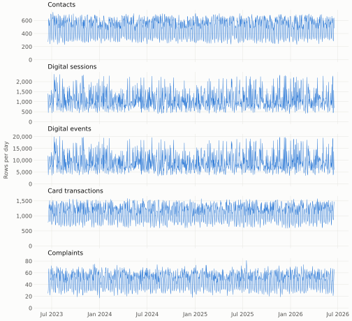
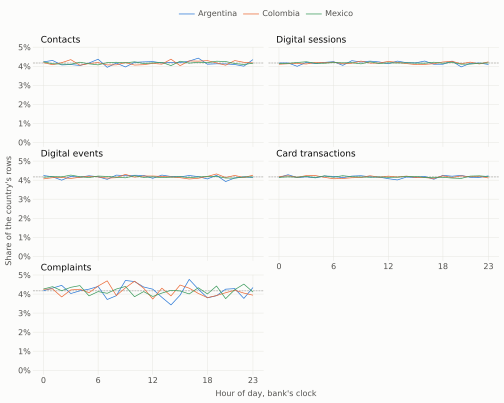
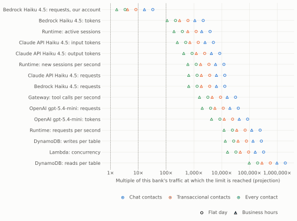

# Traffic and capacity

Snapshot `b3b8b248f604ef9a`, as of **2026-06-18 06:00:00** (business date 2026-06-17), computed by `make analysis` with DuckDB 1.5.5. It measures how much traffic the bank's customers generate, and projects what the card support agent would meet at this bank's size and beyond, for [ADR-0004](../adr/0004-agent-architecture-on-agentcore.md)'s capacity limits (OPS-08).

It reads development customers only. The held-out fifth of [ADR-0003](../adr/0003-choose-workflow-from-evidence.md), customers whose `customer_id` has an MD5 divisible by 5 (29,825 of the 150,000 registered by the as-of instant), is set aside before anything is read (DML-09); 120,175 customers remain. Sections 1 to 8 are measurements; section 9 is a projection and says so. Row counts from 1 to 9 appear as `<10` (SEC-03); [traffic.json](traffic.json) holds the same numbers for code, with the projection under its own key.

## Findings

- **No table has a daily cycle.** Over the last 365 days, the busiest hour of the day holds 7,847 contacts and the quietest 7,544, and the variance of the 24 hourly counts is 0.65 times their mean, where rows placed on the hours at random would give about 1. Each country and the digital sessions, card transactions, and complaints look the same (section 3). The synthetic data holds no peak hour, and the projection's business-hours profile is an assumption, not a finding.
- **Volume is flat across the three years.** Contacts ran 503.9, 499.9, and 499.8 a day in the last 12 months and the two years before them, and card transactions 1,134.9, 1,127, and 1,129.2 (section 1).
- **The week has a shape and the day doesn't.** Each weekday carries 16.3% to 17.0% of the week's contacts, and Saturday and Sunday 8.4% to 9.1% (section 2).
- **The busiest hour is chance on a flat day.** In the last 365 days, contacts peaked at 51 in one clock hour, against a mean of 21 and a 95th percentile of 33: 2.43 times the mean. The busiest day held 706 contacts, 1.40 times the mean day (section 4).
- **Contacts never spike; digital sessions do.** No day's contacts exceed 1.5 times the median of the same weekday over the 4 weeks before it (the highest is 1.41). Digital sessions do on 200 of 1,069 days, up to 3.05 times, and their busiest day is 2.14 times their mean day (section 5).
- **A contact takes 5:22 on average** (4:50 median, 8:59 at the 90th percentile), and a caller waits 2:00. Email, Web Chat, and WhatsApp contacts record neither handle nor wait time, so the projection gives chats the handle time of all contacts (section 7).
- **Digital events without a customer count only through their session.** 499,835 are attributed to the development customer their session names; 0 sessions name anyone else. Sessions that name no customer can't be placed on either side of the split and aren't read (section 8).

## 1. Per day

A day is the 24 hours ending at the as-of time of day, as the other reports count them. The table reads the last 365 days.

| Table | Rows | Mean per day | Median | 95th percentile | Fewest | Most |
|---|---|---|---|---|---|---|
| Contacts | 183,930 | 503.9 | 534 | 674.8 | 233 | 706 |
| Digital sessions | 397,121 | 1,088 | 952 | 2,148.2 | 402 | 2,328 |
| Digital events | 3,381,215 | 9,263.6 | 8,083 | 18,236.2 | 3,493 | 19,761 |
| Card transactions | 414,226 | 1,134.9 | 1,179 | 1,493 | 590 | 1,573 |
| Complaints | 17,846 | 48.9 | 53 | 67 | 19 | 81 |

Mean rows per day, by period:

| Table | 2025-06-18 to 2026-06-17 | 2024-06-18 to 2025-06-17 | 2023-06-17 to 2024-06-17 |
|---|---|---|---|
| Contacts | 503.9 | 499.9 | 499.8 |
| Digital sessions | 1,088 | 1,039.5 | 1,092.5 |
| Digital events | 9,263.6 | 8,830.5 | 9,282.1 |
| Card transactions | 1,134.9 | 1,127 | 1,129.2 |
| Complaints | 48.9 | 48.8 | 48.6 |

## 2. By weekday

Rows in the last 365 days, by the weekday of their day:

| Weekday | Contacts | Digital sessions | Digital events | Card transactions | Complaints |
|---|---|---|---|---|---|
| Monday | 29,945 (16.28%) | 62,628 (15.77%) | 532,782 (15.76%) | 65,447 (15.80%) | 2,747 (15.39%) |
| Tuesday | 30,382 (16.52%) | 61,438 (15.47%) | 523,695 (15.49%) | 66,887 (16.15%) | 3,006 (16.84%) |
| Wednesday | 31,198 (16.96%) | 62,177 (15.66%) | 529,142 (15.65%) | 69,684 (16.82%) | 3,064 (17.17%) |
| Thursday | 30,191 (16.41%) | 70,502 (17.75%) | 599,763 (17.74%) | 64,840 (15.65%) | 2,906 (16.28%) |
| Friday | 30,028 (16.33%) | 61,054 (15.37%) | 520,114 (15.38%) | 67,963 (16.41%) | 3,004 (16.83%) |
| Saturday | 16,654 (9.05%) | 41,893 (10.55%) | 356,801 (10.55%) | 39,883 (9.63%) | 1,646 (9.22%) |
| Sunday | 15,532 (8.44%) | 37,429 (9.43%) | 318,918 (9.43%) | 39,522 (9.54%) | 1,473 (8.25%) |

## 3. By hour of day

Rows in the last 365 days, by the hour of day of their own timestamp, in the bank's clock (the timestamps carry no time zone; the [profile](profiling.md) finds that each table's processing day ends at a fixed hour in every country, 06:00 or 08:00, so the hour isn't local time either). Dispersion is the variance of the 24 hourly counts over their mean: about 1 when rows fall on the hours at random, and far above 1 when the day has a shape. Digital events cluster within sessions, which raises their dispersion without a daily cycle; digital sessions don't.

| Table | Country | Rows | Quietest hour | Busiest hour | Dispersion |
|---|---|---|---|---|---|
| Contacts | All | 183,930 | 7,544 | 7,847 | 0.65 |
| Contacts | Argentina | 36,404 | 1,434 | 1,610 | 1.33 |
| Contacts | Colombia | 55,412 | 2,232 | 2,420 | 1.31 |
| Contacts | Mexico | 92,114 | 3,713 | 3,925 | 0.82 |
| Digital sessions | All | 397,121 | 16,215 | 16,794 | 0.98 |
| Digital sessions | Argentina | 78,836 | 3,123 | 3,381 | 1.42 |
| Digital sessions | Colombia | 119,635 | 4,886 | 5,105 | 0.85 |
| Digital sessions | Mexico | 198,650 | 8,154 | 8,411 | 0.52 |
| Digital events | All | 3,381,215 | 137,982 | 143,512 | 8.53 |
| Digital events | Argentina | 671,878 | 26,369 | 28,649 | 12.93 |
| Digital events | Colombia | 1,018,086 | 41,321 | 44,021 | 11.60 |
| Digital events | Mexico | 1,691,251 | 69,398 | 72,116 | 5.71 |
| Card transactions | All | 414,226 | 17,026 | 17,436 | 0.63 |
| Card transactions | Argentina | 82,071 | 3,290 | 3,515 | 0.83 |
| Card transactions | Colombia | 124,062 | 5,052 | 5,259 | 0.79 |
| Card transactions | Mexico | 208,093 | 8,508 | 8,809 | 0.62 |
| Complaints | All | 17,846 | 697 | 792 | 0.84 |
| Complaints | Argentina | 3,501 | 120 | 167 | 0.93 |
| Complaints | Colombia | 5,432 | 203 | 255 | 0.86 |
| Complaints | Mexico | 8,913 | 335 | 403 | 0.89 |

## 4. Peak hours

Rows per clock hour over the last 365 days, hours without rows included:

| Table | Hours | Mean | 95th percentile | 99th percentile | Most | Most over mean |
|---|---|---|---|---|---|---|
| Contacts | 8,760 | 21 | 33 | 38 | 51 | 2.43 |
| Digital sessions | 8,760 | 45.3 | 89 | 102 | 117 | 2.58 |
| Digital events | 8,760 | 386 | 753 | 879.4 | 1,065 | 2.76 |
| Card transactions | 8,760 | 47.3 | 68 | 76 | 92 | 1.95 |
| Complaints | 8,760 | 2 | <10 | <10 | 10 | 4.91 |

## 5. Spikes

Each day against the median of the same weekday over the 4 weeks before it, over the whole snapshot (the first 4 weeks have no such median). A spike is a day above 1.5 times it, a dip a day below 0.5 times it. Comparing with the same weekday keeps an ordinary weekend from reading as a dip.

| Table | Days compared | Spikes | Dips | Highest ratio | Lowest ratio |
|---|---|---|---|---|---|
| Contacts | 1,069 | 0 | 0 | 1.41 | 0.71 |
| Digital sessions | 1,069 | 200 | 50 | 3.05 | 0.31 |
| Digital events | 1,069 | 201 | 49 | 3.11 | 0.30 |
| Card transactions | 1,069 | 0 | 0 | 1.49 | 0.69 |
| Complaints | 1,069 | 1 | 0 | 1.52 | 0.55 |

## 6. Contacts by channel, type, reason, and country

183,930 contacts in the last 365 days. The busiest day and hour are each group's own.

| `channel` | Contacts | Mean per day | Busiest day | Busiest hour |
|---|---|---|---|---|
| `App` | 7,114 (3.87%) | 19.5 | 37 | <10 |
| `Email` | 7,349 (4.00%) | 20.1 | 42 | <10 |
| `Phone` | 156,279 (84.97%) | 428.2 | 612 | 42 |
| `Web` | 884 (0.48%) | 2.4 | 11 | <10 |
| `Web Chat` | 6,147 (3.34%) | 16.8 | 31 | <10 |
| `WhatsApp` | 6,157 (3.35%) | 16.9 | 31 | <10 |

| `interaction_type` | Contacts | Mean per day | Busiest day | Busiest hour |
|---|---|---|---|---|
| `Chat` | 18,548 (10.08%) | 50.8 | 85 | 10 |
| `Email` | 7,349 (4.00%) | 20.1 | 42 | <10 |
| `Inbound Call` | 128,855 (70.06%) | 353 | 512 | 34 |
| `Outbound Call` | 27,424 (14.91%) | 75.1 | 122 | 11 |
| `Video` | 1,754 (0.95%) | 4.8 | 18 | <10 |

| `reason_category` | Contacts | Mean per day | Busiest day | Busiest hour |
|---|---|---|---|---|
| `Comercial` | 14,864 (8.08%) | 40.7 | 67 | 10 |
| `Producto` | 40,434 (21.98%) | 110.8 | 171 | 16 |
| `Queja` | 31,485 (17.12%) | 86.3 | 135 | 14 |
| `Retención` | 5,465 (2.97%) | 15 | 32 | <10 |
| `Transaccional` | 64,032 (34.81%) | 175.4 | 262 | 24 |
| `Técnico` | 27,650 (15.03%) | 75.8 | 127 | 13 |

| Customer country | Contacts | Mean per day | Busiest day | Busiest hour |
|---|---|---|---|---|
| Argentina | 36,404 (19.79%) | 99.7 | 160 | 16 |
| Colombia | 55,412 (30.13%) | 151.8 | 229 | 19 |
| Mexico | 92,114 (50.08%) | 252.4 | 373 | 29 |

## 7. Handle and wait times

`duration_seconds` (handle time) and `wait_time_seconds` in the last 365 days, as minutes and seconds, among contacts that record them. With arrivals per second and the mean handle time, Little's law gives the conversations under way at once, which the projection uses.

Handle time by `channel`:

| `channel` | Contacts | Recorded | Mean | Median | 90th percentile | 99th percentile |
|---|---|---|---|---|---|---|
| `App` | 7,114 | 870 | 5:19 | 4:48 | 8:48 | 12:21 |
| `Email` | 7,349 | 0 | n/a | n/a | n/a | n/a |
| `Phone` | 156,279 | 156,279 | 5:22 | 4:50 | 8:59 | 12:42 |
| `Web` | 884 | 884 | 5:20 | 4:53 | 8:53 | 12:02 |
| `Web Chat` | 6,147 | 0 | n/a | n/a | n/a | n/a |
| `WhatsApp` | 6,157 | 0 | n/a | n/a | n/a | n/a |
| All | 183,930 | 158,033 | 5:22 | 4:50 | 8:59 | 12:41 |

Wait time by `channel`:

| `channel` | Contacts | Recorded | Mean | Median | 90th percentile | 99th percentile |
|---|---|---|---|---|---|---|
| `App` | 7,114 | 0 | n/a | n/a | n/a | n/a |
| `Email` | 7,349 | 0 | n/a | n/a | n/a | n/a |
| `Phone` | 156,279 | 128,855 | 2:00 | 1:59 | 3:16 | 4:19 |
| `Web` | 884 | 0 | n/a | n/a | n/a | n/a |
| `Web Chat` | 6,147 | 0 | n/a | n/a | n/a | n/a |
| `WhatsApp` | 6,157 | 0 | n/a | n/a | n/a | n/a |
| All | 183,930 | 128,855 | 2:00 | 1:59 | 3:16 | 4:19 |

Handle time by `reason_category`:

| `reason_category` | Contacts | Recorded | Mean | Median | 90th percentile | 99th percentile |
|---|---|---|---|---|---|---|
| `Comercial` | 14,864 | 12,698 | 9:01 | 9:03 | 12:28 | 15:10 |
| `Producto` | 40,434 | 34,781 | 4:26 | 4:22 | 6:18 | 8:01 |
| `Queja` | 31,485 | 27,098 | 7:15 | 7:12 | 10:08 | 13:01 |
| `Retención` | 5,465 | 4,666 | 8:00 | 7:59 | 11:04 | 13:39 |
| `Transaccional` | 64,032 | 55,078 | 3:41 | 3:24 | 5:32 | 9:28 |
| `Técnico` | 27,650 | 23,712 | 6:00 | 6:00 | 8:19 | 10:12 |
| All | 183,930 | 158,033 | 5:22 | 4:50 | 8:59 | 12:41 |

Wait time by `reason_category`:

| `reason_category` | Contacts | Recorded | Mean | Median | 90th percentile | 99th percentile |
|---|---|---|---|---|---|---|
| `Comercial` | 14,864 | 10,273 | 2:01 | 2:00 | 3:17 | 4:19 |
| `Producto` | 40,434 | 28,373 | 2:00 | 1:59 | 3:15 | 4:17 |
| `Queja` | 31,485 | 22,145 | 2:00 | 2:00 | 3:17 | 4:20 |
| `Retención` | 5,465 | 3,830 | 2:01 | 2:00 | 3:15 | 4:19 |
| `Transaccional` | 64,032 | 44,912 | 2:00 | 1:59 | 3:16 | 4:19 |
| `Técnico` | 27,650 | 19,322 | 2:00 | 2:00 | 3:16 | 4:21 |
| All | 183,930 | 128,855 | 2:00 | 1:59 | 3:16 | 4:19 |

## 8. Digital sessions

A digital event without a `customer_id` counts when its session names a development customer, and is attributed to that customer; a session that names no one can't be placed on either side of the split, so its events aren't read. The [profile](profiling.md) counts 3,745,446 events without a customer across every customer, which bounds what is left out.

| Measure | Value |
|---|---|
| Events naming a development customer | 9,511,052 |
| Events without a customer, attributed through their session | 499,835 |
| Sessions | 1,177,468 |
| Sessions naming a development customer and anyone else | 0 |

Sessions that start in the last 365 days, dated by their first event:

| Measure | Sessions | Mean | Median | 90th percentile | 99th percentile |
|---|---|---|---|---|---|
| Events per session | 397,121 | 8.5 | 9 | 14 | 15 |
| Length, first to last event | 397,121 | 4:04 | 4:01 | 7:13 | 8:51 |

## 9. Projection: the agent's load and the limits it meets

> [!IMPORTANT]
> **This section is a projection, not a measurement (EVL-13).** Nothing in the snapshot says what share of contacts would reach the agent, how long its conversations last, or how many calls a turn makes. The numbers below apply the assumptions listed here to the contacts measured above; they size the architecture (OPS-08), and predict no bank's traffic.

### How it's computed

- **This bank's size** is the development customers' traffic times 1.25, the 150,000 customers registered by the as-of instant over the 120,175 read; the held-out fifth is scaled for, never read (DML-09). 10× and 100× multiply it again.
- **The peak** starts from the busiest day's contacts in the last 365 days (706, against a mean of 503.9). A scenario takes its share of them, and a profile spreads them over the day.
- **Conversations under way at once** follow a Poisson law whose mean is the arrival rate times a conversation's length (Little's law, with arrivals at random, as section 3 finds). The projection sizes for its 99.9% quantile, which is what a flat day's busiest moment looks like, not its mean. Rates per second and per minute follow from it.
- **A runtime session** starts with each conversation (one sign-in, one conversation) and lives through it and the Runtime's idle timeout after it, as [ADR-0004](../adr/0004-agent-architecture-on-agentcore.md) keeps one per sign-in; each new session is a cold start.
- **Multiples** are found by search: the scale, relative to this bank, at which a projected value first reaches a limit.

### Assumptions

| Assumption | Value | Basis |
|---|---|---|
| Customer messages per conversation | 4 | Assumed: a request, a clarification or a confirmation, and a follow-up; the evaluation's scripts will replace it (ADR-0005) |
| Model calls per turn | 3 | ADR-0004's graph: the router, one extraction, and the reply |
| Input tokens per model call | 2,500 | Assumed: instructions, the turn's formatted facts, and the conversation so far; no prompt caching |
| Output tokens per model call, reasoning included | 300 | Assumed, under ADR-0004's budget of 2,048 |
| Tool calls per turn | 1.5 | Assumed, from ADR-0004's graph |
| Seconds per tool Lambda invocation | 0.5 | Assumed |
| DynamoDB read request units per turn | 5 | Assumed: the session binding, the checkpoint, and each tool's read of the tools' data and the overlay |
| DynamoDB write request units per turn | 36 | Assumed: 18 writes of up to 2 KB (checkpoints per node, the execution record's events) |
| Seconds a runtime session stays up after its last request | 900 | AgentCore Runtime's default idle timeout |
| Seconds to the first byte on a new runtime session | 7 | Spike S4, a single sample (ADR-0004) |

| Profile | Hours | Basis |
|---|---|---|
| Flat day | 24 | As measured: the busiest day's contacts spread evenly over its 24 hours, since no table has a daily cycle |
| Business hours | 12 | Assumed, not measured: the busiest day's contacts within 12 hours, twice the hourly rate, as a contact center with a daily cycle would see |

### Scenarios

| Scenario | Share of contacts | Conversation length | Basis |
|---|---|---|---|
| Chat contacts | 10.1% | 5:22 | Contacts that already arrive as a chat (App, Web Chat, WhatsApp), where the agent would sit; chats record no handle time, so a conversation lasts the mean handle time of all contacts |
| `Transaccional` contacts | 34.8% | 3:41 | The reason category nearest card support, with its own mean handle time; a bracket, not a measure, since contacts can't be tied to a workflow (ADR-0003) |
| Every contact | 100.0% | 5:22 | Every contact, whatever its reason or channel: the upper bound |

### Load

Conversations, runtime sessions, tools, and tables at the peak:

| Scenario | Profile | Scale | Busiest day's conversations | Arrivals per hour | Conversations under way | Runtime sessions | New sessions per second | Runtime requests per second | Tool calls per second | Lambda concurrency | DynamoDB reads per second | DynamoDB writes per second |
|---|---|---|---|---|---|---|---|---|---|---|---|---|
| Chat contacts | Flat day | 1× | 89 | 3.7 | 3 | 6 | 1 | 0.037 | 0.056 | 0.028 | 0.19 | 1.3 |
| Chat contacts | Flat day | 10× | 889 | 37 | 10 | 25 | 1 | 0.12 | 0.19 | 0.093 | 0.62 | 4.5 |
| Chat contacts | Flat day | 100× | 8,886 | 370.3 | 52 | 162 | 2 | 0.65 | 0.97 | 0.49 | 3.2 | 23.3 |
| Chat contacts | Business hours | 1× | 89 | 7.4 | 4 | 9 | 1 | 0.05 | 0.075 | 0.037 | 0.25 | 1.8 |
| Chat contacts | Business hours | 10× | 889 | 74.1 | 16 | 42 | 1 | 0.2 | 0.3 | 0.15 | 1 | 7.2 |
| Chat contacts | Business hours | 100× | 8,886 | 740.5 | 93 | 302 | 3 | 1.2 | 1.7 | 0.87 | 5.8 | 41.6 |
| `Transaccional` contacts | Flat day | 1× | 307 | 12.8 | 5 | 11 | 1 | 0.091 | 0.14 | 0.068 | 0.45 | 3.3 |
| `Transaccional` contacts | Flat day | 10× | 3,068 | 127.8 | 18 | 61 | 1 | 0.33 | 0.49 | 0.24 | 1.6 | 11.7 |
| `Transaccional` contacts | Flat day | 100× | 30,678 | 1,278.2 | 107 | 461 | 3 | 1.9 | 2.9 | 1.5 | 9.7 | 69.8 |
| `Transaccional` contacts | Business hours | 1× | 307 | 25.6 | 7 | 18 | 1 | 0.13 | 0.19 | 0.095 | 0.63 | 4.6 |
| `Transaccional` contacts | Business hours | 10× | 3,068 | 255.6 | 29 | 109 | 2 | 0.53 | 0.79 | 0.39 | 2.6 | 18.9 |
| `Transaccional` contacts | Business hours | 100× | 30,678 | 2,556.5 | 197 | 884 | 4 | 3.6 | 5.4 | 2.7 | 17.9 | 128.6 |
| Every contact | Flat day | 1× | 881 | 36.7 | 10 | 25 | 1 | 0.12 | 0.19 | 0.093 | 0.62 | 4.5 |
| Every contact | Flat day | 10× | 8,812 | 367.2 | 52 | 160 | 2 | 0.65 | 0.97 | 0.49 | 3.2 | 23.3 |
| Every contact | Flat day | 100× | 88,121 | 3,671.7 | 385 | 1,356 | 5 | 4.8 | 7.2 | 3.6 | 23.9 | 172.4 |
| Every contact | Business hours | 1× | 881 | 73.4 | 16 | 42 | 1 | 0.2 | 0.3 | 0.15 | 1 | 7.2 |
| Every contact | Business hours | 10× | 8,812 | 734.3 | 92 | 299 | 3 | 1.1 | 1.7 | 0.86 | 5.7 | 41.2 |
| Every contact | Business hours | 100× | 88,121 | 7,343.5 | 736 | 2,647 | 8 | 9.2 | 13.7 | 6.9 | 45.8 | 329.6 |

Model calls at the peak, with every call on one model, and cold starts in the peak hour:

| Scenario | Profile | Scale | Model requests per minute | Input tokens per minute | Output tokens per minute | Cold starts per hour |
|---|---|---|---|---|---|---|
| Chat contacts | Flat day | 1× | 7 | 16,794 | 2,015 | 4 |
| Chat contacts | Flat day | 10× | 22 | 55,980 | 6,718 | 37 |
| Chat contacts | Flat day | 100× | 116 | 291,096 | 34,932 | 370 |
| Chat contacts | Business hours | 1× | 9 | 22,392 | 2,687 | 7 |
| Chat contacts | Business hours | 10× | 36 | 89,568 | 10,748 | 74 |
| Chat contacts | Business hours | 100× | 208 | 520,614 | 62,474 | 741 |
| `Transaccional` contacts | Flat day | 1× | 16 | 40,787 | 4,894 | 13 |
| `Transaccional` contacts | Flat day | 10× | 59 | 146,832 | 17,620 | 128 |
| `Transaccional` contacts | Flat day | 100× | 349 | 872,833 | 104,740 | 1,278 |
| `Transaccional` contacts | Business hours | 1× | 23 | 57,101 | 6,852 | 26 |
| `Transaccional` contacts | Business hours | 10× | 95 | 236,562 | 28,387 | 256 |
| `Transaccional` contacts | Business hours | 100× | 643 | 1,606,991 | 192,839 | 2,556 |
| Every contact | Flat day | 1× | 22 | 55,980 | 6,718 | 37 |
| Every contact | Flat day | 10× | 116 | 291,096 | 34,932 | 367 |
| Every contact | Flat day | 100× | 862 | 2,155,231 | 258,628 | 3,672 |
| Every contact | Business hours | 1× | 36 | 89,568 | 10,748 | 73 |
| Every contact | Business hours | 10× | 206 | 515,016 | 61,802 | 734 |
| Every contact | Business hours | 100× | 1,648 | 4,120,129 | 494,415 | 7,343 |

### Limits

Each limit as its source documents it on 2026-09-28, and the multiple of this bank's traffic at which the projection reaches it, flat day / business hours. The model limits assume every call goes to that model; the grid in ADR-0004 keeps one provider per conversation, so a mix would spread the load. Every AWS limit here is adjustable.

| Limit | Value | Chat contacts | `Transaccional` contacts | Every contact |
|---|---|---|---|---|
| AgentCore Runtime: [Active session workloads per account](https://docs.aws.amazon.com/bedrock-agentcore/latest/devguide/bedrock-agentcore-limits.html) | 5,000 | 3,800× / 1,900× | 1,200× / 600× | 380× / 190× |
| AgentCore Runtime: [New runtime sessions per second](https://docs.aws.amazon.com/bedrock-agentcore/latest/devguide/bedrock-agentcore-limits.html) | 25 | 12,000× / 6,000× | 3,500× / 1,700× | 1,200× / 600× |
| AgentCore Runtime: [Data plane requests per second](https://docs.aws.amazon.com/bedrock-agentcore/latest/devguide/bedrock-agentcore-limits.html) | 1,000 | 240,000× / 120,000× | 69,000× / 35,000× | 24,000× / 12,000× |
| AgentCore Gateway: [Tool calls per second per gateway](https://docs.aws.amazon.com/bedrock-agentcore/latest/devguide/bedrock-agentcore-limits.html) | 200 | 31,000× / 16,000× | 9,100× / 4,500× | 3,200× / 1,600× |
| Lambda: [Concurrent executions per account](https://docs.aws.amazon.com/lambda/latest/dg/lambda-concurrency.html) | 1,000 | 320,000× / 160,000× | 93,000× / 46,000× | 32,000× / 16,000× |
| DynamoDB: [On-demand read request units per second per table](https://docs.aws.amazon.com/amazondynamodb/latest/developerguide/ServiceQuotas.html) | 40,000 | 1,900,000× / 970,000× | 560,000× / 280,000× | 200,000× / 98,000× |
| DynamoDB: [On-demand write request units per second per table](https://docs.aws.amazon.com/amazondynamodb/latest/developerguide/ServiceQuotas.html) | 40,000 | 270,000× / 130,000× | 77,000× / 39,000× | 27,000× / 13,000× |
| Bedrock: [Claude Haiku 4.5 cross-region requests per minute (default)](https://docs.aws.amazon.com/general/latest/gr/bedrock.html) | 10,000 | 13,000× / 6,400× | 3,700× / 1,800× | 1,300× / 650× |
| Bedrock: [Claude Haiku 4.5 cross-region tokens per minute, input and output (default)](https://docs.aws.amazon.com/general/latest/gr/bedrock.html) | 5,000,000 | 2,200× / 1,100× | 610× / 310× | 220× / 110× |
| Bedrock: [Claude Haiku 4.5 requests per minute as applied on our account](../adr/0004-agent-architecture-on-agentcore.md#s1-bedrock-access-and-quotas) | 50 | 33× / 17× | 8.2× / 4.1× | 3.3× / 1.7× |
| Claude API: [Claude Haiku 4.5 requests per minute (Scale tier)](https://platform.claude.com/docs/en/api/rate-limits) | 10,000 | 13,000× / 6,400× | 3,700× / 1,800× | 1,300× / 650× |
| Claude API: [Claude Haiku 4.5 uncached input tokens per minute (Scale tier)](https://platform.claude.com/docs/en/api/rate-limits) | 10,000,000 | 5,000× / 2,500× | 1,400× / 720× | 510× / 250× |
| Claude API: [Claude Haiku 4.5 output tokens per minute (Scale tier)](https://platform.claude.com/docs/en/api/rate-limits) | 2,000,000 | 8,500× / 4,300× | 2,400× / 1,200× | 860× / 430× |
| OpenAI API: [gpt-5.4-mini requests per minute (Tier 5)](https://developers.openai.com/api/docs/models/gpt-5.4-mini) | 30,000 | 39,000× / 20,000× | 11,000× / 5,700× | 4,000× / 2,000× |
| OpenAI API: [gpt-5.4-mini tokens per minute (Tier 5)](https://developers.openai.com/api/docs/models/gpt-5.4-mini) | 180,000,000 | 85,000× / 43,000× | 25,000× / 12,000× | 8,600× / 4,300× |

- Claude Haiku 4.5 requests per minute as applied on our account: Spike S1; a new account's applied quota can sit far below the documented default.
- Gemini API: [Gemini 3.8 Flash and Gemini 3.1 Pro: limits per project, by tier, shown only in AI Studio](https://ai.google.dev/gemini-api/docs/rate-limits).

### The first limit each scenario reaches

| Scenario | Profile | First limit | First documented default |
|---|---|---|---|
| Chat contacts | Flat day | Bedrock: Claude Haiku 4.5 requests per minute as applied on our account, at 33× | Bedrock: Claude Haiku 4.5 cross-region tokens per minute, input and output (default), at 2,200× |
| Chat contacts | Business hours | Bedrock: Claude Haiku 4.5 requests per minute as applied on our account, at 17× | Bedrock: Claude Haiku 4.5 cross-region tokens per minute, input and output (default), at 1,100× |
| `Transaccional` contacts | Flat day | Bedrock: Claude Haiku 4.5 requests per minute as applied on our account, at 8.2× | Bedrock: Claude Haiku 4.5 cross-region tokens per minute, input and output (default), at 610× |
| `Transaccional` contacts | Business hours | Bedrock: Claude Haiku 4.5 requests per minute as applied on our account, at 4.1× | Bedrock: Claude Haiku 4.5 cross-region tokens per minute, input and output (default), at 310× |
| Every contact | Flat day | Bedrock: Claude Haiku 4.5 requests per minute as applied on our account, at 3.3× | Bedrock: Claude Haiku 4.5 cross-region tokens per minute, input and output (default), at 220× |
| Every contact | Business hours | Bedrock: Claude Haiku 4.5 requests per minute as applied on our account, at 1.7× | Bedrock: Claude Haiku 4.5 cross-region tokens per minute, input and output (default), at 110× |

### Model cost per day

At list price, on the mean day (not the busiest), with every call on one model and no prompt caching; AgentCore, Lambda, and DynamoDB charges aren't included. A conversation costs Claude Haiku 4.5 0.05, gpt-5.4-mini 0.04, and Gemini 3.8 Flash 0.04 USD.

- Claude Haiku 4.5: [1.00 in and 5.00 out](https://platform.claude.com/docs/en/about-claude/pricing) per million tokens.
- gpt-5.4-mini: [0.75 in and 4.50 out](https://developers.openai.com/api/docs/models/gpt-5.4-mini) per million tokens.
- Gemini 3.8 Flash: [0.75 in and 3.75 out](https://ai.google.dev/gemini-api/docs/pricing) per million tokens; until 2026-12-31, then 1.50 and 7.50 from 2027-01-01.

| Scenario | Scale | Conversations per day | Claude Haiku 4.5, USD | gpt-5.4-mini, USD | Gemini 3.8 Flash, USD |
|---|---|---|---|---|---|
| Chat contacts | 1× | 63 | 3.04 | 2.45 | 2.28 |
| Chat contacts | 10× | 634 | 30.45 | 24.55 | 22.83 |
| Chat contacts | 100× | 6,343 | 304.45 | 245.47 | 228.34 |
| `Transaccional` contacts | 1× | 219 | 10.51 | 8.47 | 7.88 |
| `Transaccional` contacts | 10× | 2,190 | 105.10 | 84.74 | 78.83 |
| `Transaccional` contacts | 100× | 21,897 | 1,051.05 | 847.41 | 788.29 |
| Every contact | 1× | 629 | 30.19 | 24.34 | 22.64 |
| Every contact | 10× | 6,290 | 301.91 | 243.42 | 226.43 |
| Every contact | 100× | 62,898 | 3,019.10 | 2,434.15 | 2,264.33 |

### What the projection leaves out

- Retries (OPS-04) and handoff text add calls; prompt caching would cut input tokens and their cost.
- The evaluation's own runs (ADR-0005) share the same quotas while they run.
- A customer who returns to a live session skips its cold start, and one who signs in twice pays two.
- The measured peak is a synthetic flat day's; a real contact center's daily cycle, campaigns, or an outage elsewhere in the bank would raise it. The business-hours profile is one such assumption, not an estimate.
