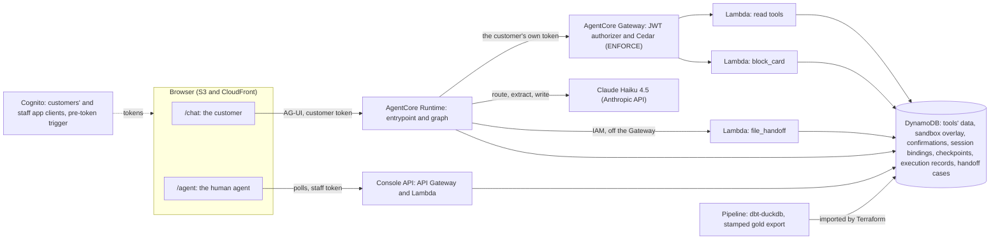
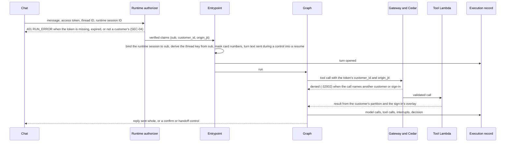
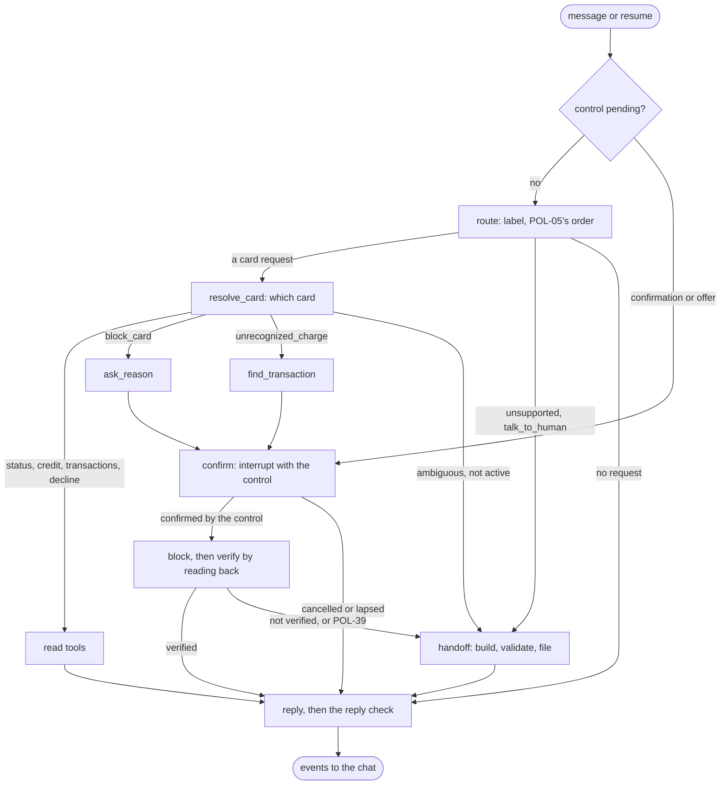
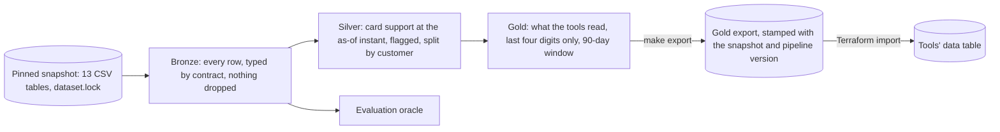
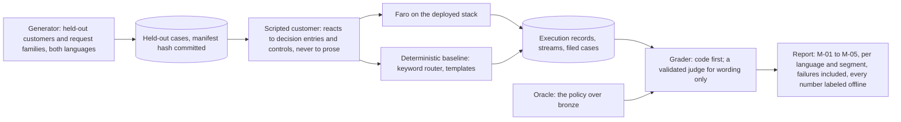

# Architecture

Faro on one page: what runs where, how a turn flows, what the graph decides, where each rule is enforced, how the data reaches the tools, and how we measure the result. Each section names the record that holds the full reasoning; the requirement IDs are from [hackathon-requirements.md](hackathon-requirements.md).

> [!NOTE]
> Deployed on `prototype` as of 2026-09-30: sign-in, the chat, the entrypoint's checks, the execution record, and a scoped card read through the Gateway. The confirmation, the block, the handoff, the pipeline, and the evaluation are designed in the records and being built; the diagrams show the design.

## The system

One backend on Amazon Bedrock AgentCore: a Runtime serves the chat and runs an explicit LangGraph workflow; a Gateway exposes Lambda tools under Cedar policies; DynamoDB holds every store. Nothing the model writes reaches a tool's `customer_id`, a confirmation, or a handoff's facts ([ADR-0004](adr/0004-agent-architecture-on-agentcore.md)).

Two layers decide access and actions, and neither trusts the one above it (CTL-04, SEC-05): Cedar checks that every tool call names the customer and the sign-in in the token; each tool checks the rest (the card's status, the confirmation, the window). The graph can route wrongly without a customer seeing another's records, and the model can answer wrongly without a card being blocked unconfirmed. `file_handoff` stays off the Gateway because a customer holding their own token could otherwise file a forged case; the Runtime invokes it with a role no customer holds.

## A turn

The execution record is the trace, the audit log, and the evaluation's source in one (OPS-01, OPS-02): every model call with its prompt version, tokens, latency, and cost; every tool call; every interrupt and resume; and a decision entry per turn that names the outcome class and what the agent waits for next. Explanations come from it, never from hidden reasoning.

## The graph

A workflow with model steps, not an agent loop (DSN-03, DSN-05): code chooses every node and tool; the model labels a request among eight, extracts among allowed values, writes a reply's words, and writes a handoff's three free-text fields. The policy's rules are the router's labels and the nodes' branches ([the policy](policy/card-support.md), CTL-01).

Three rules make the reply safe to send (AI-03, AI-05, CTL-02):

- **Typed text never confirms.** `confirm` creates a confirmation record and shows a control; only the control's resume, naming that record, confirms or cancels. `block_card` consumes the record in one DynamoDB transaction and reads the card back up to three times; the customer hears "blocked" only when the read-back shows it.
- **Facts as placeholders.** The model writes `{card.expiration}`, never the value; code fills it. Outcomes (blocked, verified, a handoff's reference) are fixed sentences chosen by code.
- **The reply check.** Before a reply leaves, code checks every placeholder, every number, and every withheld field; a reply that fails is replaced by a fixed one built from the same facts, and the fallback is counted (OPS-05).

The handoff is a structured case, not a transcript (CTL-05): the request, each verified fact tied to the tool call that read it, the actions taken, the evidence, and the unresolved questions, validated against [handoff.schema.json](../src/banking_agent/policy/handoff.schema.json) by the graph and again by `file_handoff`, which adds the `is_fraud` facts the model never sees.

## Where each rule holds

| Layer | Decides | Holds even if |
|---|---|---|
| Cognito and the pre-token trigger | Who the customer is; customers get tokens from the customers' app client only, staff from the staff client only | The browser is not ours |
| The Runtime's and the Gateway's JWT authorizers | Only a customer's valid token reaches the agent or a tool | The model is fully compromised |
| The entrypoint | The runtime session belongs to the caller; the thread key derives from the verified `sub`; card numbers are masked before anything reads them | The client sends another customer's IDs |
| Cedar | Every call names the token's `customer_id` and `origin_jti` | The graph routes wrongly |
| The tools | A read returns the customer's partition and never `is_fraud`; a block needs a confirmed, unexpired confirmation for that card and reason | The graph is wrong |
| The graph | Which card, when to ask, when to abstain, decline, or hand off; the retries and the question limit | The model mislabels or misextracts |
| The prompt | Nothing that access or an action depends on | |

## The data

A batch rebuild per pinned snapshot, on the machine that holds it; only the stamped gold export leaves it ([ADR-0002](adr/0002-mirror-dataset-into-pinned-snapshots.md), [ADR-0006](adr/0006-batch-medallion-pipeline.md); DML-01 to DML-06).

The state the tools read is a frozen master snapshot with an event cutoff: customers and cards as delivered, transactions dated at or before the as-of instant. Rows updated after that instant are flagged, never corrected, and results are reported with and without them.

## How we know it works

Offline, on scripted scenarios played against the deployed system, graded by code against an oracle that applies the policy to the frozen snapshot in code that shares nothing with the tools ([ADR-0005](adr/0005-offline-scenario-evaluation.md); EVL-01 to EVL-14, DML-07 to DML-12).

The split holds by customer (the MD5 rule shared with the analysis), by authored request family, and by time (DML-09). Held-out cases include incorrect and missing data, expired sessions, unauthorized access, prompt injection, tool failures, and multilingual ambiguity, and the same cases run against the baseline. Zero unsafe outcomes in a small set bounds the rate; it never proves it zero (M-04).

## Where the reasoning lives

| Record | Decides |
|---|---|
| [ADR-0003](adr/0003-choose-workflow-from-evidence.md) | Card support, from the [selection report](analysis/selection.md) |
| [ADR-0004](adr/0004-agent-architecture-on-agentcore.md) | The agent, the tools, the stores, the confirmation, the handoff, operations |
| [ADR-0005](adr/0005-offline-scenario-evaluation.md) | The evaluation, the oracle, the baseline, the judge, reporting |
| [ADR-0006](adr/0006-batch-medallion-pipeline.md) | The pipeline, its contracts and checks, freshness, lineage |
| [ADR-0007](adr/0007-role-gated-web-app.md) | The web app, sign-in, the console API, handoffs as cases |
| [The policy](policy/card-support.md) | What Faro answers, does, refuses, and hands off, one ID per rule |
