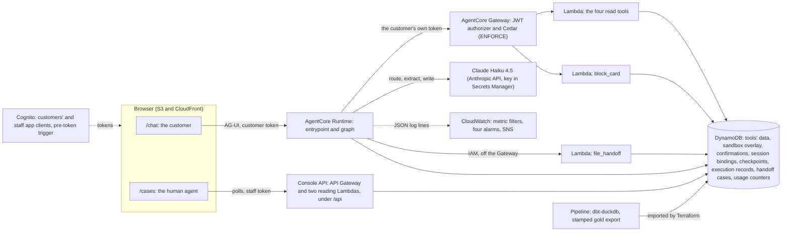
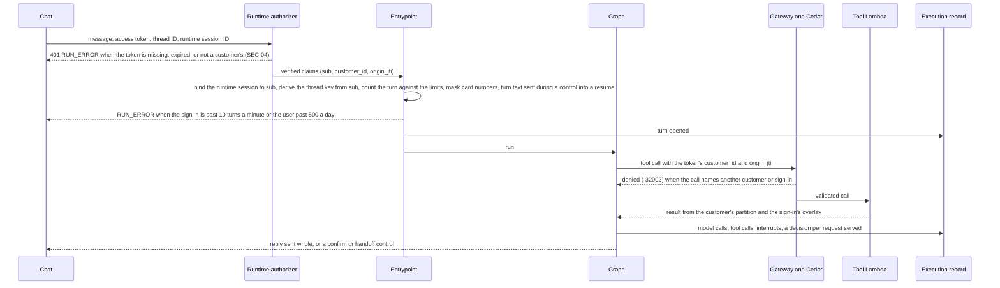
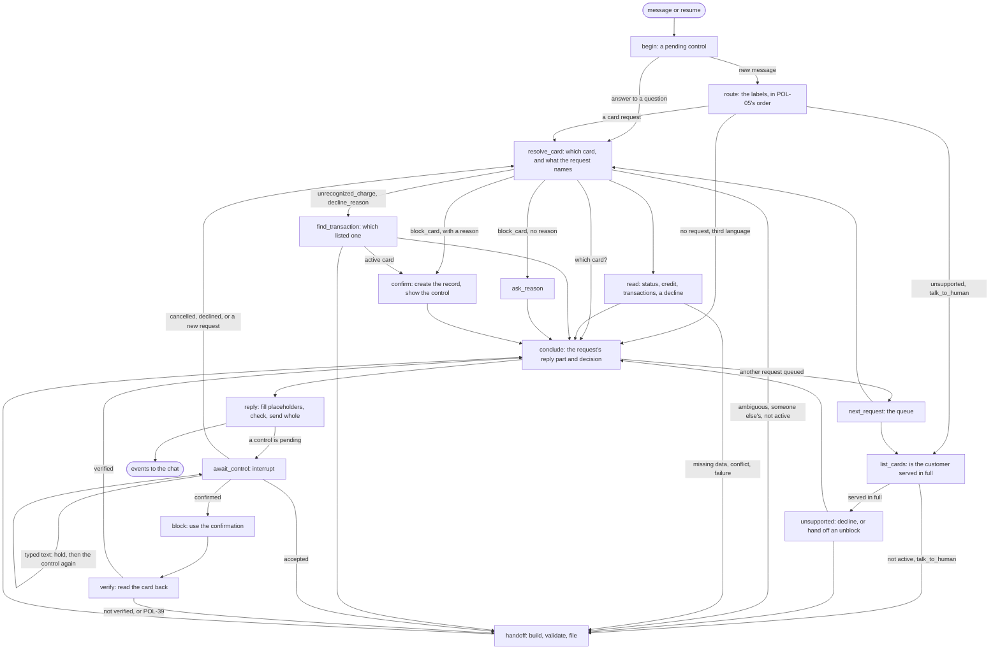
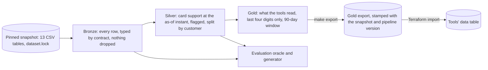
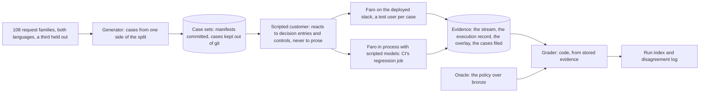

# Architecture

Faro on one page: what runs where, how a turn flows, what the graph decides, where each rule is enforced, how the data reaches the tools, and how we measure the result. Each section names the record that holds the full reasoning; the requirement IDs are from [prerequisites.md](prerequisites.md).

> [!NOTE]
> **As built.** This page describes `prototype` after promotion 3 (PR #47, 2026-10-01): sign-in for customers and staff, the chat and the human agent's console, every request in the policy's table served in both languages, the confirmation with the verified block, the handoff filed as a case, the reply check, the execution record, usage limits and alarms, the pipeline's export in the tools' data, and the evaluation harness with its first reported run. Three pieces are designed in the records and not built, each a stated limitation: a handoff filed after a confirmation's deadline when the customer has left ([ADR-0004](adr/0004-agent-architecture-on-agentcore.md#the-confirmation), decision 7); claim and resolve in the console, so every case stays `filed` ([ADR-0007](adr/0007-role-gated-web-app.md#the-console-api)); and the AI team's page, whose report lives in [docs/evaluation/](evaluation/) instead. The evaluation's deterministic baseline and its judge are defined in [ADR-0005](adr/0005-offline-scenario-evaluation.md) and still to come; the section on evaluation says what has run.

## The system

One backend on Amazon Bedrock AgentCore. A Runtime serves the chat and runs an explicit LangGraph workflow. A Gateway exposes Lambda tools under Cedar policies. DynamoDB holds every store. Nothing the model writes reaches a tool's `customer_id`, a confirmation, or a handoff's facts ([ADR-0004](adr/0004-agent-architecture-on-agentcore.md)).

Two layers decide access and actions, and neither trusts the one above it (CTL-04, SEC-05). Cedar checks that every tool call names the customer and the sign-in in the token. Each tool checks the rest: the card's status, the confirmation, the window. The graph can route wrongly without a customer seeing another's records, and the model can answer wrongly without a card being blocked unconfirmed. `file_handoff` stays off the Gateway because a customer holding their own token could otherwise file a forged case; the Runtime invokes it with a role no customer holds, and the Lambda checks the forwarded token with Cognito and the payload against the execution record before it files.

The site is one static app with a route per role. Customers sign in through one app client and staff through another, and a pre-token trigger refuses a token when the client doesn't match the user's group. The console API is served on the site's own origin under `/api`, accepts the staff client only, and reads cases and the tool calls their evidence names; no console route changes a card ([ADR-0007](adr/0007-role-gated-web-app.md)).

## A turn

The chat opens the runtime session at sign-in with a warm-up the entrypoint answers without running the graph, so the first message doesn't pay the cold start. Each turn has 60 seconds: a model or tool call that fails is tried up to three times, with the provider's `retry-after` or a short backoff, and a call that still fails ends the turn with a fixed reply and a person offered (POL-48).

The execution record is the trace, the audit log, and the evaluation's source in one (OPS-01, OPS-02): every model call with its prompt version, tokens, latency, and cost; every tool call with each attempt; every interrupt and resume; and a decision entry per request served that names the outcome class and what the agent waits for next. It is append-only: the Runtime's role may add an entry and never rewrite one. Explanations come from it, never from hidden reasoning.

## The graph

A workflow with model steps, not an agent loop (DSN-03, DSN-05). Code chooses every node and tool. The model does five things, each through structured output or a short prompt: it labels a message among eight requests and says whether it holds one at all; it extracts what a card request names, among allowed values; it says which listed transactions fit what the customer said; it writes the words of a read's answer around placeholders; and it writes a handoff's three free-text fields. The three calls that read a message also say which language it is mostly in, and code applies POL-50 and POL-51 to that reading. The policy's rules are the router's labels and the nodes' branches ([the policy](policy/card-support.md), CTL-01).

One message can hold several requests. Code puts them in POL-05's order, serves the first, and keeps the rest; when a request ends on a question or a control, a fixed sentence names what is left, and the turn that answers it serves the rest. Each request served writes its own decision entry.

Three rules make the reply safe to send (AI-03, AI-05, CTL-02):

- **Typed text never confirms.** `confirm` creates a confirmation record and shows a control. Only the control's resume, naming that record, confirms or cancels. `block_card` consumes the record in one DynamoDB transaction and reads the card back up to three times. The customer hears "blocked" only when the read-back shows it; otherwise the case is handed off as `action_not_verified`. The handoff control works the same way: an offered handoff is filed only when the control accepts it.
- **Facts as placeholders.** The model writes `{card.expiration}`, never the value; code fills it in the conversation's language and the customer's number format. Outcomes (blocked, verified, a handoff's reference) are fixed sentences chosen by code. The model writes the answer of the four reads only; every question, decline, abstention, refusal, and offer is fixed text.
- **The reply check.** Before a reply leaves, code checks every placeholder, every digit, every internal flag, and every withheld status. A reply that fails is replaced by a fixed one built from the same facts, and the fallback is counted (OPS-05).

The handoff is a structured case, not a transcript (CTL-05): the request, each verified fact tied to the tool call that read it, the actions taken, the evidence, the customer's own statements kept apart, and the unresolved questions. The graph validates it against [handoff.schema.json](../src/banking_agent/policy/handoff.schema.json), and `file_handoff` validates it again, checks each fact against the execution record, adds the `is_fraud` and customer status facts the model never sees, raises the priority to `urgent` where POL-47 requires it, and files it with a reference the customer hears. The human agent's console shows the case within a 3-second poll.

## Where each rule holds

| Layer | Decides | Holds even if |
|---|---|---|
| Cognito and the pre-token trigger | Who the customer is; customers get tokens from the customers' app client only, staff from the staff client only | The browser is not ours |
| The Runtime's and the Gateway's JWT authorizers | Only a customer's valid token reaches the agent or a tool | The model is fully compromised |
| The entrypoint | The runtime session belongs to the caller; the thread key derives from the verified `sub`; card numbers are masked before anything reads them; a sign-in's turns are limited | The client sends another customer's IDs |
| Cedar | Every call names the token's `customer_id` and `origin_jti` | The graph routes wrongly |
| The tools | A read returns the customer's partition and never `is_fraud`; a block needs a confirmed, unexpired confirmation for that card and reason; a handoff's facts must be in the execution record | The graph is wrong |
| The graph | Which card, when to ask, when to abstain, decline, or hand off; the queue, the retries, and the question limit | The model mislabels or misextracts |
| The prompt | Nothing that access or an action depends on | |

The full map, one row per policy rule, is in [ADR-0004](adr/0004-agent-architecture-on-agentcore.md#where-each-rule-is-enforced).

## The data

A batch rebuild per pinned snapshot, on the machine that holds it; only the stamped gold export leaves it ([ADR-0002](adr/0002-mirror-dataset-into-pinned-snapshots.md), [ADR-0006](adr/0006-batch-medallion-pipeline.md); DML-01 to DML-06).

The state the tools read is a frozen master snapshot with an event cutoff: customers and cards as delivered, transactions dated at or before the as-of instant (business date 2026-06-17, read as of 2026-06-18 06:00). Rows updated after that instant are flagged, never corrected, and results are reported with and without them. `prototype` serves export `795ff66b819516bf` of snapshot `b3b8b248f604ef9a`; its manifest, with every check's result, is in [docs/pipeline/](pipeline/), and [the pipeline's README](../pipeline/README.md) says how to rebuild it.

Writes never touch the export. A block lands in a sandbox overlay keyed by the sign-in, so each judge and each evaluation case starts clean, and the overlay also carries the evaluation's fixtures (a record the snapshot lacks) and fault plans (a tool made to fail), honored only in the sign-in that wrote them.

## How we know it works

Offline, on scripted scenarios, graded by code against an oracle that applies the policy to the frozen snapshot in code that shares nothing with the tools ([ADR-0005](adr/0005-offline-scenario-evaluation.md); EVL-01 to EVL-14, DML-07 to DML-12).

What is built and has run, as of promotion 3:

- **The families** ([families.md](evaluation/families.md)): seeds we wrote and paraphrases a model wrote, checked for slots, digits, language, and closeness; labeled team-generated (SEC-02).
- **The split** holds by customer (the MD5 rule shared with the analysis), by family, and by time (DML-09), with tests that no development artifact holds a held-out customer or message.
- **The oracle** reads the pipeline's bronze tables and computes each case's expected outcome per turn. Where the system and the oracle differ, the question goes to the [disagreement log](evaluation/disagreements.md), and CI's regression gate lets a finding through only while an open entry matches it.
- **Two development sets**, drawn by `make eval-sets` with their manifests under [docs/evaluation/sets/](evaluation/sets/): a regression set that CI plays in process on a team-generated bank, and a selection set.
- **The harness** plays a case end to end against a deployed stack: a test user of its own, the chat's own AG-UI client paced to the usage limits, fixtures and fault plans written under its sign-in, and write-once evidence in the evaluation bucket. The unauthorized-access cases call the Gateway's tools directly and expect Cedar to deny them.
- **The grader** is a function of the case and its stored evidence, so a later version regrades without running the system. Every run writes a manifest; the committed ones are indexed in [runs.md](evaluation/runs.md), where the first reported run is the live check after promotion 3.

Still to come, as ADR-0005 defines them: the deterministic baseline on the same workload (EVL-01), the judge for language and wording, validated against hand grading before use (EVL-10), the held-out run with M-01 to M-05 per language and segment (EVL-11, EVL-12), and the report. Zero unsafe outcomes in a small set bounds the rate; it never proves it zero (M-04).

## Where the reasoning lives

| Record | Decides |
|---|---|
| [ADR-0003](adr/0003-choose-workflow-from-evidence.md) | Card support, from the [selection report](analysis/selection.md) |
| [The policy](policy/card-support.md) | What Faro answers, does, refuses, and hands off, one ID per rule |
| [ADR-0004](adr/0004-agent-architecture-on-agentcore.md) | The agent, the tools, the stores, the confirmation, the handoff, operations |
| [ADR-0005](adr/0005-offline-scenario-evaluation.md) | The evaluation, the oracle, the baseline, the judge, reporting |
| [ADR-0006](adr/0006-batch-medallion-pipeline.md) | The pipeline, its contracts and checks, freshness, lineage |
| [ADR-0007](adr/0007-role-gated-web-app.md) | The web app, sign-in, the console API, handoffs as cases |
| [docs/analysis/](analysis/) | The profile, the traffic, and the card support numbers the policy and the ADRs cite |
| [docs/evaluation/](evaluation/) | The families, the disagreement log, the case set manifests, and the run index |
| [CONTRIBUTING.md](../CONTRIBUTING.md) | How to stand the stack up in another account and run every check |
